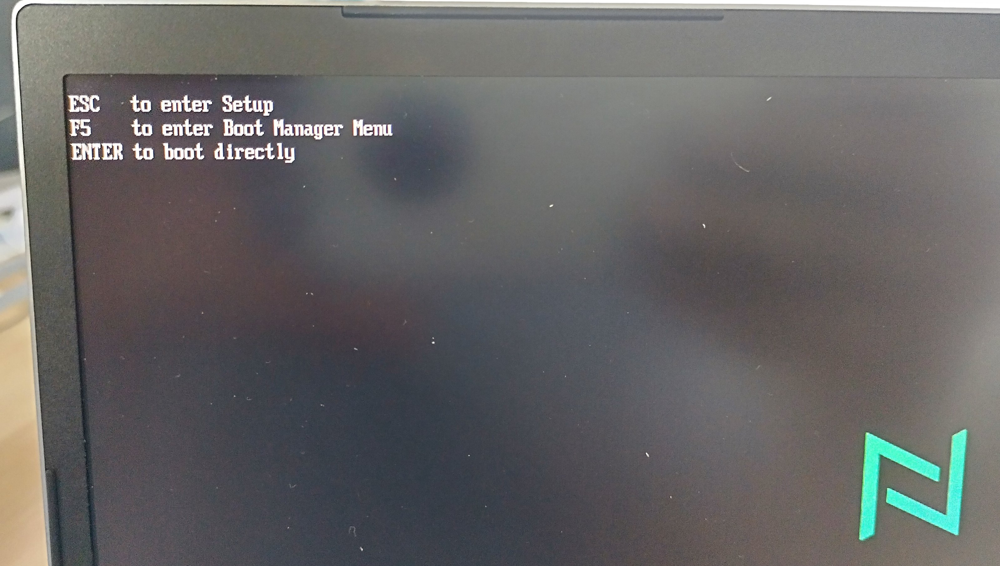
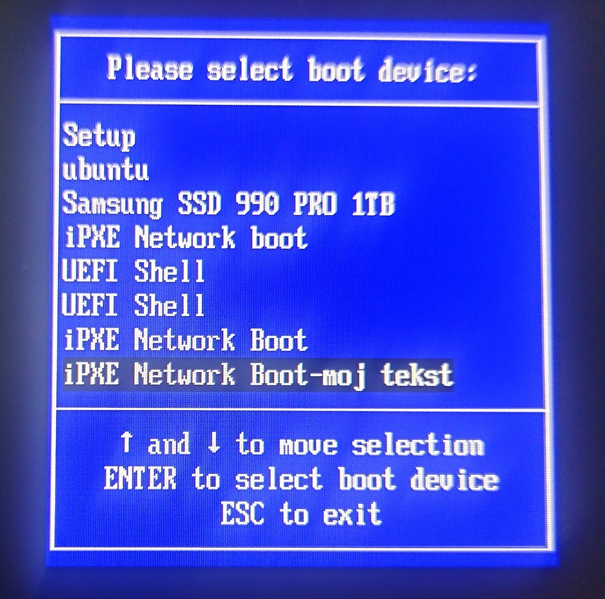
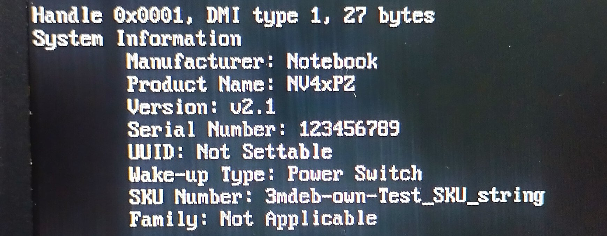
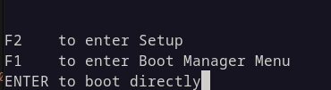
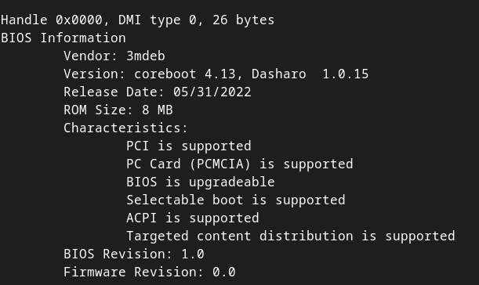
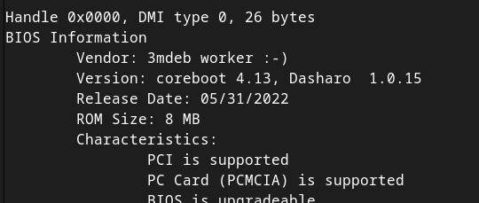

class: center, middle, intro

# Dasharo onboarding

### v0.1.0

.center[]

---

# Contents

These tasks can be done on two different platforms:
Novacustom Laptop or Remote Testing Environment with Protectli VP2410

Next section is dedicated to Novacustom laptop

---
# Prerequisities

* Hardware
  * Novacustom Laptop
  * Power supply
  * Ethernet cable
  * Flashing tool (optional; in case of bricking the device)

* Software
  * Docker installed on host machine
  * Source of the coreboot
  * edk2 sources

???
Flashing tool is not absolutely needed, unless laptop is not bricked.

---
# Types and sources

* There is need to properly identify model and version of the supported
hardware.
  - NS5* series - model with bigger screen, additional numeric keypad
various minor properties
  - NV4* series - 14" laptop without numeric keypad, monochromatic keyboard
backlight
* Sources:
  - ADL - Alder Lake processor used(Intel 12.gen)
  - TGL - Tiger Lake processor used(Intel 11.gen)
---

# Documentation
* Official webpage for documentation:
https://docs.dasharo.com/
* Path to more specific information:
  - Supported hardware -> Novacustom Laptops -> Building manual

---
# Build Process
* Described in "Build Dasharo BIOS firmware"
https://docs.dasharo.com/unified/novacustom/building-manual/
* Make sure testing model and platform
* Chooose proper sources, depending on processor type and Novacustom laptop
model (compilation for Novacustom NV41PZ checkout `clevo/develop`)
* First time build:
```
make olddefconfig && make
```
further, there is need for only `make` command.

---

# Flash Process
* Mainly, process is described in instruction.
* Flashing is performed on target device, itself.
* To enter flashing mode, device should be booted properly:
 - make sure laptop is powered off
 - turn on the device
 - wait for splash with one-time boot menu
 - press key for one-time boot menu
 - choose option `iPXE Network Boot`
 - choose option 9 (Shell)

---
# Flash Process - cont.
* check flashrom is available on the laptop
```
flashrom -p internal
```
* connect laptop to Ethernet, get its IP

* copy previously compiled Dasharo firmware:
```
scp build/coreboot.rom root@<here IP of NVC laptop>/tmp
```
* connect with scp
```
ssh root@<here IP of NVC laptop
cd /tmp
flashrom -p internal -i RW_SECTION_A --fmap -w /tmp/coreboot.rom
```
* After finishing(still, under ssh):
```
reboot
```
* Test whether flashing correctly
---
# Troubleshooting
* During SSHing process the following message can occur:
```
@@@@@@@@@@@@@@@@@@@@@@@@@@@@@@@@@@@@@@@@@@@@@@@@@@@@@@@@@@@
@    WARNING: REMOTE HOST IDENTIFICATION HAS CHANGED!     @
@@@@@@@@@@@@@@@@@@@@@@@@@@@@@@@@@@@@@@@@@@@@@@@@@@@@@@@@@@@
IT IS POSSIBLE THAT SOMEONE IS DOING SOMETHING NASTY!
Someone could be eavesdropping on you right now (man-in-the-middle attack)!
It is also possible that a host key has just been changed.
The fingerprint for the ECDSA key sent by the remote host is
SHA256:uBHMBbOlesrKFIwafxOTfk0sVoL59tmbnWqKQm08pA4.
Please contact your system administrator.
Add correct host key in /home/coreboot/.ssh/known_hosts to get rid of this message.
Offending ECDSA key in /home/coreboot/.ssh/known_hosts:1
  remove with:
  ssh-keygen -f "/home/coreboot/.ssh/known_hosts" -R "192.168.4.236"
ECDSA host key for 192.168.4.236 has changed and you have requested strict checking.
Host key verification failed.
lost connection
```
Solution is in the line:
```
ssh-keygen -f "/home/coreboot/.ssh/known_hosts" -R "192.168.4.236"
```
---
# Recovery

After bricking the device there is need to perform the same action, as with
brand new device.

???
TBD:
In case there is problem, computer is bricked there is need to
reflash using external programmer

---
# Change key
* Config option responsible for entering the SETUP is:
```
CONFIG_EDK2_SETUP_MENU_KEY
```
* Config option responsible for one-time boot option is:
```
CONFIG_EDK_BOOT_MENU_KEY
```
Proper values can be found issuing command:
```
make menuconfig
```
Section `Payload->TianoCore boot menu key` and
`Payload->TianoCore setup menu key`, press button Help.
---
# Exercise 1

* Change boot option key
* Find in configuration key: `EDK2_BOOT_MENU_KEY`/"TianoCore boot menu key"
* Change value (button Help will show possible options)
* Check changes (build, reflash laptop)

--
* Result in next slide:

???
Comment

---
# Exercise 1-solve

.center[.image-65[]]

---
# Exercise 2
* Change option for booting option `iPXE Network Boot` to add own string
* Recompile, flash
* Test changes
* Solve results in next slide

---
# Exercise 2-solve
* Find string in `.config` file: `CONFIG_EDK2_IPXE_OPTION_NAME`
* Change value (here: change to `iPXE Network Boot-moj tekst`)
.center[.image-45[]]

---
# Excercise 3
* Change SMBIOS variable, SKU Number
* String is set up in mainboard's code
* Find in directory, in `src/mainboard` proper file, function, change phrase
* Compile, burn to the flash
* Check value using `dmidecode` (run on target device)
--
.column-1[
.middle-1[Result on next slide...]
]

---
# Exercise 3-solve

* Source:

```
coreboot/src/mainboard/clevo/adl-p/ramstage.c
```

function:
```
const char *smbios_system_sku(void);
```

--
.center[.image-45[]]

---
# Remote Protectli VP2410 platform

---
# Prerequisities:
- python
- telnet
- ready to use SnipeIT account ([instructions](https://gitlab.com/3mdeb/rte/docs/-/blob/master/docs/snipeIT_theory_of_operation.md))

---

## Setup
Clone [osfv-scripts](https://github.com/Dasharo/osfv-scripts) repository:

```
git clone https://github.com/Dasharo/osfv-scripts.git
```

Checkout to branch **osfv-cli**:
```
git checkout osfv-cli
```

Move to the directory with **osfv_cli** script:

```
cd snipeit
```

Install required python packages:

```
pip install -r requirements.txt
```

Test if script works (you should get the list of possible subcommands):

```
./osfv_cli.py snipeit -h
```

---

### Connecting and basic operations
First of all make sure that the platform is available for checking out:

```
snipeit list_unused | grep VP2410 -A 8
```

If platform is available you should get this entry in output:

```

Asset Tag: Protectli VP2410_1, Asset ID: 317, Name: , Serial:
Lab location:
RTE IP: 192.168.10.233
RTE cpuid:
RTE Rev:
RTE MAC address: 02:42:66:1f:90:13
Sonoff IP:
PiKVM IP:
PiKVM HW Base:
```

Checkout the platform:

```
./osfv_cli.py snipeit check_out --rte_ip 192.168.10.233
```

---

### Connecting and basic operations - cont.

Now if you run `./osfv_cli.py snipeit list_used | grep VP2410 -A 8` you should get the same entry of Protectli as above.

You can get list of possible operations by running

```
./osfv_cli.py rte --rte_ip 192.168.10.233 -h
```

For example you can check the state of the GPIO pin 0:

```
./osfv_cli.py rte --rte_ip 192.168.10.233 gpio get 0
```

Acces the platform by serial interface:

```
./osfv_cli.py rte --rte_ip 192.168.10.233 serial
```

Fetch current ROM image:

```
./osfv_cli.py rte --rte_ip 192.168.10.233 flash read --rom vp2410-read.rom
```

---

### Connecting and basic operations - cont.

Writing new ROM image:

```
./osfv_cli.py rte --rte_ip 192.168.10.233 flash write --rom ~/coreboot/protectli_vault_glk_v1.0.15.rom
```

Switching power on relay:
```
./osfv_cli.py rte --rte_ip 192.168.10.233 rel tgl
```

---

# Building firmware

This can be done as shown in [building manual](https://docs.dasharo.com/variants/protectli_vp2410/building-manual/).

Tips:
- In protectli blobs repository make sure you are on the branch with the same name as in coreboot repository
- Instead of creating symbolic link you can simply copy Geminilake (inside root coreboot directory):

    ```
    cp -r 3rdparty/blobs/mainboard/protectli/vault_glk/GeminilakeFspBinPkg 3rdparty/fsp/GeminilakeFspBinPkg
    ```

---

### Exercises

1. Change boot menu key
    - Find how to change boot menu key
    - You can use values between `0x0001` (UP) and `0x0017` (ESC)

---

### Excercise 1 - solve

Modify file `coreboot/configs/config.protectli_vp2410`, line `CONFIG_TIANOCORE_BOOT_MENU_KEY`

.center[.image-45[]]

---

### Exercise 2

Change bios information - "Vendor", it can be checked using `dmidecode`:

.center[.image-45[]]

---

### Exercise 2 - solve

Edit file `coreboot/src/arch/x86/smbios.c`, function `smbios_write_type0`, variable `t->vendor`

.center[.image-45[]]

---

class: center, middle, outro
.center[##Q&A]
