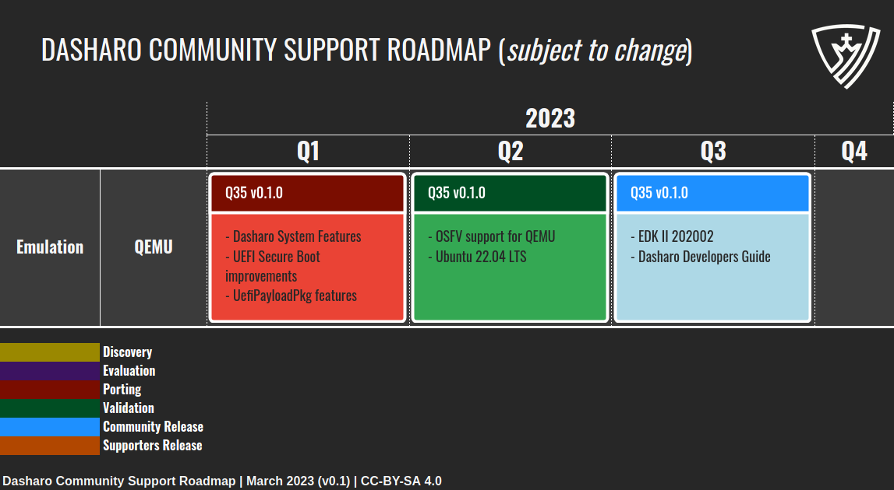
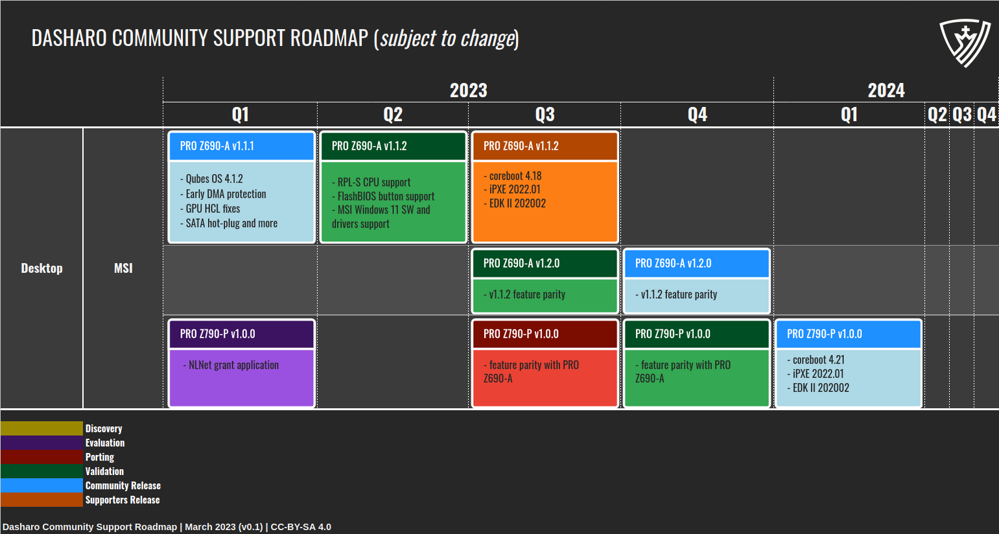
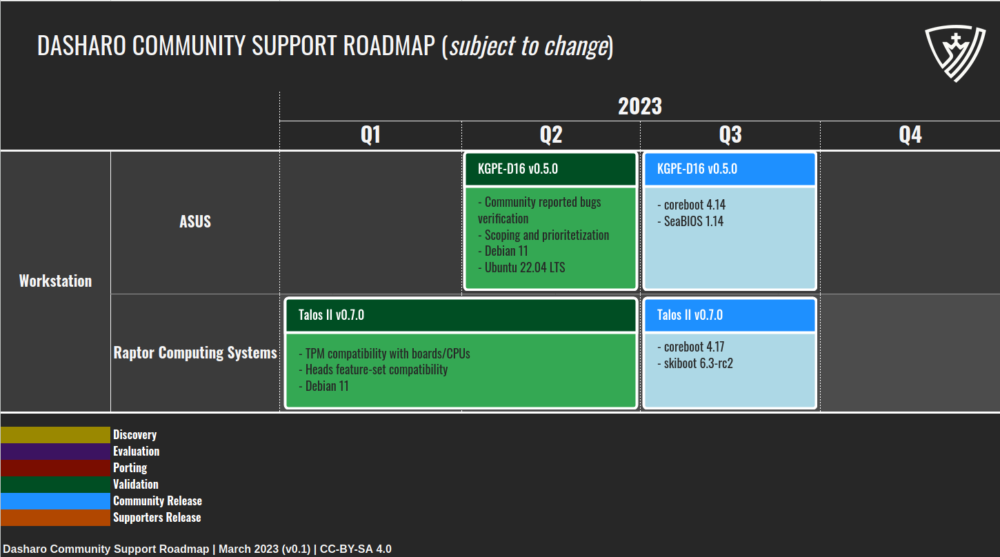

class: center, middle, intro

# Dasharo Roadmap

.center[]

---

# Dasharo Roadmap Disclaimer

_Please note that the roadmap for the Dasharo Community Support Program is
subject to change and may not represent final release candidates or end of
support dates. This roadmap is intended to provide guidance and direction for
the program's development, but is not a guarantee of specific timelines or
outcomes. For more information on release candidates or release dates, please
contact the Dasharo Team directly._

???

---

# Dasharo support levels

* Dasharo Community Support (DCP) - donation driven development.
* Dasharo Support Package (DSP) - annual firmware support package.
* Dasharo Enterprise Package (DEP) - custom SLA, corporate and open roadmap
  alignment advisroy.

???

The Dasharo Community Support Program is an open-source firmware support
initiative that leverages the expertise of community members and developers to
improve firmware solutions for a range of hardware models.

Platforms in scope of the program should comply with Dasharo quality criteria,
which we slowly gather in Dasharo Certification Program.

---

# Dasharo Community Support Process

.center[

]

???

* DCP means executing and delivering test results according to specs defined in
  earlier stages.
* This process shows how flow look like for new platforms, already supported
  platforms typically get through Validation/Release cycle.

---

# Dasharo Emulation Roadmap

.center[

]

---

# Dasharo Desktop Roadmap

.center[

]

---

# Dasharo Desktop Roadmap

.center[

]

---

# Dasharo Desktop Roadmap

.center[

]

---

# Dasharo Workstation Roadmap

.center[

]

---

# Dasharo Server Roadmap

.center[

]

---
class: center, middle, intro

# Q&A
