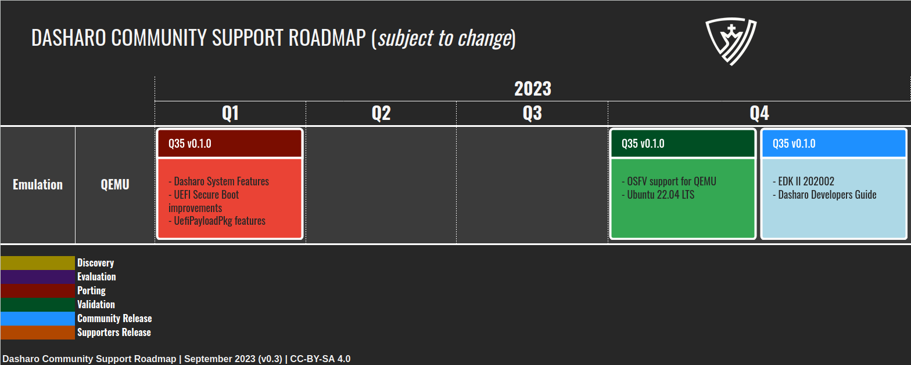
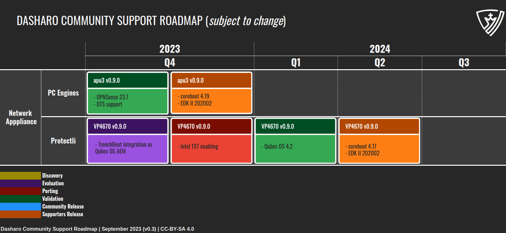
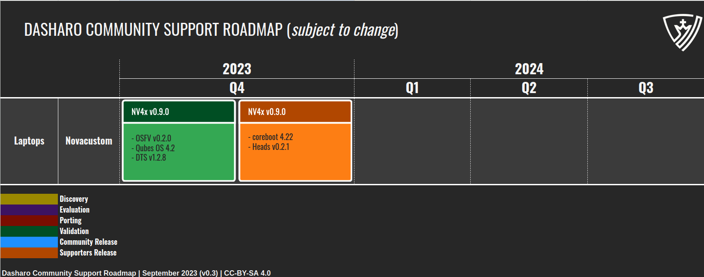
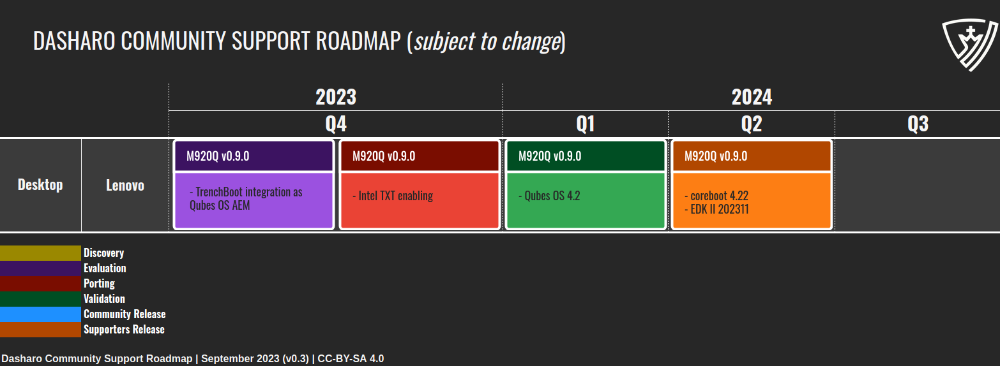
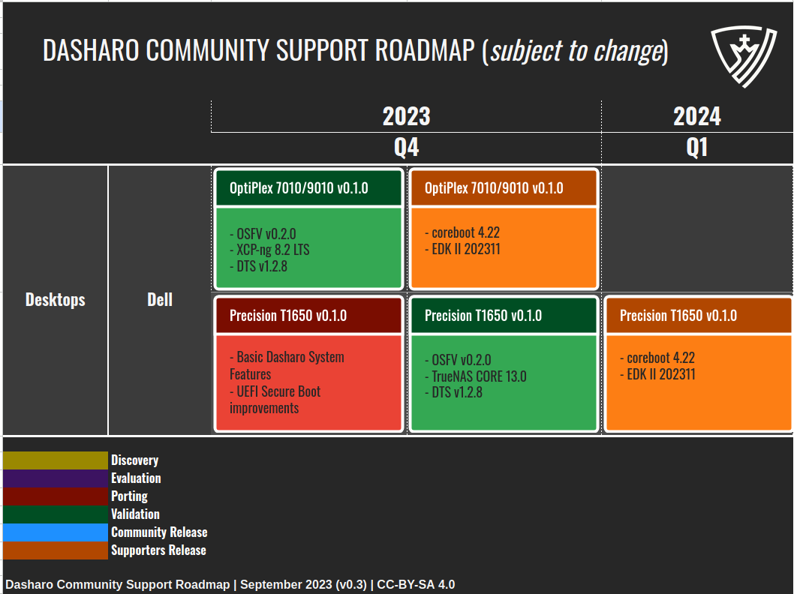
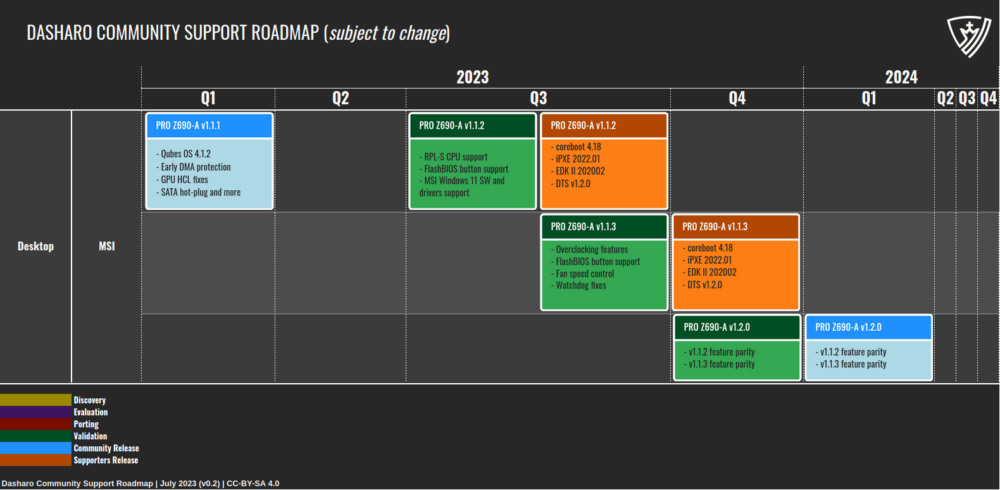
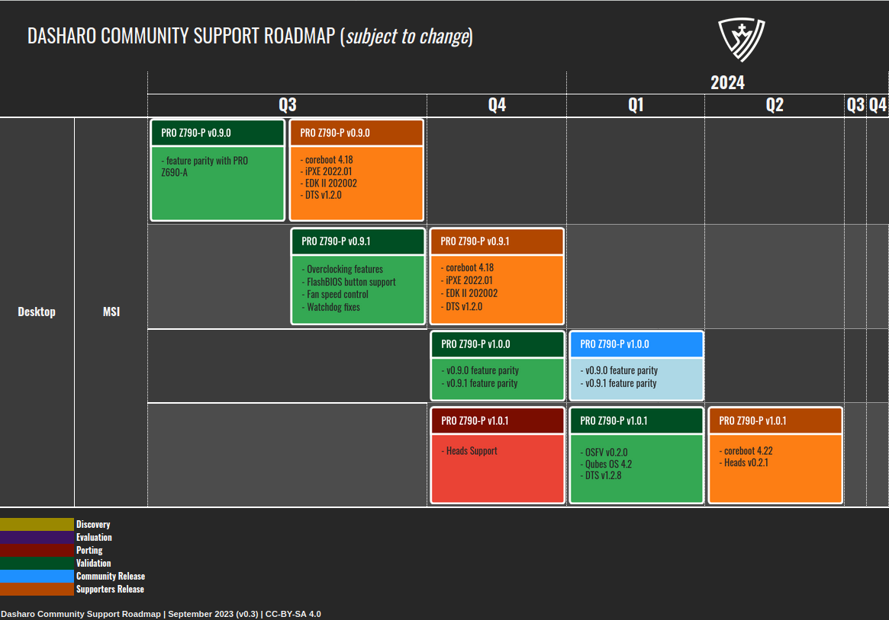
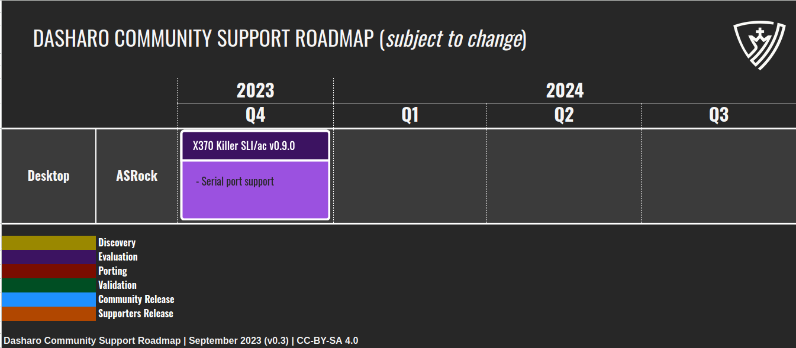
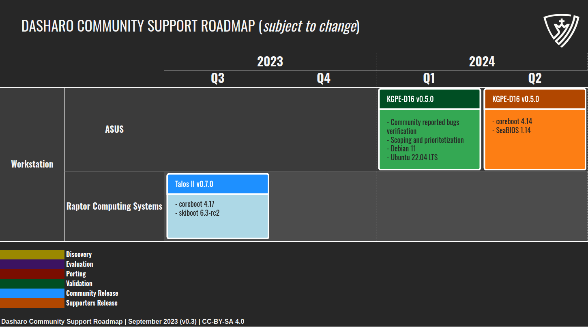
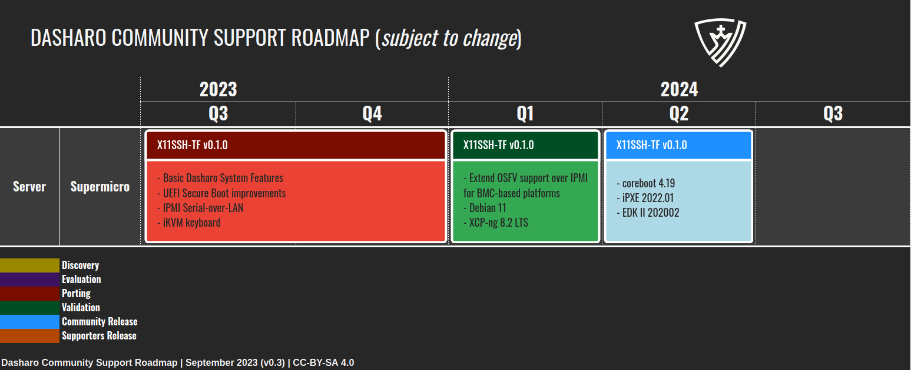

class: center, middle, intro

# Dasharo Roadmap

.center[]

---

# Dasharo Roadmap Disclaimer

.center.image-35[]

_Please note that the roadmap for the Dasharo Community Support Program is
subject to change and may not represent final release candidates or end of
support dates. This roadmap is intended to provide guidance and direction for
the program's development, but is not a guarantee of specific timelines or
outcomes. For more information on release candidates or release dates, please
contact the Dasharo Team directly._

???

---

# From OST2 to Dasharo Support Pacakage

.center.image-85[]

---

# Dasharo Community Support Process

.center[

]

* We released first Subscribers Releases in Q3'23 and it was Dasharo compatible
  with:
    - MSI PRO Z690-A (WIFI) (DDR4) v1.1.2
    - MSI PRO Z790-P (WIFI) (DDR4) v0.9.0

???

* DCP means executing and delivering test results according to specs defined in
  earlier stages.
* This process shows how flow look like for new platforms, already supported
  platforms typically get through Validation/Release cycle.
* TODO:
    - define publicly visible deliverables of each phase
    - document frameworks and tools on which given release will be based on

---

# Dasharo Emulation Roadmap

.center[

]

* Dasharo OSFV release provided infrastructure for validation.
* QEMU tests were proven to work and it is just matter to run set of tests
  defined by test matrix, prepare release notes and send newsletter.
* We have to do that in Q4'23.

???

- DUG#1: QEMU Q35 v0.1.0 planned for Q3'23
- DUG#2: (CHANGED) QEMU Q35 v0.1.0 planned for Q3'23
    - release date changed to Q4'23 (+1)
- DUG#3: QEMU Q35 v0.1.0 planned for Q4'23

---

# (NEW) Dasharo Network Appliance Roadmap

.center[

]

* Both solutions will be availabel in 3mdeb shop.
* We will start pre-sale in Q4'23.

???

- DUG#3: (NEW) PC Engines apu3 planned for Q4'23
- DUG#3: (NEW) Protectli VP4670 planned for Q2'24

---

# (NEW) Dasharo Laptops Roadmap

.center[

]

* Part of Dasharo Revenue Sharing with NovaCustom.
* We will most likely change Heads versioning scheme.

???

- DUG#3: (NEW) Novacustom NV4x Dasharo (coreboot+Heads) v0.9.0 planned for Q2'24

---

# (NEW) Dasharo Desktop Lenovo Roadmap

.center[

]

* We will start pre-sale in Q1'24.
* The hope is to achieve feature parity with MSI PRO Z690-A/Z790-P releases
  with the addition of Intel TXT and TrenchBoot as AEM solution for Qubes OS
  and potentially other OSes.

???

- DUG#3: (NEW) Lenovo M920Q planned for Q2'24

---

# Dasharo Desktop Dell Roadmap

.center[

]

???

- DUG#1
- Dell OptiPlex 7010/9010 v0.1.0 planned for Q2'23
- Dell T1650 v0.1.0 planned for Q3'23
- DUG#2
- (CHANGED) Dell OptiPlex 7010/9010 v0.1.0 planned for Q2'23
    - release date changed to Q4'23 (+2)
- (CHANGED) Dell T1650 v0.1.0 planned for Q3'23
- release date changed to Q1'24 (+2)
- DUG#3
- (CHANGED) Dell OptiPlex 7010/9010 v0.1.0 planned for Q4'23
    - release type changed to DES
- (CHANGED) Dell T1650 v0.1.0 planned for Q1'24
    - release type changed to DES

---

# Dasharo Desktop MSI Roadmap

.center[

]

* No changes, all releases on this roadmap are according to plan.

???

- DUG#1
    - MSI Z690-A v1.1.2 planned for Q3'23
    - MSI Z690-A v1.2.0 planned for Q4'23
- DUG#2
    - MSI Z690-A v1.1.2 planned for Q3'23
    - (NEW) MSI Z690-A v1.1.3 release planned for Q4'23
    - (CHANGED) MSI Z690-A v1.2.0 planned for Q4'23
        - release date changed to Q1'24 (+1)
- DUG#3
    - (RELEASED) MSI Z690-A v1.1.2 planned for Q3'23
    - MSI Z690-A v1.1.3 release planned for Q4'23
    - MSI Z690-A v1.2.0 planned for Q1'24

---

# Dasharo Desktop Roadmap

.center[

]

* We considering Dasharo (coreboot+Heads) as next step.

???

- DUG#1
    - MSI Z790-A v1.0.0 planned for Q1'24
- DUG#2
    - (NEW) MSI Z790-A v0.9.0 planned for Q3'23
    - (NEW) MSI Z790-A v0.9.1 planned for Q4'23
    - MSI Z790-A v1.0.0 planned for Q1'24
- DUG#3
    - (RELEASED) MSI Z790-A v0.9.0 planned for Q3'23
    - MSI Z790-A v0.9.1 planned for Q4'23
    - MSI Z790-A v1.0.0 planned for Q1'24
    - (NEW) MSI Z790-A Dasharo (coreboot+Heads) v1.0.1 planned for Q2'24

---

# (NEW) Dasharo Desktop Roadmap

.center[

]

* Replacing previous ASUS Pro WS X570-ACE v0.9.0.

---

# Dasharo Workstation Roadmap

.center[

]

???

- DUG#1
    - ASUS KGPE-D16 v0.5.0 planned for Q3'23
    - RCS Talos II v0.7.0 planned for Q3'23
- DUG#2
    - (CHANGED) ASUS KGPE-D16 v0.5.0 planned for Q3'23
        - release date changed to Q1'24 (+2)
    - RCS Talos II v0.7.0 planned for Q3'23
- DUG#3
    - (CHANGED) ASUS KGPE-D16 v0.5.0 planned for Q1'24
        - release type changed to DES
        - release date changed to Q2'24 (+1)
    - (RELEASED) RCS Talos II v0.7.0 planned for Q3'23

---

# Dasharo Server Roadmap

.center[

]

* Unfortunately X11SSH priority was was dropped because of issues during
  TrenchBoot as AEM for Qubes OS development.

???

- DUG#1
    - Supermicro X11SSH-TF v0.1.0 planned for Q4'23
- DUG#2
    - (CHANGED) Supermicro X11SSH-TF v0.1.0 planned for Q4'23
        - release date changed to Q1'24 (+1)
- DUG#3
    - (CHANGED) Supermicro X11SSH-TF v0.1.0 planned for Q1'24
        - release date changed to Q2'24 (+1)

---

# Support Dasharo Today

* Buy Dasharo Entry Subscription for your platform.
* Available in 3mdeb shop: https://3mdeb.com/shop
* Available through our Revenue Sharing Partners:
    - Nitrokey: https://shop.nitrokey.com/shop
    - NovaCustom: https://configurelaptop.eu
* Help us find resellers intersted in open-source firmware for their computers.
    - We looking for partners from Canada, US and Brazil (or other South America
    countries).
* Spread the word about Dasharo and our mission on social media and other platforms.
* Interested in other ways? Feel free to contact us contact@dasharo.com

.center[https://docs.dasharo.com/ways-you-can-help-us/]

---
class: center, middle, intro

# Q&A

---
class: center, middle, intro

# CHANGELOG

---

# Changelog DUG#1

- (NEW) QEMU Q35 v0.1.0 planned for Q3'23
- (NEW) Dell OptiPlex 7010/9010 v0.1.0 planned for Q2'23
- (NEW) Dell T1650 v0.1.0 planned for Q3'23
- (NEW) MSI Z690-A v1.1.2 planned for Q3'23
- (NEW) MSI Z690-A v1.2.0 planned for Q4'23
- (NEW) MSI Z790-A v1.0.0 planned for Q1'24
- (NEW) ASUS KGPE-D16 v0.5.0 planned for Q3'23
- (NEW) RCS Talos II v0.7.0 planned for Q3'23
- (NEW) Supermicro X11SSH-TF v0.1.0 planned for Q4'23
- Summary: 9 new

---

# Changelog DUG#2

- (CHANGED) QEMU Q35 v0.1.0 planned for Q3'23
    - release date changed to Q4'23 (+1)
- (CHANGED) Dell OptiPlex 7010/9010 v0.1.0 planned for Q2'23
    - release date changed to Q4'23 (+2)
- (CHANGED) Dell T1650 v0.1.0 planned for Q3'23
    - release date changed to Q1'24 (+2)
- MSI Z690-A v1.1.2 planned for Q3'23
- (NEW) MSI Z690-A v1.1.3 release planned for Q4'23
- (CHANGED) MSI Z690-A v1.2.0 planned for Q4'23
    - release date changed to Q1'24 (+1)
- (NEW) MSI Z790-A v0.9.0 planned for Q3'23
- (NEW) MSI Z790-A v0.9.1 planned for Q4'23
- MSI Z790-A v1.0.0 planned for Q1'24
- (CHANGED) ASUS KGPE-D16 v0.5.0 planned for Q3'23
    - release date changed to Q1'24 (+2)

---

# Changelog DUG#2

- RCS Talos II v0.7.0 planned for Q3'23
- (CHANGED) Supermicro X11SSH-TF v0.1.0 planned for Q4'23
    - release date changed to Q1'24 (+1)
- Summary: 3 new, 6 changed, 3 on track (total: 12)

---

# Changelog DUG#3

- QEMU Q35 v0.1.0 planned for Q4'23
- (NEW) PC Engines apu3 v0.9.0 planned for Q4'23
- (NEW) Protectli VP4670 v0.9.0 planned for Q2'24
- (NEW) Novacustom NV4x Dasharo (coreboot+Heads) v0.9.0 planned for Q2'24
- (NEW) Lenovo M920Q v0.9.0 planned for Q2'24
- (CHANGED) Dell OptiPlex 7010/9010 v0.1.0 planned for Q4'23
    - release type changed to DES
- (CHANGED) Dell T1650 v0.1.0 planned for Q1'24
    - release type changed to DES
- (RELEASED) MSI Z690-A v1.1.2 planned for Q3'23
- MSI Z690-A v1.1.3 release planned for Q4'23
- MSI Z690-A v1.2.0 planned for Q1'24
- (RELEASED) MSI Z790-A v0.9.0 planned for Q3'23

---

# Changelog DUG#3

- MSI Z790-A v0.9.1 planned for Q4'23
- MSI Z790-A v1.0.0 planned for Q1'24
- (NEW) MSI Z790-A Dasharo (coreboot+Heads) v1.0.1 planned for Q2'24
- (CHANGED) ASUS KGPE-D16 v0.5.0 planned for Q1'24
    - release type changed to DES
    - release date changed to Q2'24 (+1)
- (RELEASED) RCS Talos II v0.7.0 planned for Q3'23
- (CHANGED) Supermicro X11SSH-TF v0.1.0 planned for Q1'24
    - release date changed to Q2'24 (+1)
- Summary: 5 new, 4 changed, 5 on track, 3 released (total: 17)
