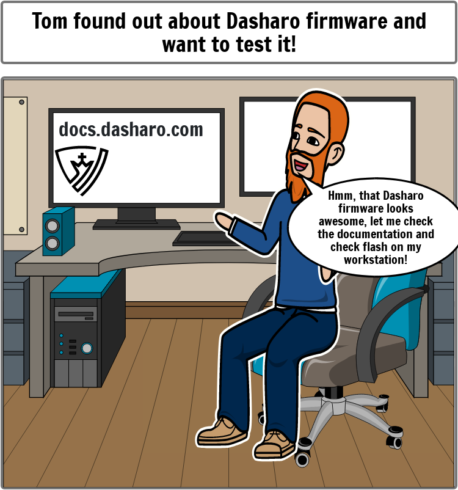
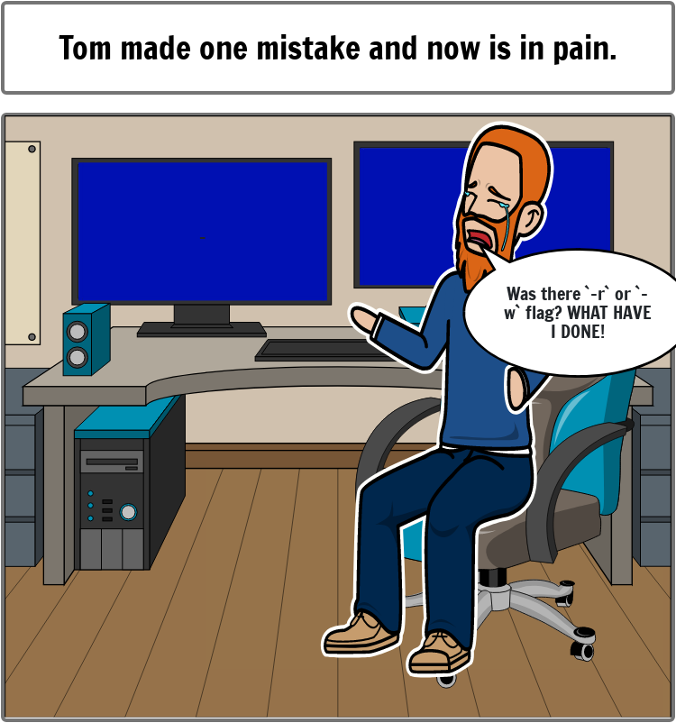

class: center, middle, intro

# &#x1F386; Dasharo Tools Suite &#x1F386;

## Getting started and roadmap

.center[]

???

Hi, my name is Tomasz Zyjewski and I am responsible for the development of a
system that some of you may have already met and which is called Dasharo Tools
Suite. This presentation is to introduce what this system is and tell you a
little about the plans for the future.

---

# Agenda

* What?
* How?
* Why?
* List of features
* Demo on MSI PRO Z690-A DDR4
* Upcoming releases
* Roadmap

???

---

# What?

* Dasharo Tools Suite a.k.a. DTS
* Set of tools and scripts running in minimal Linux environment
  - swiss army knife for Dasharo users and open-source firmware community
  - aims to provide a comprehensive solution for firmware flashing, gather
    information about hardware
  - [documentation](https://docs.dasharo.com/dasharo-tools-suite/overview/)
* First publicly available release on 2022-08-09
  - since then four more releases
  - [releases](https://docs.dasharo.com/dasharo-tools-suite/releases/#embedded-firmware)
* Dasharo Tools Suite test cases
  - performed on MSI PRO Z690-A DDR4 and DDR5 also on NovaCustom NV4x and
    NS5x/7x
  - [test cases](https://docs.dasharo.com/unified-test-documentation/dasharo-compatibility/326-dasharo-tools-suite/)

???

---

# How?

* Build based on Yocto Project
  - compatible with Kirkstone release
  - dependent on minimal set of additional layers
  - kas used to manage the compilation
  - provided documentation about how to build manually
* Meta layer stored on Dasharo GitHub organization
  - two main branches `main` and `develop`
  - [meta-dts](https://github.com/Dasharo/meta-dts)
* Available artifacts
  - iso and compressed images on releases subpage
  - kernel and cpio to boot from iPXE

???

---

# Why?

.left-column50[.center[]]
.right-column50[.center[]]

???

I may be wrong as this was a lot time ago, but basically the idea for creating
DTS came from situation described on this short comic. Let's imagine Tom, BTW
accidental name resemblance, who just found out about Dasharo. He goes do
docs.dasharo.com, go through perfectly prepared documentation (perfectly by our
mean) and bang, brick his platform. Of course we want to avoid such problems
because there is no worse thing than provide and open-source or just any
solution which just does not work, or worse, break something. And as accidents
may still happens, using DTS should limit that risk.

Of course this was only the beginning. Ultimate goal is to provide a tool that
can be used by open-source community to use open-source firmware easier.

---

# Features

* Dasharo zero-touch initial deployment
  - automates Dasharo firmware flashing, while also dumping flash content before
    to create backup
  - supported on ASUS KGPE-D16, Dell OptiPlex 7010/9010, MSI PRO Z690-A DDR4 and
    DDR5, NovaCustom NV4x and NS5x/7x
  - [more information](https://docs.dasharo.com/dasharo-tools-suite/documentation/#dasharo-zero-touch-initial-deployment)
* Dasharo Hardware Compatibility List Report (HCL Report)
  - powerful option, allows to get information about your hardware
  - dumped as compressed tarball in rootfs of DTS, also can be send to Dasharo
    Team
  - `results` file in dump
  - [more information](https://docs.dasharo.com/dasharo-tools-suite/documentation/#hcl-report)
* Latest versions of important utilities
  - e.g. `fwupd`, `flashrom`, `coreboot-utils` from Dasharo forks
  - allows to compile, test and upstream
  - in future, we want to provide whole SBoM

???

---
class: center, top, outro

.center[##DEMO]
.center[###Dasharo Tools Suite - Initial deployment and rollback]

???

---

# Upcoming releases

* **DTS v1.2.0**
  - ETA: March 2023
* Key features
  - enable Dasharo firmware update already available on develop build
  - bug fixing
* **DTS v2.0.0**
  - ETA: April/May 2023
  - [GitHub Milestone](https://github.com/Dasharo/dasharo-issues/milestone/5)
* Key features
  - add QEMU image with sets of basic tests of the system
  - update UI; make it shiny, beautiful and what more important - user friendly
  - enable Dasharo zero-touch initial deployment on Dell Precision T1650
  - work on DTS logo
  - introduce nightly/develop builds

---

# Roadmap

* Device authentication to improve Dasharo firmware update
  - client authentication mechanism working with updates
  - ETA: Q3 2023
  - [GitHub issue](https://github.com/Dasharo/dasharo-issues/issues/55)
* Expanding DTS root file system via NFS or other solution
  - adds posibility to load custom kernel modules
  - protects against endless growth of root file system size
  - ETA: Q3 2023
  - [GitHub issue](https://github.com/Dasharo/dasharo-issues/issues/366)
* DTS zero touch initial deployment for firmware `as is`
  - facilitate entry into the world of open-source firmware
  - ETA: Q4 2023
  - [GitHub issue](https://github.com/Dasharo/dasharo-issues/issues/384)
* DTS security features provisioning
  - improve the trustworthiness of computing device
  - ETA: Q1 2024
  - [GitHub issue](https://github.com/Dasharo/dasharo-issues/issues/385)

---
class: center, middle, outro

.center[##Q&A]
