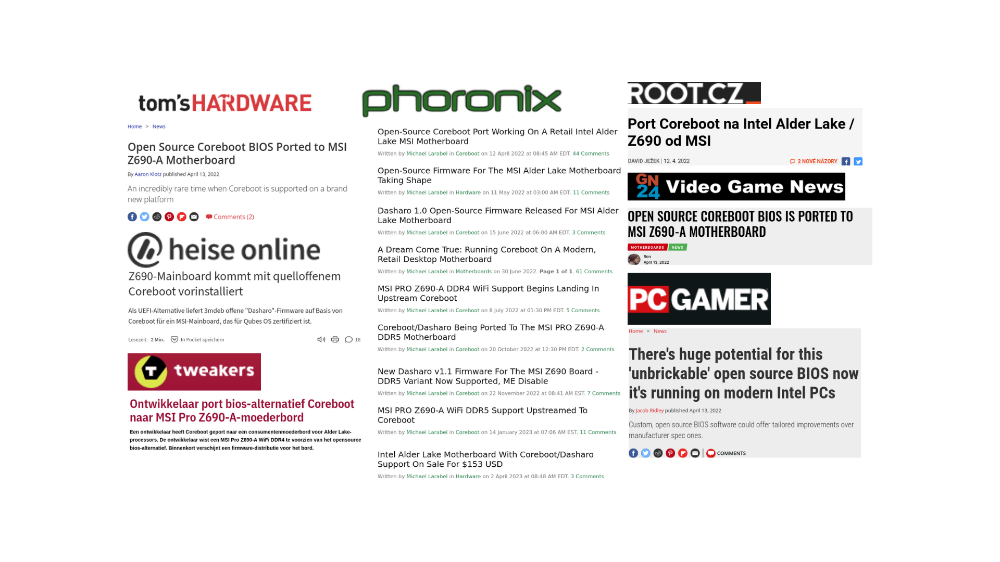
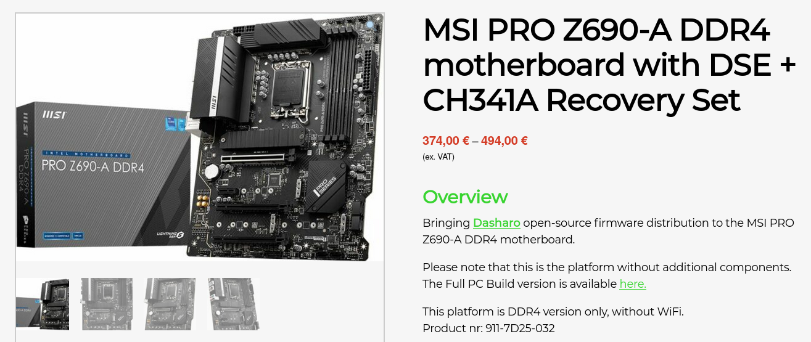
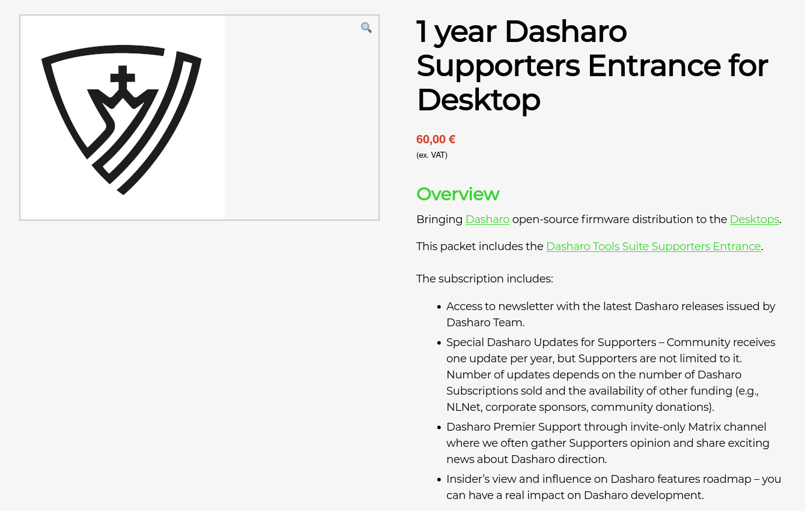
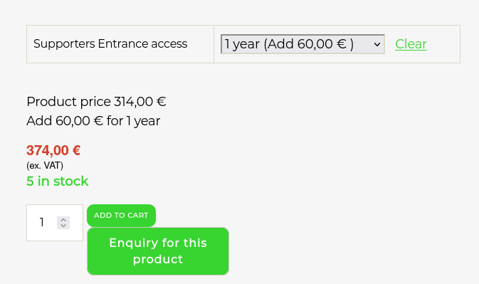
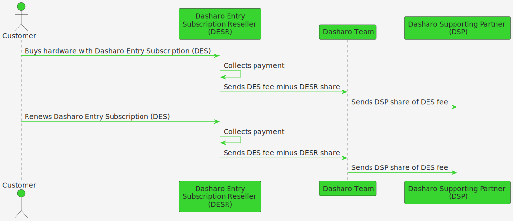
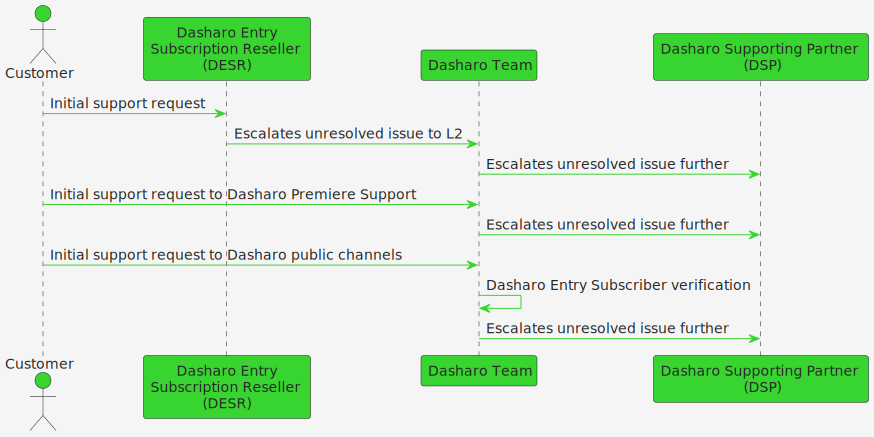
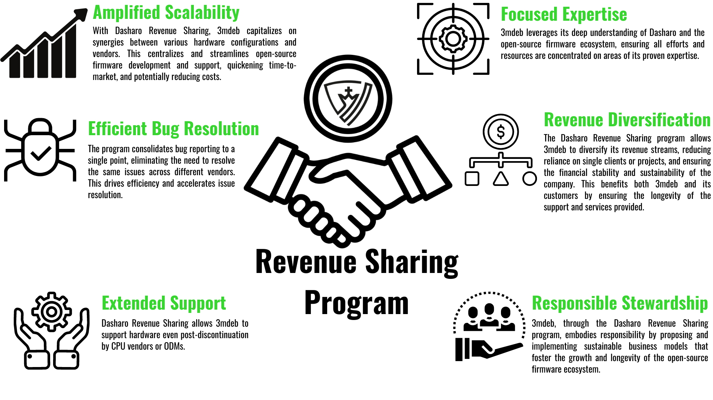
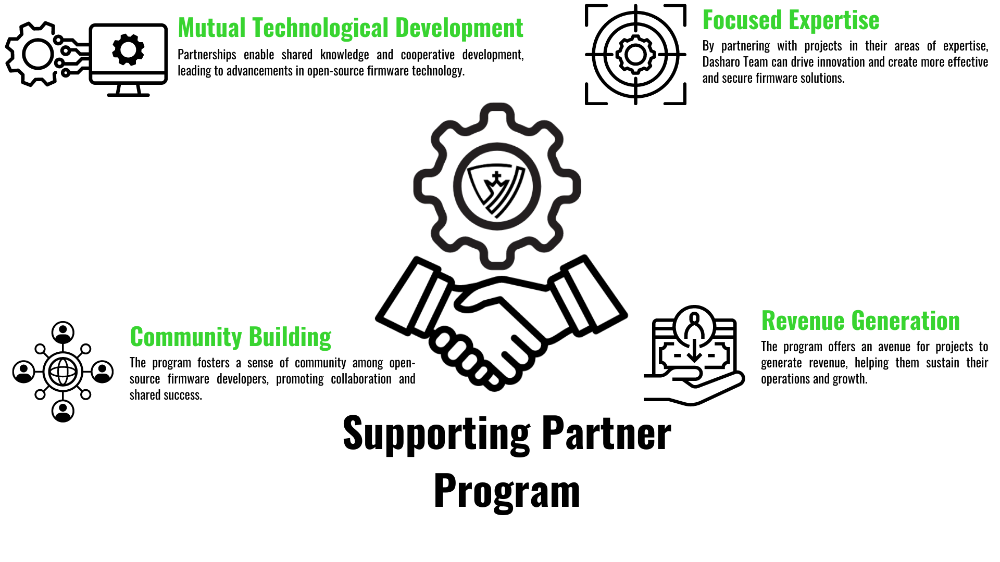

class: center, middle, intro

# &#x1F389; Dasharo Announcements &#x1F389;

.center[]

---

# Agenda

* Dasharo Entry Subscription value proposition
* Dasharo Revenue Sharing overview
* Benefits for Nitrokey
* Benefits for NovaCustom
* Dasharo Supporting Partner program overview
* Benefits for Insurgo
* Benefits for 3mdeb

---

# Dasharo Entry Subscription

.center.image-99[]

???

* Special Dasharo Updates.
* Exclusive newsletter.
* Access to Dasharo Primer Support invite-only Matrix channel.
* Direct access to Dasharo Team with ability to influence features roadmap.
* Formerly known as Dasharo Supporters Entrance
* Sustainable long-term development and maintenance of open-source firmware for
  your hardware.
* Meaningful release notes - no more "improved performance" or "fix for #4242" in release notes
* links to publicly available continously improving documentation
* links to fixed issues
* clear description of know issues
* basic SBOM information, which we plan to extend with US executive order
* compliant supply chain information
* signed binaries with clear information about update procedure
* access to detailed test results spreadsheet
* and more

---

# DES case study

.center[.image-100[]]

---

# DES case study

.center.image-50[ ]

.center.image-40[ ]

---

# Dasharo Revenue Sharing

.center.image-99[]

???

Consider Value Proposition Canvas in future.

---

class: center, middle, intro

# Nitrokey benefits

???

---

class: center, middle, intro

# NovaCustom benefits

---

# Dasharo Supporting Partner

.center.image-99[]

---

class: center, middle, intro

# Insurgo benefits

---

class: center, middle, intro

# 3mdeb benefits

---

# 3mdeb benefits

.center.image-99[]

---

# 3mdeb benefits

.center.image-99[]

---

# How to join

_To join any of the Dasharo programs, you need to contact 3mdeb directly.
Whether you're interested in the Dasharo Entry Subscription in general, Dasharo
Revenue Sharing, or Dasharo Supporting Partner Program, 3mdeb is your point of
contact.)_

* When reaching out, we will ask for:
  * The specific hardware you're using or interested in
  * The estimated annual volumes
  * The Dasharo or open-source firmware version you're interested in
* Contact Information
   * Email: contact@3mdeb.com
   * Website: 3mdeb.com/contact

---

class: center, middle, intro

# Q&A
