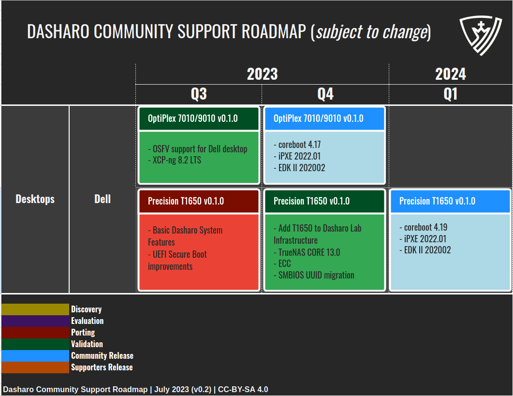
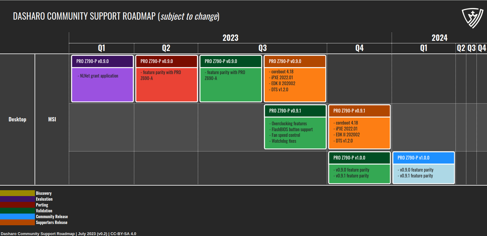

class: center, middle, intro

# Dasharo Roadmap

.center[]

---

# Dasharo Roadmap Disclaimer

_Please note that the roadmap for the Dasharo Community Support Program is
subject to change and may not represent final release candidates or end of
support dates. This roadmap is intended to provide guidance and direction for
the program's development, but is not a guarantee of specific timelines or
outcomes. For more information on release candidates or release dates, please
contact the Dasharo Team directly._

???

---

# Dasharo support levels

* Dasharo can support hardware under following programs:
    * Dasharo Enterprise Package (DEP) - custom SLA agreement.
        * Dasharo Support Package (DSP) - annual support package with releases driven
    by customer.
    * Dasharo Community Support (DCP)

???

The Dasharo Community Support Program is an open-source firmware support
initiative that leverages the expertise of community members and developers to
improve firmware solutions for a range of hardware models.

Platforms in scope of the program should comply with Dasharo quality criteria,
which we slowly gather in Dasharo Certification Program.

---

# Dasharo Support Models: DCS

.center.image-60[]

???

@startuml
!define Color1 #38d430
!define Color2 #272727
!define Color3 #f5f5f5

skinparam defaultFontColor Color2
skinparam defaultFontSize 14

skinparam BackgroundColor Color3
skinparam LegendBackgroundColor Color3

skinparam ArrowColor Color1
skinparam ArrowFontColor Color2

skinparam ClassBackgroundColor Color1
skinparam ClassFontColor Color2

skinparam ActorBackgroundColor Color1
skinparam ActorFontColor Color2

skinparam ComponentBackgroundColor Color1
skinparam ComponentFontColor Color2

skinparam PackageBackgroundColor Color1
skinparam PackageFontColor Color2

skinparam SequenceParticipantBackgroundColor Color1
skinparam SequenceParticipantFontColor Color2

skinparam StateBackgroundColor Color1
skinparam StateFontColor Color2

skinparam UseCaseBackgroundColor Color1
skinparam UseCaseFontColor Color2

title Dasharo Support Models: Dasharo Community Support

actor Customer
actor Community
participant "**Dasharo Entry**\n**Subscription (DES)**\n**Reseller**" as DESR
participant "**3mdeb**\n**(aka Dasharo Team)**" as ThreeMdeb

== Dasharo Supported Hardware ==
Customer -> ThreeMdeb : Buys hardware with DES
ThreeMdeb -> ThreeMdeb : Collect founds
Customer -> DESR : Buys hardware with DES
DESR -> DESR : Collects payment
DESR -> ThreeMdeb : Sends DES fee minus Reseller share
ThreeMdeb -> ThreeMdeb : Collect founds
== Enough founds for new DCS release ==
ThreeMdeb -> ThreeMdeb : Schedule new DES release
ThreeMdeb -> Customer: Deliver DES release
== <= 2x/year ==
ThreeMdeb -> ThreeMdeb : Schedule DCS release
ThreeMdeb -> Community: Deliver DCS release
@enduml

---

# Dasharo Support Models: DCS

.center.image-85[]

???

@startuml
!define Color1 #38d430
!define Color2 #272727
!define Color3 #f5f5f5

skinparam defaultFontColor Color2
skinparam defaultFontSize 14

skinparam BackgroundColor Color3
skinparam LegendBackgroundColor Color3

skinparam ArrowColor Color1
skinparam ArrowFontColor Color2

skinparam ClassBackgroundColor Color1
skinparam ClassFontColor Color2

skinparam ActorBackgroundColor Color1
skinparam ActorFontColor Color2

skinparam ComponentBackgroundColor Color1
skinparam ComponentFontColor Color2

skinparam PackageBackgroundColor Color1
skinparam PackageFontColor Color2

skinparam SequenceParticipantBackgroundColor Color1
skinparam SequenceParticipantFontColor Color2

skinparam StateBackgroundColor Color1
skinparam StateFontColor Color2

skinparam UseCaseBackgroundColor Color1
skinparam UseCaseFontColor Color2

title Dasharo Support Models: Dasharo Community Support

actor Customer
actor Sponsor
participant "**NLNet Foundation**" as NLNet
participant "**Technology Commons Trust**" as TCT
participant "**3mdeb**\n**(aka Dasharo Team)**" as ThreeMdeb

== Planned Dasharo Support ==
Customer -> ThreeMdeb : Buys Dasharo Entry Subscription (DES)
note right
  Just a newsletter subscription,
  which gives notifications
  and access to binaries,
  if/when DCS release for planned
  hardware would be available.
end note
ThreeMdeb -> ThreeMdeb : Collect founds
== Crypto-sponsored development ==
Sponsor -> TCT: "Anonymous" cryptocurrency donation
TCT -> NLNet: Founds available
== NLNet-sponsored development  ==
ThreeMdeb -> NLNet: Sends grant application
NLNet -> ThreeMdeb : Approve grant application
ThreeMdeb -> ThreeMdeb : Collect founds\nafter each milestone

@enduml

---

# Dasharo Community Support Process

.center[

]

???

* DCP means executing and delivering test results according to specs defined in
  earlier stages.
* This process shows how flow look like for new platforms, already supported
  platforms typically get through Validation/Release cycle.

---

# Dasharo Emulation Roadmap

.center[

]

???

* We were able finalize porting, code and documentation is public.
* Unfrotunately there was not enough time for finishing validation and
  publishing the release, because of that we shift by one quarter.

---

# Dasharo Desktop Roadmap

.center[

]

???

* ENOTIME, everything shifted to next quarter.

---

# Dasharo Desktop Roadmap

.center[

]

???

* Most changes regarding our support for MSI platforms.
* v1.1.2 validation and release would be squeezed in Q3 and we believe release
  should be published early, hopefully this month.
* additional release was added: v1.1.3
* v1.2.0 community release is shifted to Q1'23 and will cover v1.1.2 and v1.1.3
  features

---

# Dasharo Desktop Roadmap

.center[

]

???

* We were able to shift Z790-P porting to Q2'2023 (so release would be faster)
* First released version would be v0.9.0 (instead of v1.0.0)
* Then we plan v0.9.1 for which feature set is still under TBD
* Then we will release v1.0.0 for community which will cover v0.9.0 and v0.9.1
* Wherever it is possible we migrate to v0.9.0 as initial release to not give
  impression this is production ready.

---

# Dasharo Desktop Roadmap

.center[

]

???

* No change. We will discuss it during vPub with hanetzer

---

# Dasharo Workstation Roadmap

.center[

]

???

* We have no time to get back to KGPE-D16, there is some minimal interest and
  with Dasharo Revenue Sharing agreement in place some thing may change.
* We are on track with Dasharo release for Talos II and we plan to release it early Q3.

---

# Dasharo Server Roadmap

.center[

]

---

# Support Dasharo Today

* Buy Dasharo Supporter Entrance subscription for your platform.
* Available in 3mdeb shop: https://3mdeb.com/shop
* Available through our Revenue Sharing Partners:
    - Nitrokey: https://shop.nitrokey.com/shop
        - NovaCustom: https://configurelaptop.eu
* Help us find resellers interested in open-source firmware for their computers.
    - We looking for partners from Canada, US and Brazil (or other South America
    countries).
* Spread the word about Dasharo and our mission on social media and other platforms.
* Interested in other ways? Feel free to contact us contact@dasharo.com

.center[https://docs.dasharo.com/ways-you-can-help-us/]

---
class: center, middle, intro

# Q&A
