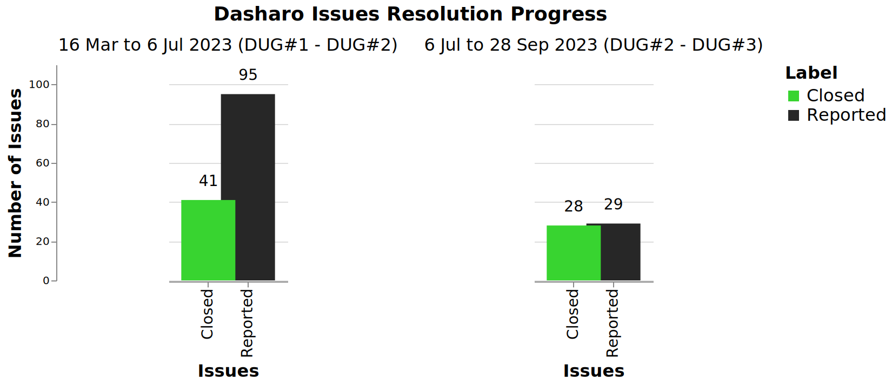
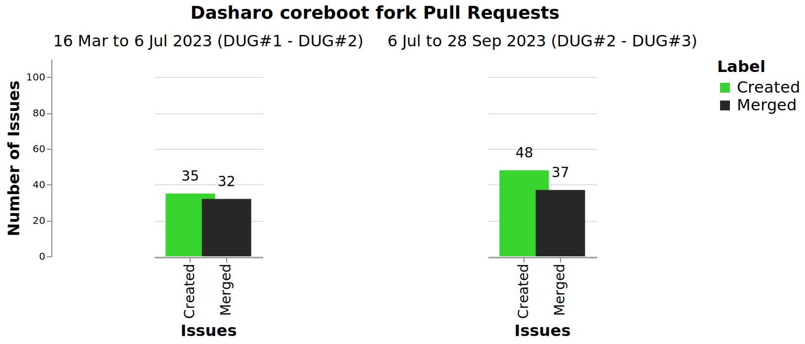

class: center, middle, intro

# &#x1F44B; Dasharo User Group #3 &#x1F389;

## Greetings, Agenda and Dasharo Community Status

.center[]

---

# Why we are here?

.center.image-85[]

???

* explain format of the meeting
* meeting is recorded and will be published on Youtube

---

# Agenda

### .center[&#x1F680; Dasharo User Group #3 Meeting Agenda &#x1F680;]

* #### &#x1F44B; 16:00 UTC Greetings, Agenda and Dasharo Community Status
* #### &#x1F9ED; 16:10 UTC NovaCustom Roadmap
* #### &#x1F9F0; 16:25 UTC Dasharo Tools Suite Status
* #### &#x1F9F0; 16:35 UTC Dasharo Openess Score Status
* #### &#x1F9F0; 16:50 UTC Nitrokey new products overview
* #### &#x1F4BB; 17:00 UTC Dasharo Community Release Roadmap
* #### &#x1F9F0; 17:40 UTC Dasharo Open Source Firmware Validation Announcement
* #### &#x1F44F; 17:55 UTC Closing remarks &#x27A1;&#xFE0F; &#x1F37A;&#x1F37B; vPub 0x8

???

TODO: try to say what specific will be presented as part of every presentation.

---

# Community Hearbeat &#x1F493;

.image-100[]

???

Date of data snapshot: 24/09/2023

* Commands cheat sheet
  - issues
    - gh issue list -s all -L 1000
    - gh issue list -s closed -L 1000
  - prs
    - gh pr list --state all
    - gh pr list --state merged
  - number of unique users active in Dasharo community
    - PAGER="less -R" gh issue list -s all -L 5000 --json author,comments --jq '.[].author.login'|sort|uniq|wc -l
  - count all comments
    - PAGER="less -R" gh issue list -s all -L 5000 --json comments --jq '.[].[].[].createdAt'
  - count how many comments each user posted
    - PAGER="less -R" gh issue list -s all -L 5000 --json comments --jq '.[].[].[].author.login'|sort|uniq -c|sort -h
  - matrix activity
    - fetching all communication may be not the most effective way to get data,
      there seem to be need for differential download
    - number of messages for DUG#3 snapshot: 25561
    - matrix comments per user:
	- grep -E "\-.+: " matrix\ -\ Dasharo\ -\ General\ -\ Chat\ Export\ -\ 2023-07-02T22-37-07.435Z.txt |cut -d"-" -f2|cut -d":" -f1|grep -E "^ "|sort|uniq -c|grep -v "banned"|sort -h|grep -v import|grep -v "'"|grep -v "removed"|grep -v coreboot

* TBD: look at community status of other projects, news?
  - consider news presentation with Dasharo status about the OpenSIL
* Documentation releases?

---

# Dasharo Issues

.center.image-99[]

* Experiments with presenting other data. Feedback welcome.
* In Q2'23 we definitely had more active testers then Q3'23 so far.
* Dasharo Team and community focused more on features then bug fixes.

???

- gh issue list -s all -L 1000
- gh issue list -s closed -L 1000

---

# Dasharo PRs

.center.image-99[]

* In comparison to previous statistics we can see more code related activity
  (mostly MSI stuff).
* Marging and development tempo is higher if we consider time frame.

???

* created are obtained by counting all opened PRs minus all opened PRs reported
  at last DUG
  - gh pr list --state all
* merged are counted manually from 
  - gh pr list --state merged

---

# Dasharo Space on Matrix

* 22 channels (most active: General, Support, Random)
* 2 new channels
  - **qubes-summit** - dedicated to Qubes OS Summit coorganized by ITL and 3mdeb
    (https://qubes.3mdeb.com)
  - **Dasharo OSFV** - channel dedicated to Open Source Firmware Validation
    with focus on Dasharo Team maintained Robot Framework infrstructure and
    Dasharo Certification Lab. More about that in other presentation.
* Libera bridge is suspended, so we are disconnect from IRC.
* Dasharo Disord is misconfigured - currently we have no resources to bring
  that channel back, we can reconsider that if there would be any interest.
* Dasharo Space on Matrix is official communication channel and since more and
  more communities migrate to Matrix we will most likely stick with it.

---
class: center, middle, intro

# Q&A
