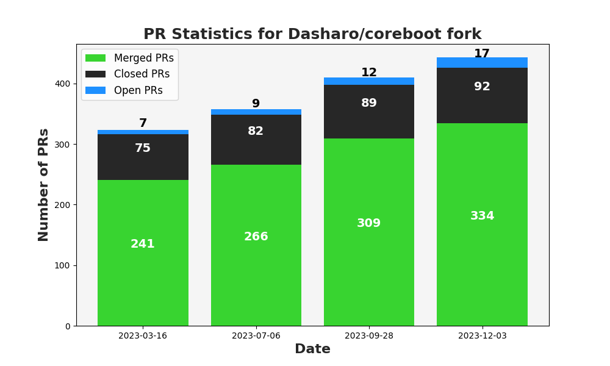
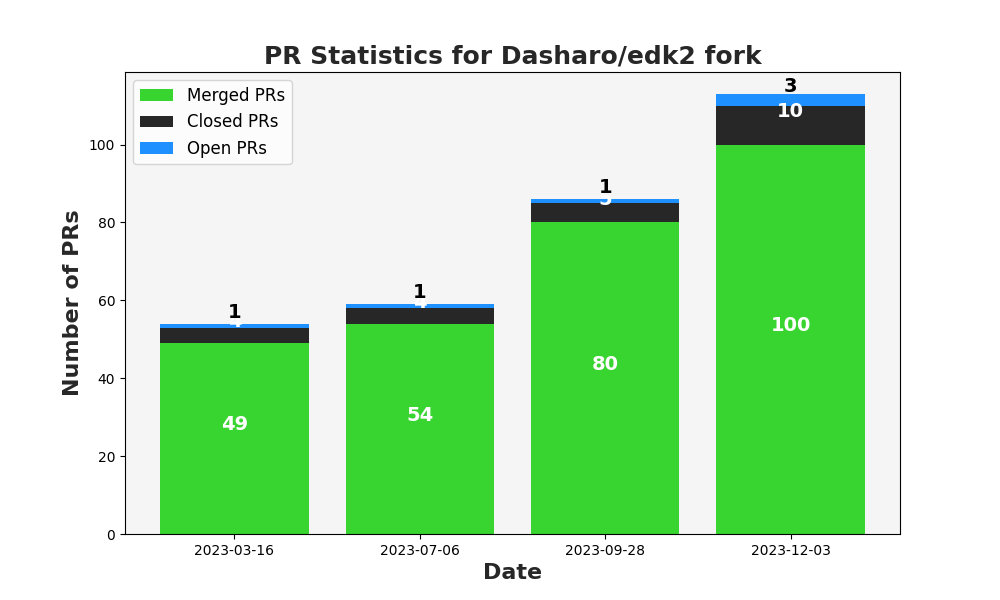
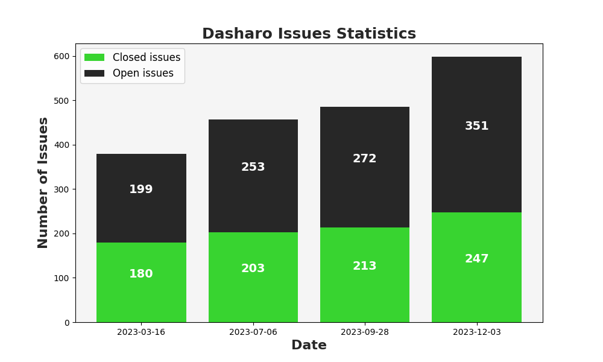
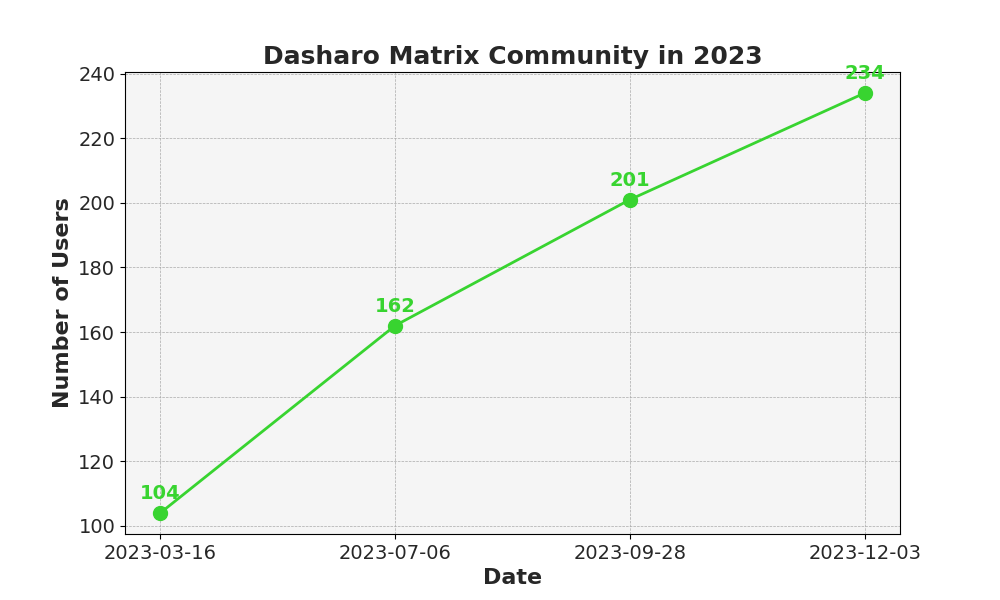

class: center, middle, intro

# &#x1F44B; Dasharo User Group #4 &#x1F389;

## Greetings, Agenda and Dasharo Community Status

.center[]

---

# Why we are here?

.center.image-85[]

???

* explain format of the meeting
* meeting is recorded and will be published on Youtube

---

# Agenda

### .center[&#x1F680; Dasharo User Group #3 Meeting Agenda &#x1F680;]

* #### &#x1F44B; 17:00 UTC Greetings, Agenda and Dasharo Community Status

* #### &#x1F9ED; 17:10 UTC Dasharo Tools Suite Status

* #### &#x1F9F0; 17:25 UTC Dasharo Configuration Utility Introduction

* #### &#x1F9F0; 17:40 UTC Open Source Firmware Validation Status

* #### &#x1F9F0; 18:00 UTC Dasharo Community Release Roadmap

* #### &#x1F4BB; 18:45 UTC NovaCustom-Dasharo: Call for Beta Testers

* #### &#x1F44F; 18:55 UTC Closing remarks &#x27A1;&#xFE0F; &#x1F37A;&#x1F37B; vPub 0x9

???

TODO: try to say what specific will be presented as part of every presentation.

---

# Community Heartbeat &#x1F493;

.image-100[]

???

Date of data snapshot: 03/12/2023

* Consider replacement of that graphics with:
    - https://github.com/lowlighter/metrics/blob/master/source/plugins/followup/README.md
* Commands cheat sheet
    - issues
        - gh issue list -s all -L 1000
        - gh issue list -s closed -L 1000
    - prs (Dasharo/coreboot, Dasharo/edk2)
        - all: gh pr list --state all - provide all PRs number as well as diff from last DUG
        - merged: gh pr list --state merged  - provide all PRs merged number as well
      as diff from last DUG
        - closed: gh pr list --state closed  - provide all PRs closed number as well
      as diff from last DUG, to calculate it you have to calculate difference
      between closed and merged number
    - number of unique users active in Dasharo community
        - PAGER="less -R" gh issue list -s all -L 5000 --json author,comments --jq '.[].author.login'|sort|uniq|wc -l
    - count all comments
        - PAGER="less -R" gh issue list -s all -L 5000 --json comments --jq '.[].[].[].createdAt'|wc -l
    - count how many comments each user posted
        - PAGER="less -R" gh issue list -s all -L 5000 --json comments --jq '.[].[].[].author.login'|sort|uniq -c|sort -h
    - matrix activity
        - fetching all communication may be not the most effective way to get data (general: 00:11-TBD),
      there seem to be need for differential download, but it looks like matrix
      does not support that
        - number of messages for DUG#4 snapshot:
        - matrix comments per user:
        - grep -E "\-.+: " matrix\ -\ Dasharo\ -\ General\ -\ Chat\ Export\ -\ 2023-07-02T22-37-07.435Z.txt |cut -d"-" -f2|cut -d":" -f1|grep -E "^ "|sort|uniq -c|grep -v "banned"|sort -h|grep -v import|grep -v "'"|grep -v "removed"|grep -v coreboot

* TBD: look at community status of other projects, news?
    - consider news presentation with Dasharo status about the OpenSIL
    - maybe announcements section
* Documentation releases?
    - in long run everything should be a release, it would be easier to track
    ideas related to improvements of given area of development

---

# Dasharo/coreboot PRs

.center.image-80[]

* Experiment v2 with data presentation.
* Since DUG#3 we merged 25 PRs, what is average results for Dasharo/coreboot.

---

# Dasharo/edk2 PRs

.center.image-80[]

* EDK II fork activity is similar to coreboot fork.
* We merged 20 PRs.

---

# Dasharo Issues

.center.image-80[]

* We resolved healthy amount of issues (34) since last DUG.
* We also faced biggest activity in this year regarding issue reporting, what
  was partially caused by Novacustom releases.

---

# Dasharo Matrix

.center.image-80[]

* We more then double the size of our community over last 9 months.
* We would like to thank you for your contribution to growth of Dasharo.

---
class: center, middle, intro

# Q&A
