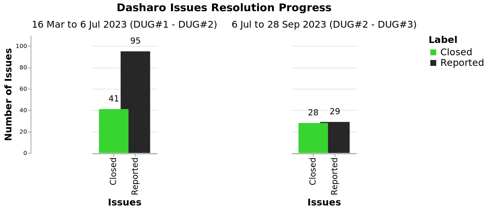

class: center, middle, intro

# &#x1F44B; Dasharo User Group #4 &#x1F389;

## Greetings, Agenda and Dasharo Community Status

.center[]

---

# Why we are here?

.center.image-85[]

???

* explain format of the meeting
* meeting is recorded and will be published on Youtube

---

# Agenda

### .center[&#x1F680; Dasharo User Group #3 Meeting Agenda &#x1F680;]

* #### &#x1F44B; 17:00 UTC Greetings, Agenda and Dasharo Community Status
* #### &#x1F9ED; 17:10 UTC Dasharo Tools Suite Status
* #### &#x1F9F0; 17:25 UTC Dasharo Configuration Utility Introduction
* #### &#x1F9F0; 17:40 UTC Open Source Firmare Validation Status
* #### &#x1F9F0; 18:00 UTC Dasharo Community Release Roadmap
* #### &#x1F4BB; 18:45 UTC NovaCustom-Dasharo: Call for Beta Testers
* #### &#x1F44F; 18:55 UTC Closing remarks &#x27A1;&#xFE0F; &#x1F37A;&#x1F37B; vPub 0x9

???

TODO: try to say what specific will be presented as part of every presentation.

---

# [TBD] Community Hearbeat &#x1F493;

.image-100[]

???

Date of data snapshot: 03/12/2023

* Consider replacement of that graphics with:
  - https://github.com/lowlighter/metrics/blob/master/source/plugins/followup/README.md
* Commands cheat sheet
  - issues
    - gh issue list -s all -L 1000
    - gh issue list -s closed -L 1000
  - prs (Dasharo/coreboot, Dasharo/edk2)
    - all: gh pr list --state all - privde all PRs number as well as diff from last DUG
    - merged: gh pr list --state merged  - privde all PRs merged number as well
      as diff from last DUG
    - closed: gh pr list --state closed  - privde all PRs closed number as well
      as diff from last DUG, to calculate it you have to calculate difference
      between closed and merged number
  - number of unique users active in Dasharo community
    - PAGER="less -R" gh issue list -s all -L 5000 --json author,comments --jq '.[].author.login'|sort|uniq|wc -l
  - count all comments
    - PAGER="less -R" gh issue list -s all -L 5000 --json comments --jq '.[].[].[].createdAt'|wc -l
  - count how many comments each user posted
    - PAGER="less -R" gh issue list -s all -L 5000 --json comments --jq '.[].[].[].author.login'|sort|uniq -c|sort -h
  - matrix activity
    - fetching all communication may be not the most effective way to get data (general: 00:11-TBD),
      there seem to be need for differential download, but it looks like matrix
      does not support that
    - number of messages for DUG#4 snapshot: 
    - matrix comments per user:
	- grep -E "\-.+: " matrix\ -\ Dasharo\ -\ General\ -\ Chat\ Export\ -\ 2023-07-02T22-37-07.435Z.txt |cut -d"-" -f2|cut -d":" -f1|grep -E "^ "|sort|uniq -c|grep -v "banned"|sort -h|grep -v import|grep -v "'"|grep -v "removed"|grep -v coreboot

* TBD: look at community status of other projects, news?
  - consider news presentation with Dasharo status about the OpenSIL
  - maybe announcements section
* Documentation releases?
  - in long run everything should be a release, it would be easier to track
    ideas related to improvements of given area of development

---

# [TBD] Dasharo Issues

.center.image-99[]

* Experiments with presenting other data. Feedback welcome.
* In Q2'23 we definitely had more active testers then Q3'23 so far.
* Dasharo Team and community focused more on features then bug fixes.

???

- gh issue list -s all -L 1000
- gh issue list -s closed -L 1000

---

# [TBD] Dasharo PRs

.center.image-99[]

* In comparison to previous statistics we can see more code related activity
  (mostly MSI stuff).
* Marging and development tempo is higher if we consider time frame.

???

* created are obtained by counting all opened PRs minus all opened PRs reported
  at last DUG
  - gh pr list --state all
* merged are counted manually from 
  - gh pr list --state merged

---

# Dasharo Space on Matrix

* 22 channels (most active: General, Support, Random) - no change
* Dasharo Space on Matrix is official communication channel and since more and
  more communities migrate to Matrix we will most likely stick with it.

---

# PC Engines custom builds

TODO: add picture and couple words about PC Engines custom builds

???

Is this news section?

---
class: center, middle, intro

# Q&A
