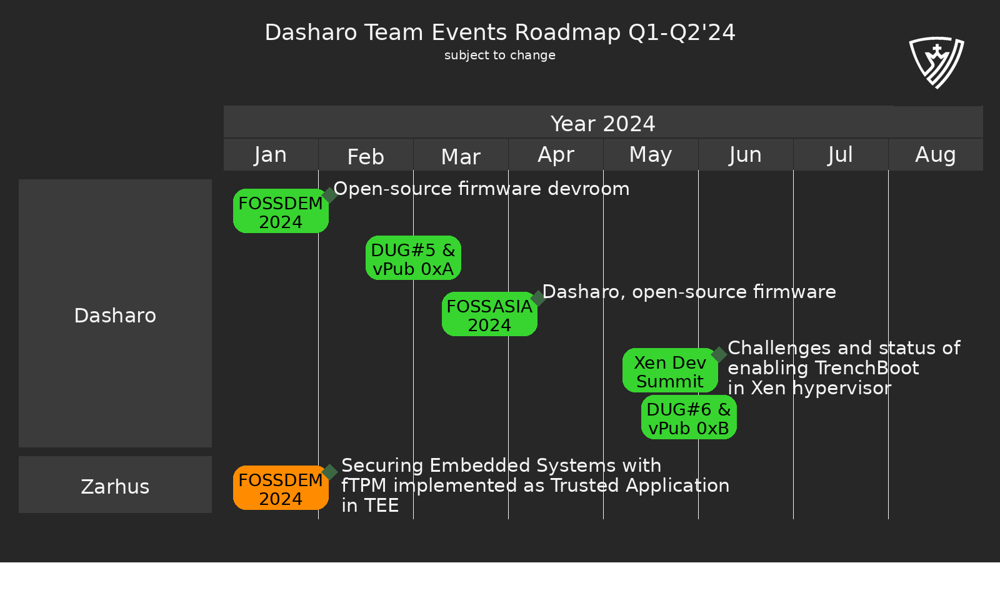
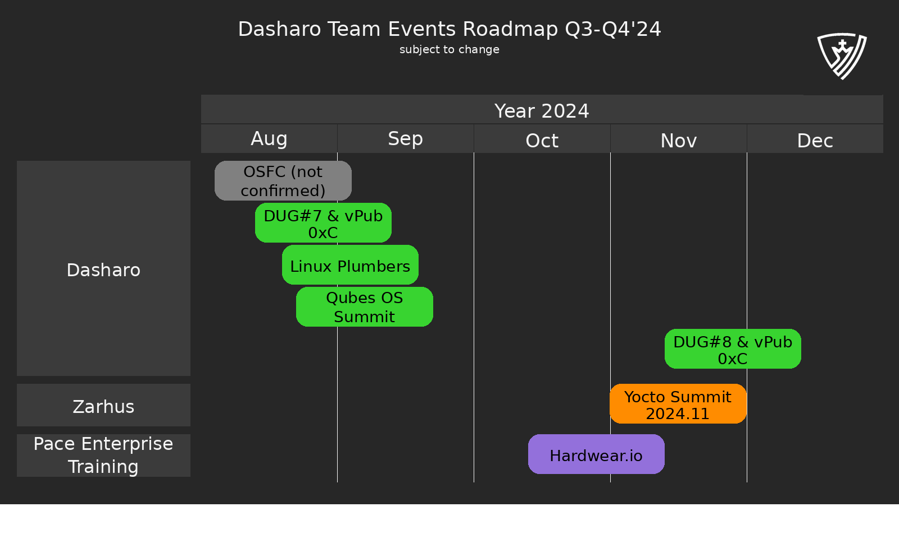
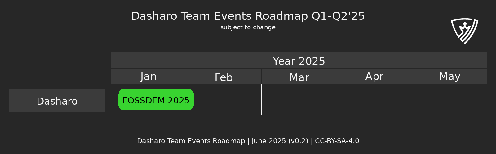

class: center, middle, intro

# &#x1F44B; Dasharo User Group #6 &#x1F389;

## Dasharo Community Status

.center[]

???

<!--
SPDX-FileCopyrightText: 2024 3mdeb <contact@3mdeb.com>

SPDX-License-Identifier: CC-BY-SA-4.0
-->

Date of previous data snapshot: 11/03/2023
Date of data snapshot: 02/06/2024

---

# Agenda

- DUG and vPub infrastructure transparency
- Events page updates
- Dasharo Team Events Roadmap
- Dasharo Issues repo stats
- Dasharo coreboot and edk2 forks repos stats
- Dasharo Matrix stats

---

# Dasharo Website Roadmap

---

# Dasharo Events Roadmap Q1-Q2'24

.center.image-100[]

---

# Dasharo Events Roadmap Q3-Q4'24

.center.image-100[]

---

# Dasharo Events Roadmap Q1-Q2'24

.center.image-100[]

---

# Dasharo Issues

.center.image-50[]
.center.image-80[]

???

Modify and run:
./diagrams/dasharo_issues.py

---

# Dasharo Issues

### .center[Comments]

.center.image-50[]

### .center[Top Contributors]

.center.image-60[]

???

Following should be run in dasharo-issues repo, gh command should be installed:

- number of unique users active in Dasharo community
  - PAGER="less -R" gh issue list -s all -L 5000 --json author,comments --jq '.[].author.login'|sort|uniq|wc -l
- count all comments
  - PAGER="less -R" gh issue list -s all -L 5000 --json comments --jq '.[].[].[].createdAt'|wc -l
- count how many comments each user posted
  - PAGER="less -R" gh issue list -s all -L 5000 --json comments --jq '.[].[].[].author.login'|sort|uniq -c|sort -h

---

# Dasharo/coreboot PRs

.center.image-50[]
.center.image-80[]

???

Modify and run:
./diagrams/dasharo_forks.py

---

# Dasharo/coreboot upstreaming

.center.image-50[]
.center.image-80[]

---

# Dasharo/coreboot upstreaming

### .center[Delta `dasharo` branch vs upstream v4.21 tag]

#### .center[`473 files changed, 22692 insertions(+), 2379 deletions(-)`]

### .center[Top Upstreamers]

- **Sergii Dmytruk (sergiid):** +1869/-42
  - _util: add smmstoretool for editing SMMSTORE_
- **Michał Kopeć (mkc):** +854
  - _mb/lenovo: Add ThinkCentre M700/M900 Tiny board (Skylake/Kaby Lake)_
- **Michał Żygowski (miczyg):** +183/-31
  - _device/pciexp_device.c: Fix setting Max Payload Size_

???

```bash
./contribution-stats list -r coreboot -s 12/03/2023 -o dug5.csv
./contribution-stats list -r coreboot -s 09/28/2023 -e 12/03/2023 -o dug4.csv
./contribution-stats list -r coreboot -s 07/06/2023 -e 09/28/2023 -o dug3.csv
./contribution-stats list -r coreboot -s 03/16/2023 -e 07/06/2023 -o dug2.csv
awk -F';' '{sum += $6} END {print sum}' dug4.csv #added lines
awk -F';' '{sum += $7} END {print sum}' dug4.csv #removed lines
```

---

# Dasharo/edk2 PRs

.center.image-50[]
.center.image-80[]

---

# Dasharo star history

.center.image-80[]

???

https://star-history.com/#Dasharo/coreboot&Dasharo/docs&Dasharo/dasharo-issues&2024-03-12

---

# Dasharo Matrix

### .center[Messages and Users]

.center.image-50[]

### .center[Top contributors]

.center.image-50[]

???

Getting number of messages for every user:
grep -E "\-.+:\s" matrix\ -\ Dasharo\ -\ General\ -\ Chat\ Export\ -\ 2024-03-12T11-16-54.063Z.txt |cut -d"-" -f2|cut -d":" -f1|grep -E "^ "|sort|uniq -c|grep -v "banned"|sort -h|grep -v import|grep -v "'"|grep -v "removed"|grep -v coreboot

To count messages add after pipe:
awk '{sum += $1} END {print sum}'

---

# Dasharo Matrix

.center.image-90[]

---

# Dasharo Matrix

### .center[Most active Dasharo Community Matrix channels]

.center[Random (`#dasharo-random:matrix.org`)]
.center[Support (`#dasharo-support:matrix.org`)]
.center[Dasharo Developers vPub (`#dasharo-osf-vpub:matrix.org`)]

???

General: 29764
Random: 7211
Support: 3322
vPub: 3050
Supermicro: 1640
OSFV: 825
Announcements: 187
Laptops: 187

---

class: center, middle, intro

# Q&A

> > > > > > > 6929b1d0898b (dug_6_dasharo_community_status: initial commit)
