## Dasharo Open Source Firmware Validation Status

<center></center>

---

# <center> Agenda </center>

* Short introduction to OSFV
* Stats
* Improvements
* Work in progress & future plans
* Q&A

---
layout: cover
background: /intro.png
class: text-center
---

# <center> Introduction to Open Source Firmware Validation </center>

---

# <center> Introduction to Open Source Firmware Validation </center>

- Open Source Validation of Open Source Firmware
- Based on Robot Framework
- Allows us to perform hundreds of automated tests
  to ensure the quality of Dasharo

For more details check the previous OSFV Status presentations at
[DUG #08](https://cfp.3mdeb.com/developers-vpub-0xd-2024/schedule/) and [DUG #06](https://cfp.3mdeb.com/developers-vpub-0xb-2024/schedule/).


---
layout: cover
background: /intro.png
class: text-center
---

# OSFV Stats

---

# <center> Releases? </center>

We have decided on switching to a rolling release for now

<center>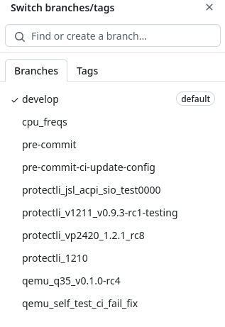</center>

<!--
- releases happened rarely
- main was far behind develop which was confusing
- according to previous OSFV status
- will stay as a rolling release "for now"
-->

---

# <center> PR stats </center>
### <center> open-source-firmware-validation </center>
#### <center> Total </center>

<center>
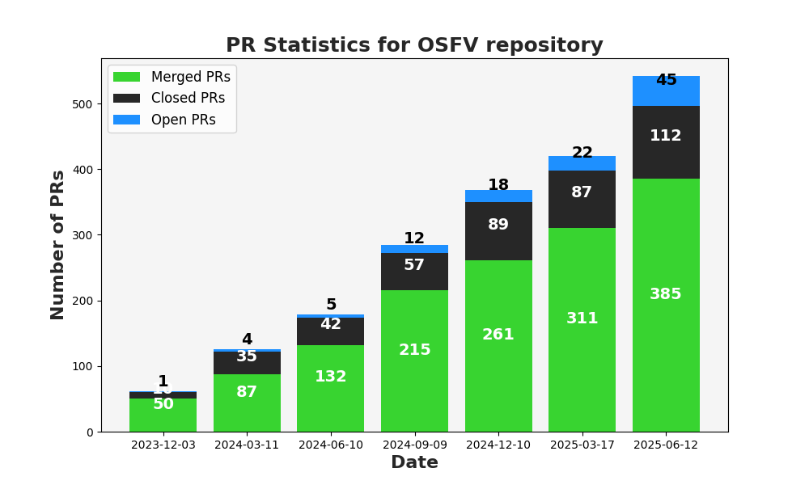
</center>

<!--

-->

---

# <center> PR stats </center>
### <center> open-source-firmware-validation </center>
#### <center> Difference </center>

<center>
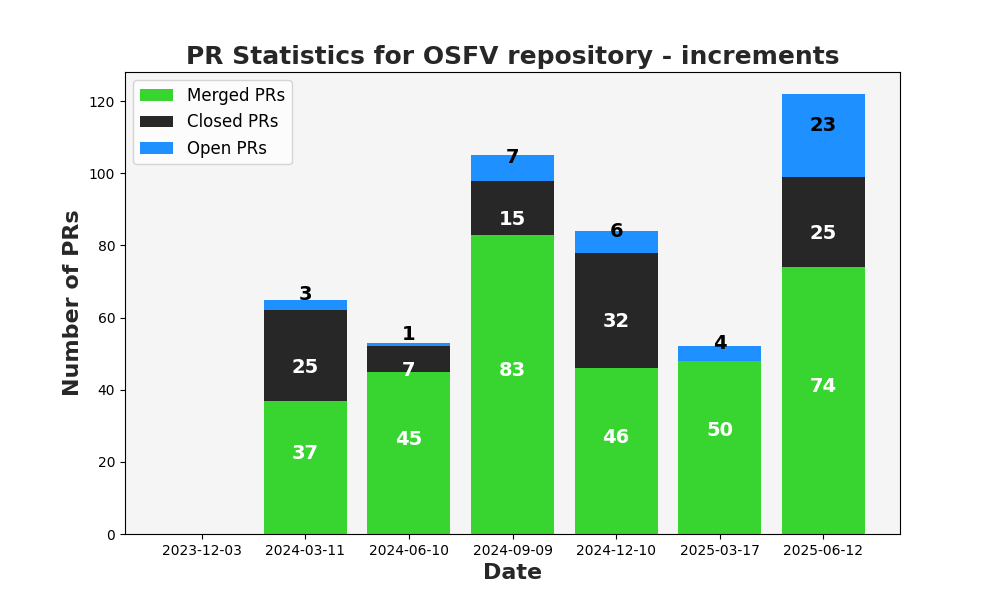
</center>

<!--
steady pace of development
-->

---

# <center> Test modules stats </center>
#### <center> Total test cases </center>

<center>

</center>

### <center><b>990</b> total test cases!</center>

---

# <center> Test modules stats </center>
#### <center> Difference </center>

<center>
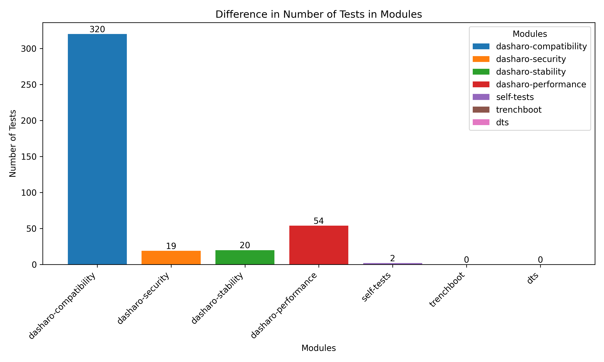
</center>

### <center>Total count increased by **415** since DUG #09</center>

---

# <center> New test cases </center>

* Added FBT suite testing the fast boot feature
* Added ACPI suite testing ACPI drivers
* Added USC suite testing the Always On USB feature
* Added multiple benchmark test suites:
  + UPP, CPP, ETHPERF, DIO
  + testing the CPU, Ethernet and disks performance
* Automated the CBO - Custom Boot Order test suite
* Automated most of the AUD tests
* Extended NVM suite with an NVMe on x2 PCIe test
* Extended TPM suite with tests for the TPM Physical Presence Interface and changing the Endorsement Primary Seed
* Extended UTC Docking station tests with variants for every docking station, ME enabled/disabled

<!--
- ACPI - Advanced Configuration and Power Interface
- UPP, CPP - CPU benchmarks
- ETHPERF - Ethernet network performance benchmars
- DIO - Disk IO benchmarks
- AUD - all features related to audio
- NVM - NVMe support
- UTC - USB Type-C support,
-->

---

# <center> New platforms </center>

* Protectli VP2440
  + 2x10 GBps Ethernet
  + available next quarter
<center>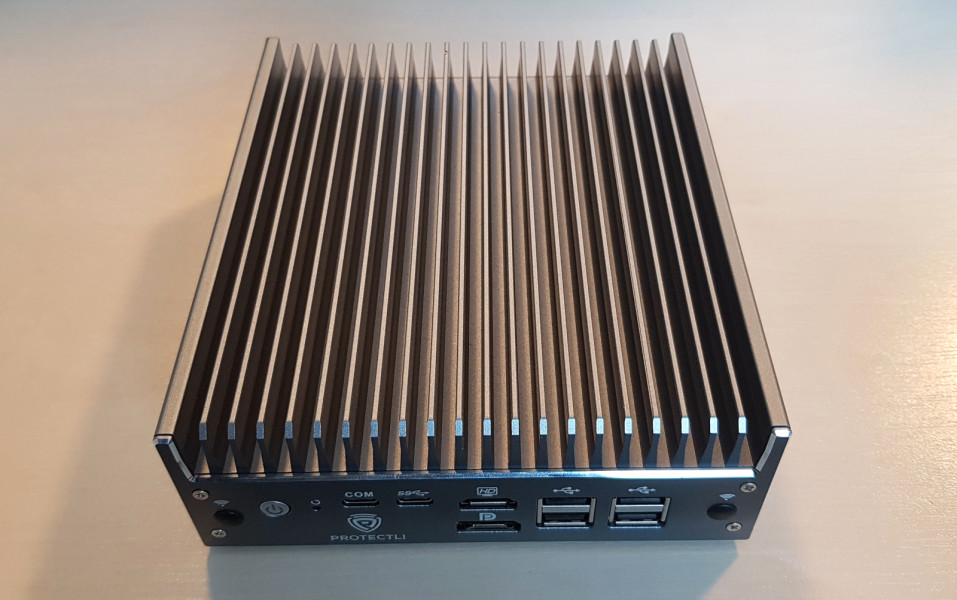</center>
<!--
2x10Gbps Ethernet ports over 4x2.5 i 2430
-->

---
layout: cover
background: /intro.png
class: text-center
---

# Key changes

---

# <center> Fedora support </center>

Most test cases are also possible to run on Fedora.
The [test ID naming convention](https://github.com/Dasharo/open-source-firmware-validation/blob/develop/docs/tests-naming-convention.md) has changed to support the increasing count of supported operating systems

<span color="green">CPU</span><span color="blue">001</span>.<span color="red">201</span> CPU works (Ubuntu)
* <span color="green">CPU</span> - Test suite ID - `CPU Status`
* <span color="blue">001</span> -Test case ID - `CPU works`
* <span color="red">201</span> - Environment ID - `Ubuntu`

Environment ID examples:
* `101` - EDK2 UEFI
* `201` - Ubuntu, `202` - Fedora, `203` - QubesOS
* `301` - Windows

<!--
We are ready to support much more OSes in the future
-->

---

# <center> Fedora support </center>

<center>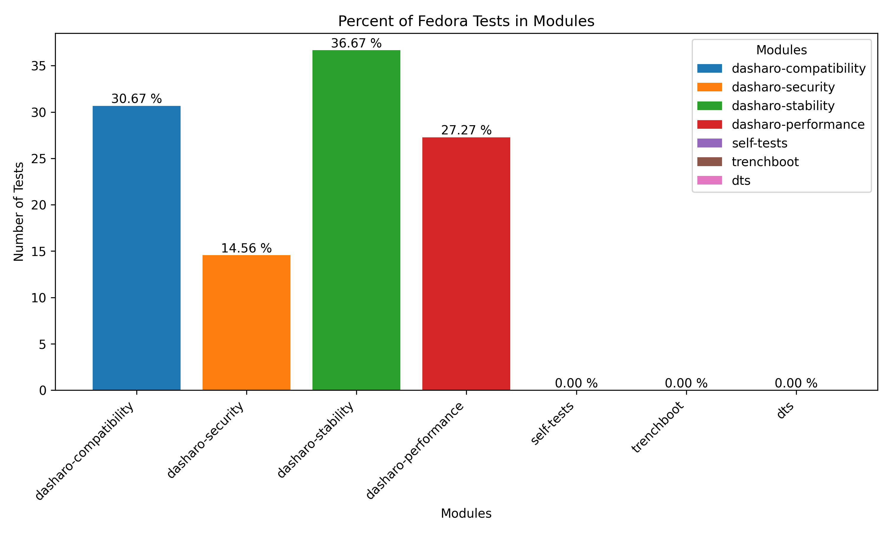</center>

<!--
many test cases can also be performed on Fedora
every test case *Will* be possible to be performed on Fedora

Its the % of total test cases on Fedora
perfect score is ~33-50% (we also test Ubuntu and Windows)

-->

---

# <center> DeGoogle </center>

Dasharo Test & Feature Matrix at Google Docs is now deprecated

<center>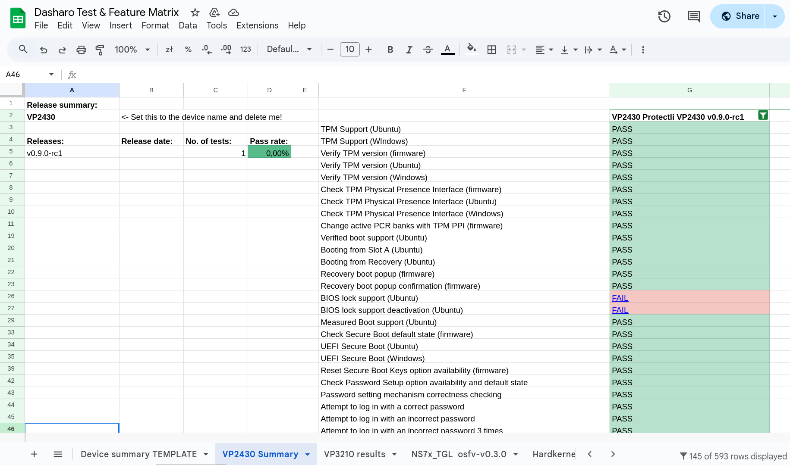</center>

<!--

wyniki pozakaz a nie readme

Dasharo Test & Feature matrix going deprecated and is no longer used.
Test results published at osfv-results
-->

---

# <center> OSFV results </center>

The test results are now being published on the [OSFV Results repo](https://github.com/Dasharo/osfv-results/)

<center>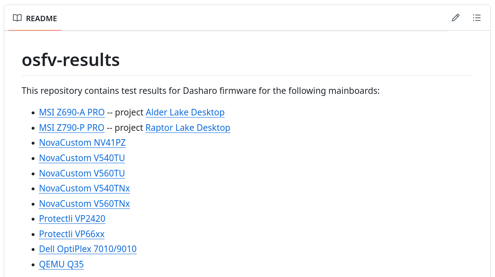</center>
<!--
Model families listed in README
Lets pick the VP66xx series
-->

---

# <center> OSFV results </center>

<center>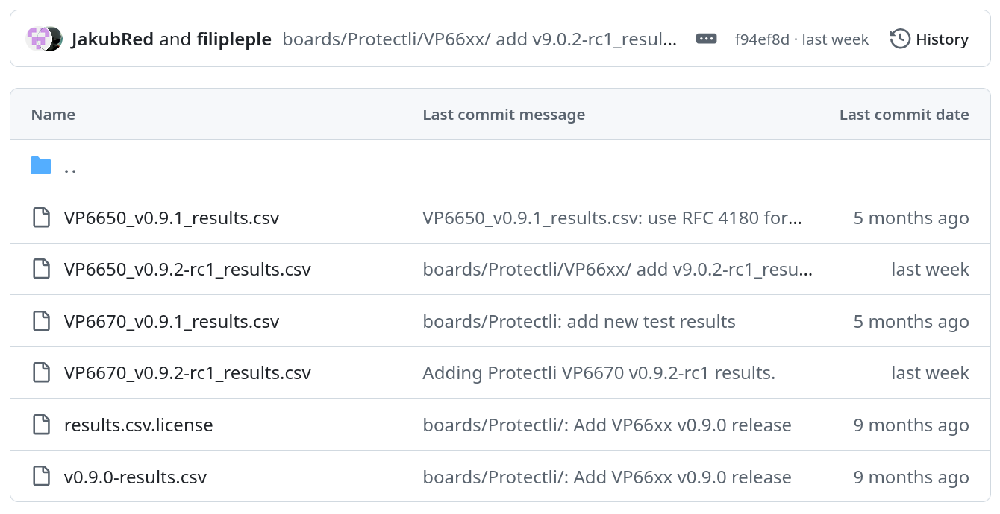</center>

<!--
A new release candidate last week
lets check the VP6650 v0.9.2-rc1
-->
---

# <center> OSFV results </center>

<center>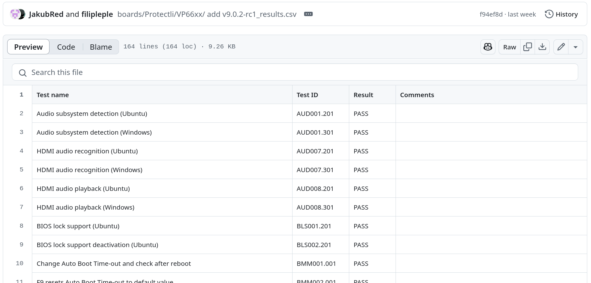</center>

<!--
All the results shown with
URLs to issues in case of fails

Let's check if WiFi and Bluetooth works
simply ctrl+f "wifi"
-->

---

# <center> OSFV results </center>

<center>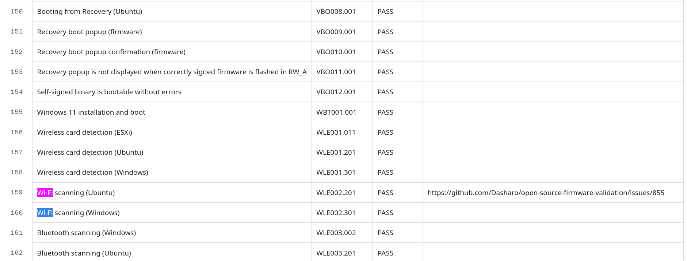</center>

---

# <center> OSFV results </center>

<center>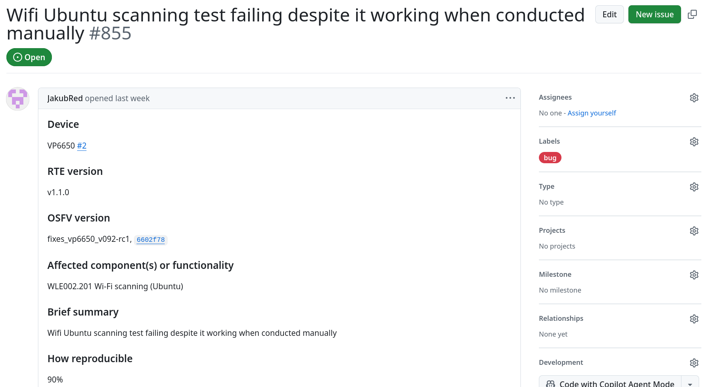</center>

---

# <center> Manual test documentation deprecated </center>

[docs.dasharo/unified-test-documentation](https://docs.dasharo.com/unified-test-documentation/overview/)

Manual tests will be slowly transferred to OSFV to reduce redundancy and improve coherence

<center>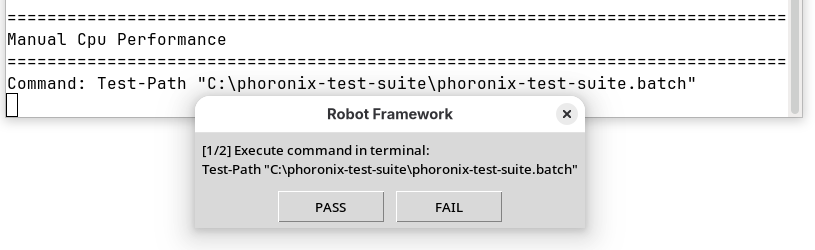</center>
<center>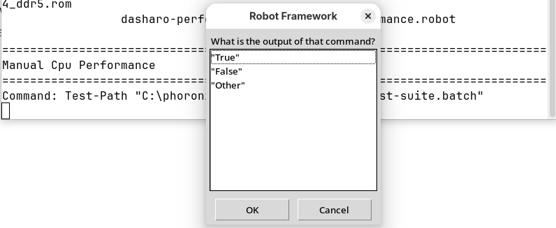</center>

<!--
- Keeping it in sync with OSFV turned out impractical
- often contradicted themselves
- Manual cases will be implemented in Robot
 -->
---

# <center> Adding HW tests to OSFV CI </center>

</br>
Performing CI tests on real hardware will greatly improve the reliability of OSFV

- The work is in progress
- Two representatives prepared as a start
    <center><table>
    <tr>
    <td>MSI Z690 DDR4 i5 14600k</td><td>PC Engines APU3C AMD GX-412TC</td>
    </tr>
    <tr>
    <td></td>
    <td>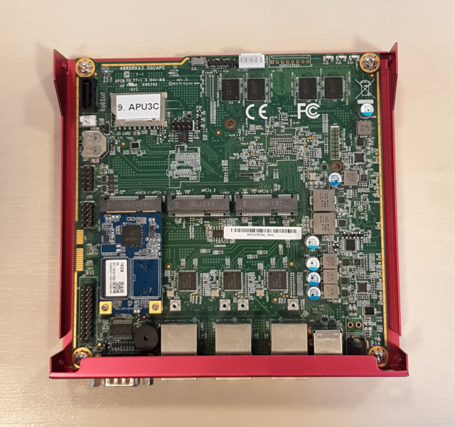</td>
    </tr>
    </table></center>

<!--
- WIP, no exciting results yet
- Two representatives prepared to be used for CI
-->
---

# <center> Adding HW test to CI </center>
## <center> Automatic test scope determining </center>

<center>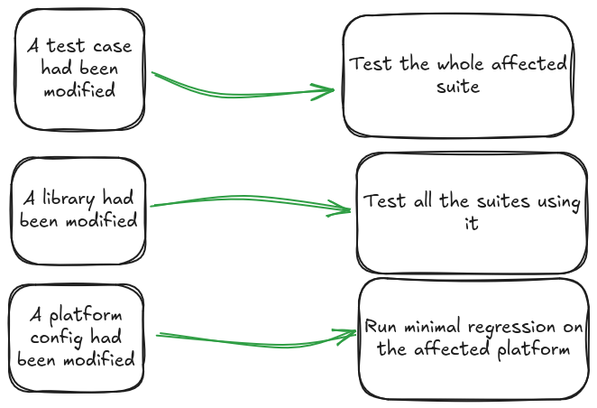</center>
<!--
https://excalidraw.com/#json=qmgEKuh9t2q5LzVA6gHZ7,DBQpMBlSFCkvUrsJ3lDkoQ
-->

<!--
- platform config tests won't be in CI in the near future
- it would require attaching most of our platforms to CI at once
 -->

---

# <center> Priorities for the future </center>

* CI tests on real hardware on every PR
  * Ensuring nothing unexpected breaks on changes
* Full SeaBIOS support is still on the roadmap

<!--
- We've identified that uncaught bugs severely hurt the release cycle
- CI is the main priority for the next quarter
- More reliability means shorter release cycle
  - fixes are being added on every regression
  - undesirable

- no exciting updated on SeaBIOS support
-->

---
layout: cover
background: /intro.png
class: text-center
---
# <center> Thank you! </center>
<!--
Current state
Changes:
- Enforcing the test naming convention
  - the bulk amount of tests we perform
  - how to look for the results, how to find the features you are
    interested in
- A summary of improvements and additions regarding the test cases and supported platforms
- Deprecation of Dasharo Test Specification at docs.dasharo.com
- FTDI converters for laptops

Future plans:
- Development of a new tool for managing Dasharo releases and the testing process
  - still in progress, but can do a little highlight

-->

---
layout: cover
background: /intro.png
class: text-center
---
# <center> Bonus content </center>

---

# <center> OSFV Dashboard </center>

Working on our own tool for documenting and publishing test results
<center></center>

---

# <center> OSFV Dashboard </center>

Will include details of manual tests, causes of fails and links to issues and
logs from the tests.

A large step towards the best documentation and repeatibility of the testing process

<center>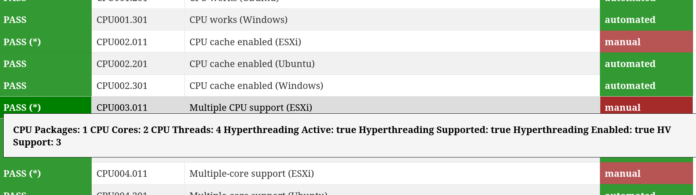</center>

---

# <center> PR stats </center>
### <center> osfv-scripts </center>
#### <center> Total </center>

<center>
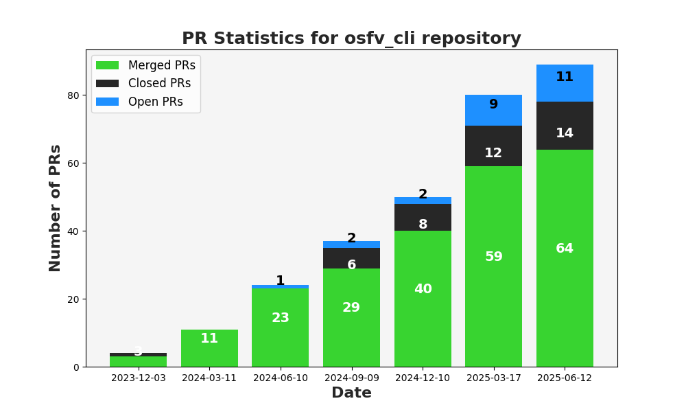
</center>

---

# <center> PR stats </center>
### <center> osfv-scripts </center>
#### <center> Difference </center>

<center>
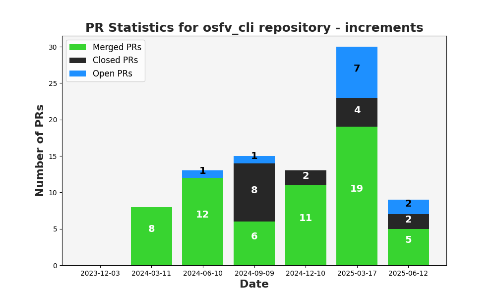
</center>

---

# <center> Power On finally reliable </center>

OSFV CLI uses the Power LED to determine the state of the platform
```shell
fgolas in ~ λ osfv_cli rte --rte_ip 192.168.10.198 pwr pwr_led
DUT model retrieved from snipeit: V1410
Using rte command is invasive action, checking first if the device is not used...
Asset 150 is already checked out by you
Power LED state: OFF

fgolas in ~ λ osfv_cli rte --rte_ip 192.168.10.198 pwr on
DUT model retrieved from snipeit: V1410
Using rte command is invasive action, checking first if the device is not used...
Asset 150 is already checked out by you
Powering on...

fgolas in ~ λ osfv_cli rte --rte_ip 192.168.10.198 pwr pwr_led
DUT model retrieved from snipeit: V1410
Using rte command is invasive action, checking first if the device is not used...
Asset 150 is already checked out by you
Power LED state: ON
```

---

# <center> Power On finally reliable </center>

```shell
fgolas in ~ λ osfv_cli rte --rte_ip 192.168.10.198 pwr pwr_led
DUT model retrieved from snipeit: V1410
Using rte command is invasive action, checking first if the device is not used...
Asset 150 is already checked out by you
Power LED state: ON

fgolas in ~ λ osfv_cli rte --rte_ip 192.168.10.198 pwr off
DUT model retrieved from snipeit: V1410
Using rte command is invasive action, checking first if the device is not used...
Asset 150 is already checked out by you
Powering off...

fgolas in ~ λ osfv_cli rte --rte_ip 192.168.10.198 pwr pwr_led
DUT model retrieved from snipeit: V1410
Using rte command is invasive action, checking first if the device is not used...
Asset 150 is already checked out by you
Power LED state: OFF
```

---
layout: cover
background: /intro.png
class: text-center
---

# <center> Thank you! #2 </center>
