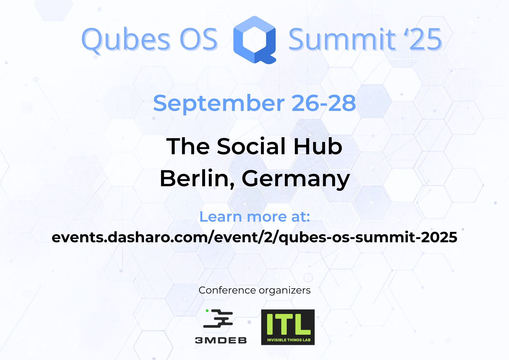
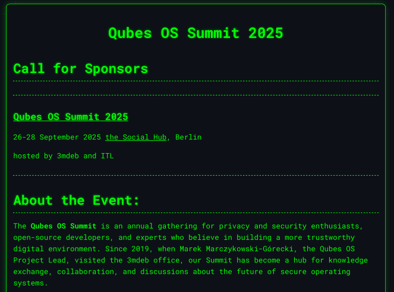
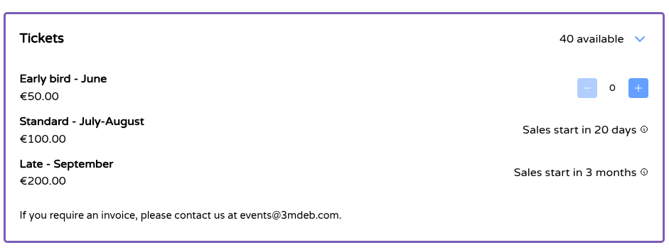
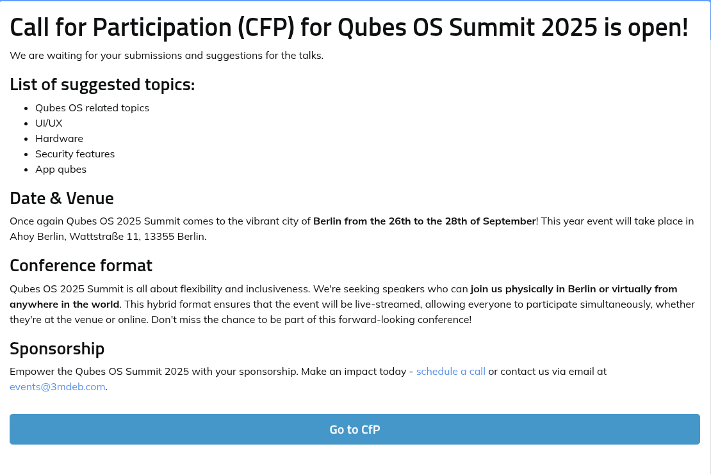
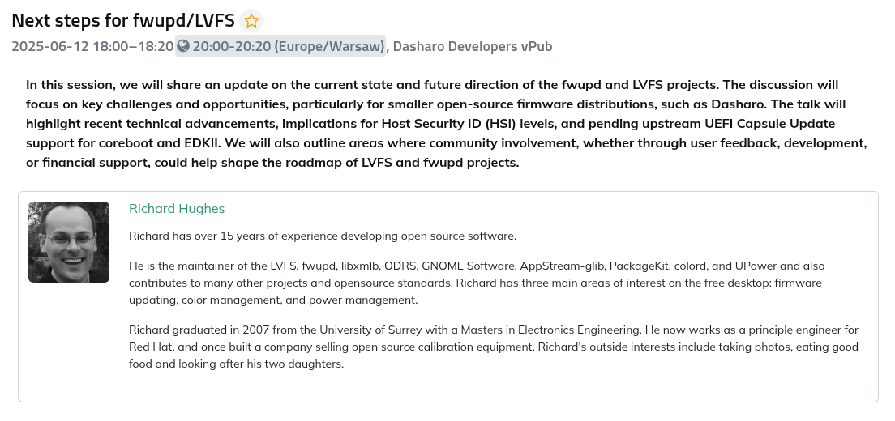
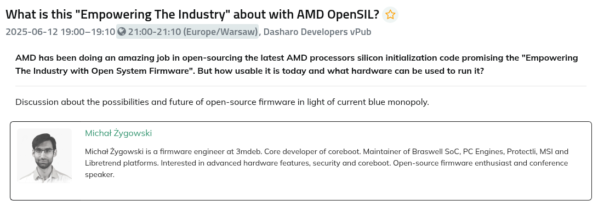
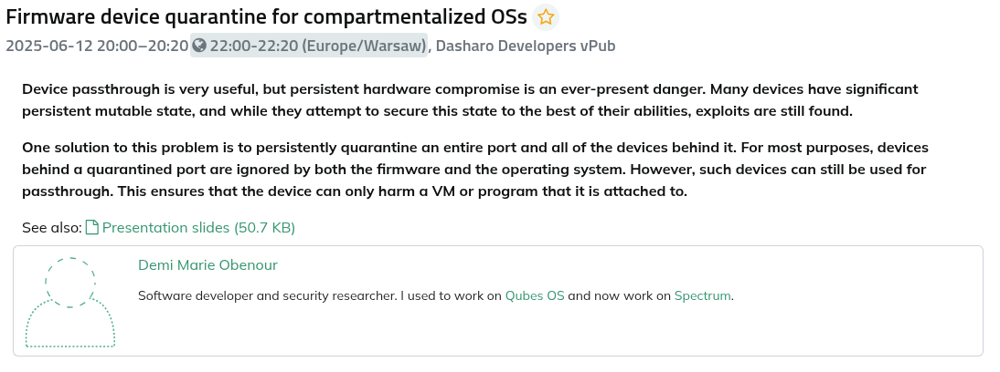
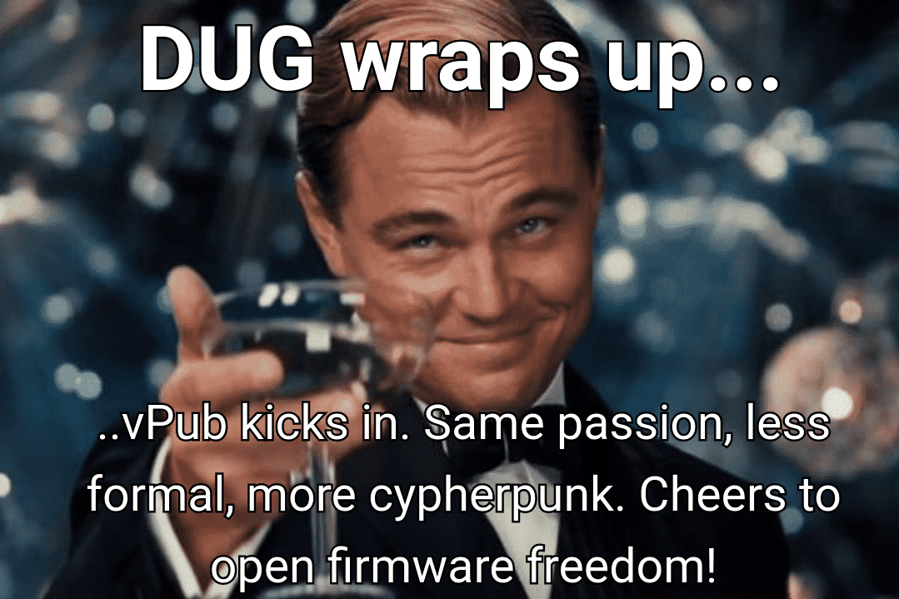

## &#x1F44B; DUG#10 Closing Remarks &#x1F44B;

---

---

 

#### https://dl.3mdeb.com/dasharo/qoss/2025/qubes_os_summit_2025_prospectus.pdf

---

 

## https://events.dasharo.com/event/2/qubes-os-summit-2025

---

 

## https://cfp.3mdeb.com/qubes-os-summit-2025

---

---

---

---

- **Test**: Dive into our latest releases, test them out, and share your
  feedback. Your experiences refine our roadmap. 🧪
- **Choose**: Choose to be an active part of our community. Your engagement
  shapes Dasharo's evolution. 🛠️
- **Know**: Stay informed and share your knowledge. Together, we deepen our
  understanding and create a robust firmware solution. 🎓

---

## Your Actions Matter 🌟 **Thank You** 🙏

- **Spread the Word**: Help more people discover, test, and choose Dasharo.
  🗣️
- **Contribute**: Your code, documentation, and ideas are the building blocks
  of Dasharo's growth. 👩‍💻👨‍💻
- **Engage**: Join our discussions, forums, and DUG meetings. Every
  interaction enriches our community. 🤝

---
layout: cover
background: /intro.png
class: text-center

---

# Let's Switch to vPub
