## &#x1F44B; Dasharo User Group #11 &#x1F389;

### Dasharo Community Release Roadmaps

<center></center>

<!--

- consider what feature set is provided in roadmaps
  - define publicly visible deliverables of each phase
  - document frameworks and tools on which given release will be based on
- We need more focused slides, saying precisely what we plan for given release,
  what features what will be validated etc.
- Dasharo development unification
- Customer stories?
- Features matrix concept
- Inform about our priorities
- Average Delay of Dasharo Community Release
- Average Time To Dasharo Community Release
- Explain Dasharo TrustRoot
- Dasharo Certification Lab

-->

---

<center></center>

<small>

_Please note that the roadmap for the Dasharo Community Support Program is
subject to change and may not represent final release candidates or end of
support dates. This roadmap is intended to provide guidance and direction for
the program's development, but is not a guarantee of specific timelines or
outcomes. For more information on release candidates or release dates, please
contact the Dasharo Team directly._

</small>
<!--

We consider to be more conservative in adding new platforms to the roadmap.

-->

---

- For those watching this presentation first time we really encourage to look
  at past videos to get better context and understanding of the format.
  - [DUG#10](https://www.youtube.com/watch?v=imhXpjCoQb4&list=PLuISieMwVBpIA51fGDz2dSPDlFE5Df1cE&index=3),
   [DUG#9](https://www.youtube.com/watch?v=ZVgjzvRcnqU&list=PLuISieMwVBpKNjDQBK2MU78tbU1XWkiPD),
  [DUG#8](https://www.youtube.com/watch?v=elEYzR-kVkw&list=PLuISieMwVBpLcYtLuM7rwooWeoH7I6tEF),
    [DUG#7](https://www.youtube.com/watch?v=raxY3JfMdp0&list=PLuISieMwVBpIJQpso6QICMUqqW5z8L1S2),
    [DUG#6](https://www.youtube.com/watch?v=Q8ILsTzoUjA&list=PLuISieMwVBpIQqHtHwYqypru50eg5nxoz),
    [DUG#5](https://www.youtube.com/watch?v=n7yv9T4VoFc&list=PLuISieMwVBpKBpfYlGZnDXOcqcQKXGXCX),
    [DUG#4](https://www.youtube.com/live/EN5rBAAOdOk?feature=shared&t=3973),
    [DUG#3](https://www.youtube.com/live/xHdlDmZVVkI?feature=shared&t=8700),
    [DUG#2](https://www.youtube.com/live/ZyctrnJNTPc?feature=shared&t=3395),
    [DUG#1](https://www.youtube.com/live/fUfjWyljKNs?feature=shared&t=795)

<center>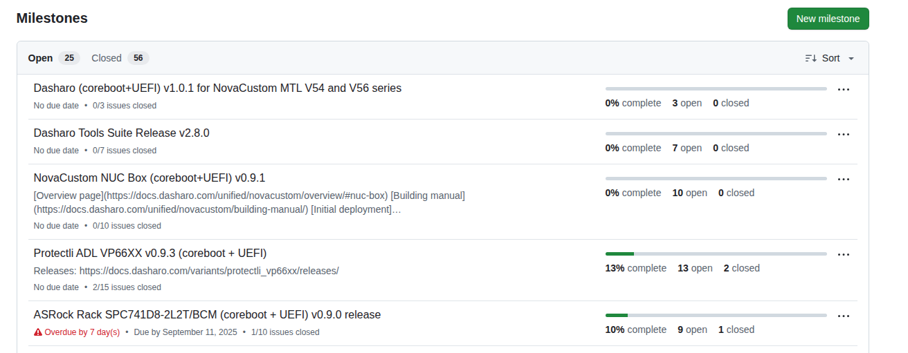</center>

---

<center>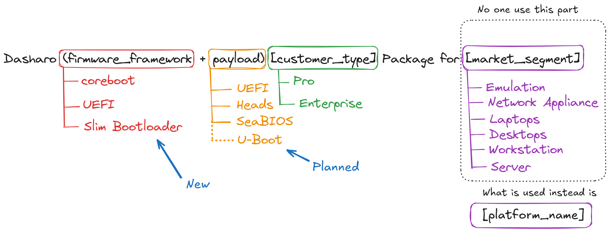</center>

* In short Dasharo Pro Package (DPP)
* Dasharo (coreboot+UEFI) Pro Package for MSi Z690-A
* Dasharo (coreboot+Heads) Pro Package for NV41
* Dasharo (Slim Bootloader) Enterprise Package for Odroid-H4

<!--

More details about it can be found in previous editions of the talk e.g. [DUG #9](https://youtu.be/bhWMc06UEiU?feature=shared&t=118).

-->

---

<center>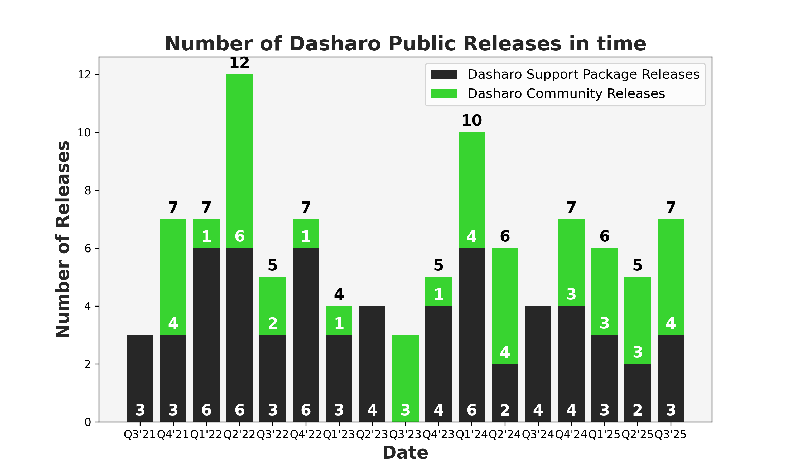</center>

<!--

- Average: 20.4 (+1.6) releases/year, 6 (+0.8) releases/quarter for all
releases, 102 releases total since Q3'21
- 40 DCR / 62 DSPR = 0.645 DCR/DSPR (+0.005)
- Considering year by year:
  - 2021: 10
  - 2022: 31
  - 2023: 16
  - 2024: 27
  - 2025: 18

- snippets:

```
grep "^## v" docs/variants -r | grep -E "2024-(09|1[0-2])"
grep "^## v" docs/variants -r | grep -E "2024-(09|1[0-2])"|grep -E "novacustom|protectli"|grep -v"heads"
```

-->

---

<center>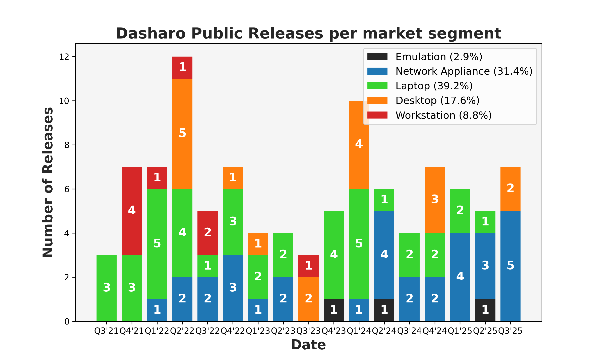</center>

<!--

* NUC Box and Odroid are classified as network appliance
* Hopefully next DUG we will add Server segment finally

- we need historical and last quarter to see trends

-->

---

<center>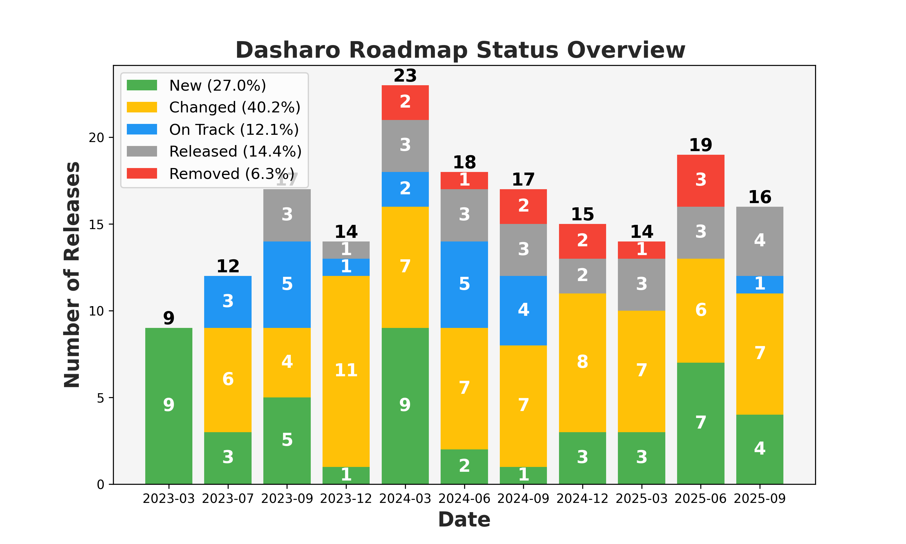</center>

<!--

* We have a lot of changes to report. Exciting new platforms coming.
* To some extent this diagram say, that likelihood of change is 40%.
* Likelihood we will add new release 27% and that we will remove existing one
is 6%.
* There is only 15% chance we will release or 12% chance we will stay on track
towards release.

-->
---

<center>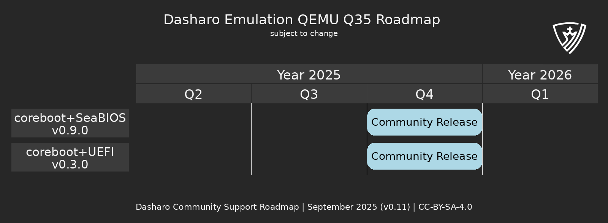</center>

- coreboot+SeaBIOS keep waiting for its prime time, it is connected with
transition to OSFV, which we are very hesitant to do because it is quite a lot
of work and we have other projects
- [GitHub Milestone Link](https://github.com/Dasharo/dasharo-issues/milestone/59) to QEMU Q35 (coreboot+SeaBIOS) v0.9.0. **No progress**
- [GitHub Milestone Link](https://github.com/Dasharo/dasharo-issues/milestone/45) to QEMU Q35 (coreboot+UEFI) v0.3.0 which potentially could be scheduled this year. **62% completed**

<!--

- DUG#11:
  - (ON TRACK) QEMU Q35 v0.3.0 planned for Q4'25
  - (CHANGED) QEMU Q35 v0.9.0 planned for Q3'25
    - release date changed: to Q4'25
- DUG#10:
  - (NEW) QEMU Q35 v0.3.0 planned for Q4'25
  - (NEW) QEMU Q35 v0.2.1 planned for Q2'25
  - (RELEASED) QEMU Q35 v0.2.1 planned for Q2'25
  - (CHANGED) QEMU Q35 v0.9.0 planned for Q2'25
    - release date changed: to Q3'25
- DUG#9:
  - (CHANGED) QEMU Q35 v0.9.0 planned for Q1'25
    - release name changed: v24.08.00.01 to v0.9.0
    - release date changed: to Q2'25
- DUG#8:
  - (NEW) QEMU Q35 v24.08.00.01 planned for Q1'25
- DUG#7:
  - (RELEASED) QEMU Q35 v0.2.0 planned for Q2'24
- DUG#6:
  - (CHANGED) QEMU Q35 v0.2.0 planned for Q3'24
    - release scope changed: we will use coreboot+UEFI instead of pure UEFI
    - release date changed: to Q2'24
- DUG#5:
  - (NEW) QEMU Q35 v0.2.0 planned for Q3'24
- DUG#4:
  - (RELEASED) QEMU Q35 v0.1.0 release
- DUG#3:
  - (ON TRACK) QEMU Q35 v0.1.0 planned for Q4'23
- DUG#2:
  - (CHANGED) QEMU Q35 v0.1.0 planned for Q3'23
    - release date changed to Q4'23 (+1)
- DUG#1:
  - (NEW) QEMU Q35 v0.1.0 planned for Q3'23

-->

---

<center>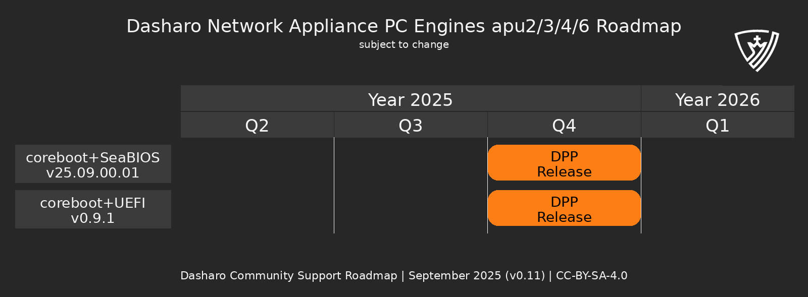</center>

* `v25.06` was replaced with `v25.09` release. It is planned for EOM.
* After last vPub there was extensinve discussion about Dasharo Patchqueue Initiative.
* `v25.09.00.01` is **12% completed**. [GitHub Milestone Link](https://github.com/Dasharo/dasharo-issues/milestone/68)
* `v0.9.1` is **11% completed**. [GitHub Milestone Link](https://github.com/Dasharo/dasharo-issues/milestone/51)

<!--

- DUG#11
  - (CHANGED) PC Engines apu2/3/4/6 Dasharo (coreboot+SeaBIOS) v25.06.00.01 planned for Q2'25
    - release scope change: switched tag to 24.09.00.01
    - release date changed to Q4'25 (+2)
  - (CHANGED) PC Engines apu2/3/4/6 Dasharo (coreboot+UEFI) v0.9.1 planned for Q3'25
    - release date changed to Q4'25 (+1)
- DUG#10
  - (RELEASED) PC Engines apu2/3/4/6 Dasharo (creboot+SeaBIOS) v24.08.00.01 planned for Q4'24
  - (REMOVED) PC Engines apu2/3/4/6 Dasharo (coreboot+SeaBIOS) v25.03.00.01 planned for Q3'25
  - (REMOVED) PC Engines apu2/3/4/6 Dasharo (coreboot+SeaBIOS) v25.12.00.01 planned for Q2'25
  - (NEW) PC Engines apu2/3/4/6 Dasharo (coreboot+SeaBIOS) v25.06.00.01 planned for Q2'25
  - (CHANGED) PC Engines apu2/3/4/6 Dasharo (coreboot+UEFI) v0.9.1 planned for Q2'25
    - release date changed to Q3'25 (+1)
- DUG#9
  - (NEW) PC Engines apu2/3/4/6 Dasharo (coreboot+SeaBIOS) v25.03.00.01 planned for Q3'25
  - (NEW) PC Engines apu2/3/4/6 Dasharo (coreboot+SeaBIOS) v25.12.00.01 planned for Q2'25
  - (CHANGED) PC Engines apu2/3/4/6 Dasharo (coreboot+UEFI) v0.9.1 planned for Q1'25
    - release date changed to Q2'25 (+1)
  - (CHANGED) PC Engines apu2/3/4/6 Dasharo (creboot+SeaBIOS) v24.08.00.01 planned for Q4'24
    - release date changed to Q2'25 (+2)
- DUG#8
  - (REMOVED) PC Engines apu2/3/4/6 Dasharo (creboot+SeaBIOS) legacy planned for Q4'24
  - (CHANGED) PC Engines apu2/3/4/6 Dasharo (coreboot+UEFI) v0.9.1 planned for Q4'24
    - release date changed to Q1'25
  - (CHANGED) PC Engines apu2/3/4/6 Dasharo (creboot+SeaBIOS) v24.08.00.01 planned for Q3'24
    - release date changed to Q4'24
- DUG#7
  - (RELEASED) PC Engines apu2/3/4/6 Dasharo (creboot+SeaBIOS) v24.05.00.01 planned for Q2'24
  - (NEW) PC Engines apu2/3/4/6 Dasharo (creboot+SeaBIOS) v24.08.00.01 planned for Q3'24
- DUG#6
  - (RELEASED) PC Engines apu2/3/4/6 Dasharo (coreboot+UEFI) v0.9.0 planned for Q1'24
  - (CHANGED) PC Engines apu2/3/4/6 Dasharo (creboot+SeaBIOS) mainline planned for Q2'24
    - release scope change: switched tag to 24.05.00.01
  - (CHANGED) PC Engines apu2/3/4/6 Dasharo (creboot+SeaBIOS) legacy planned for Q3'24
    - release date changed to Q3'24
  - (NEW) PC Engines apu2/3/4/6 Dasharo (coreboot+UEFI) v0.9.1 planned for Q2'24
- DUG#5
  - (CHANGED) PC Engines apu2/3/4/6 Dasharo (coreboot+UEFI) planned for Q1'24
    - release scope changed: additional platform apu4
  - (NEW) PC Engines apu2/3/4/6 Dasharo (creboot+SeaBIOS) mainline planned for Q2'24
  - (NEW) PC Engines apu2/3/4/6 Dasharo (creboot+SeaBIOS) legacy planned for Q2'24
- DUG#4:
  - (CHANGED) PC Engines apu3 planned for Q4'23
    - release date changed to Q1'23 (+1)
    - add support for apu2 and apu6
- DUG#3:
  - (NEW) PC Engines apu3 planned for Q4'23

-->

---

<center>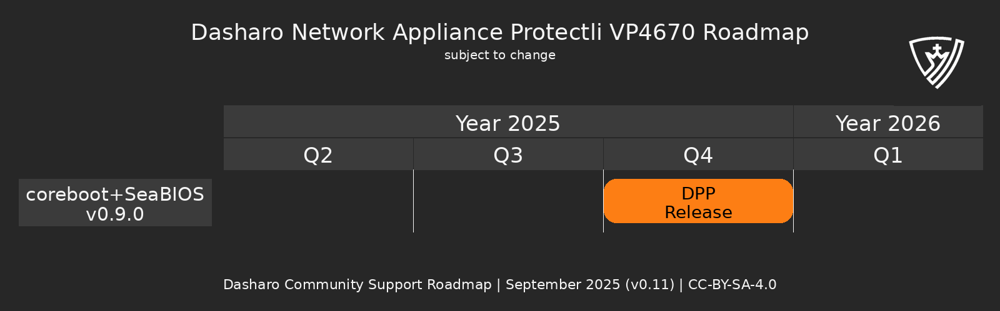</center>

* We lack of resources for this release, because of that it is last time we
move this release forward and next time we will remove it.
* Outstanding issues:
  * [Intel TXT doesn't work on VP4670](https://github.com/Dasharo/dasharo-issues/issues/1269) - closed as invalid.
  * [Hangs during microcode update](https://github.com/Dasharo/dasharo-issues/issues/1256) - it was identified as kernel issue and needs testing.
* [GitHub Milestone Link](https://github.com/Dasharo/dasharo-issues/milestone/52) it is **0% completed**.

<!--

- DUG#11
  - (CHANGED) Protectli VP4670 planned for Q3'25
    - release date changed to Q4'25 (+1)
- DUG#10
  - (CHANGED) Protectli VP4670 planned for Q2'25
    - release date changed to Q3'25 (+1)
- DUG#9
  - (CHANGED) Protectli VP4670 planned for Q1'25
    - release date changed to Q2'25 (+1)
- DUG#8
  - (CHANGED) Protectli VP4670 planned for Q4'24
    - release date changed to Q1'25 (+1)
- DUG#7
  - (CHANGED) Protectli VP4670 planned for Q3'24
    - release date changed to Q4'24 (+1)
- DUG#6
  - (CHANGED) Protectli VP4670 planned for Q2'24
    - release date changed to Q3'24 (+1)
    - scope change to Dasharo (coreboot+SeaBIOS)
- DUG#5
  - (CHANGED) Protectli VP4670 planned for Q2'24
    - release date changed to Q2'24 (-1)
- DUG#4:
  - (CHANGED) Protectli VP4670 planned for Q2'24
    - release date changed to Q3'23 (+1)
- DUG#3:
  - (NEW) Protectli VP4670 planned for Q2'24

-->

---

<center>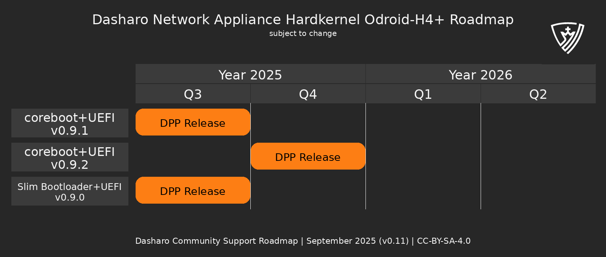</center>

* `v0.9.1` was released on time.
* First release form Dasharo (Slim Bootloader+UEFI) with [Slim Bootlaoder](https://slimbootloader.github.io/) as
firmware framework was added. The main goal of supporting new framework are new
courses in Pace Enterprise Training family.
* As Odroid-H4 is our platform of choice for PET we plan to continue development and new releases. On the roadmap is `v0.9.2`

<!--

- DUG#11
  - (NEW) Hardkernel Odroid-H4 Dasharo(coreboot+UEFI) v0.9.2 planned for Q4'25
  - (RELEASED) Hardkernel Odroid-H4 Dasharo(Slim Bootloader) v0.9.0 planned for Q3'25
  - (NEW) Hardkernel Odroid-H4 Dasharo(Slim Bootloader) v0.9.0 planned for Q3'25
  - (RELEASED) Hardkernel Odroid-H4 Dasharo(coreboot+UEFI) v0.9.1 planned for Q3'25
- DUG#10
  - (CHANGED) Hardkernel Odroid-H4 Dasharo(coreboot+UEFI) v0.9.1 planned for Q2'25
    - changed to second half of Q3'25 (+1)
- DUG#9
  - (RELEASED) Hardkernel Odroid-H4 Dasharo(coreboot+UEFI) planned for Q4'24
  - (NEW) Hardkernel Odroid-H4 Dasharo(coreboot+UEFI) v0.9.1 planned for Q2'25
- DUG#8
  - (CHANGED) Hardkernel Odroid-H4 Dasharo(coreboot+UEFI) planned for Q4'24
    - changed to second half of Q4'24'
- DUG#7
  - (ON TRACK) Hardkernel Odroid-H4 Dasharo(coreboot+UEFI) planned for Q4'24
- DUG#6
  - (NEW) Hardkernel Odroid-H4 Dasharo(coreboot+UEFI) planned for Q4'24

-->

---

## Dasharo (coreboot+UEFI) for ODROID-H4 SBOM

<br>

* Dasharo coreboot fork based on 24.12 revision b8e6b3eb
* Dasharo EDKII fork based on edk2-stable202502 revision 91a7a092
* Dasharo iPXE fork based on 2025.03 revision 6c7068fc
* Intel Flash Descriptor version v1.1
  - support for [Intel Top-Block Swap feature](https://edc.intel.com/content/www/us/en/design/products-and-solutions/processors-and-chipsets/700-series-chipset-family-platform-controller-hub-datasheet-volume-1-of/boot-block-update-scheme/)
  - Increased top swap size from 256KB to 512KB for Slim Bootloader
  - thanks to Top-Block Swap Slim Bootloader redundancy works as expected

<br>

<center>

#### https://docs.dasharo.com/variants/hardkernel_odroid_h4/releases/#v091-2025-09-03

</center>

<!--

What value bring IFD v1.1?

-->
---

## What is inside?

<br>

### Added

* Support for the Hardkernel ODROID H4 Ultra device
* Support for Net Card 2 module
* Capsule Update integration
* In-Band ECC option
* Quiet and fast boot option
* ME disable option
* Boot Guard status information to UEFI setup menu
* Improved measured boot support
* Microsoft Option ROM UEFI CA to Secure Boot DB
* Check for flash descriptor writability when exposign HAP disable option

---

### Changed

* VBT file to fix graphical output in firmware
* Flash descriptor updated to v1.1 (see SBOM)
* Owner GUID of Secure Boot DB and KEK to Microsoft recommended values
* Updated DBX to 2025-06-13

### Fixed

* S3 sleep too short on ODROID H4 Plus
* Can't delete signature of enrolled EFI file from DB as it's not shown
* Dismissing a pop-up in UEFI payload caused instant booting
* Recovery of damaged variable storage causing random settings reset

---

## Dasharo (Slim Bootloader+UEFI) for ODROID-H4 SBOM

<br>

* Dasharo Slim Bootloader fork based on d888673acdc4cf92bb5ebf4d8e73e66222654596 revision 00796934
* Dasharo EDKII fork based on edk2-stable202502 revision e8cd1856

<br>

<center>

#### https://docs.dasharo.com/variants/hardkernel_odroid_h4/releases/#v091-2025-09-03

</center>

---

## What is inside?

<br>

### Added

* Initial support for the Hardkernel ODROID H4 device, based on Intel Alder Lake N
* UEFI compatible interface
* USB boot support
* NVMe boot support
* UEFI Shell
* Ubuntu LTS booting
* Serial port console redirection
* TPM Measured Boot
* Verified Boot
* Measured Boot

---

### Known issues

<br>

* [Universal Payload hangs when SMM and SPI variable support is enabled](https://github.com/Dasharo/dasharo-issues/issues/1485)
* [Dasharo (Slim Bootloader+UEFI) - Can't shutdown via power button in BIOS](https://github.com/Dasharo/dasharo-issues/issues/1513)
* [Dasharo (Slim Bootloader+UEFI) freezes when trying to read flash](https://github.com/Dasharo/dasharo-issues/issues/1494)

---

<center>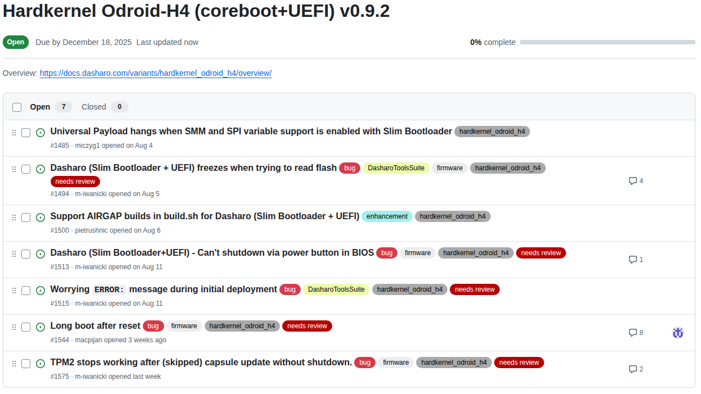</center>

---

<center>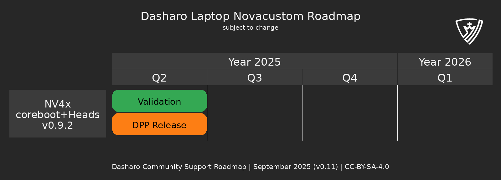</center>

* This year we have no other plans for releasing Dasharo (coreboot+Heads). Next release will be planned for 2026 when time will come.

<!--

- DUG#11:
  - No plans in 2025
- DUG#10:
  - (RELEASED) NV4x Dasharo (coreboot+Heads) v0.9.2 planned for Q1'25
    - release date changed to Q2'25 (+1)
  - (REMOVED) NV4x Dasharo (coreboot+SeaBIOS) v1.7.2.x planned for Q1'25
    - release scope changed to coreboot+SeaBIOS
    - release date changed to Q1'25
- DUG#9:
  - (RELEASED) V56TU Dasharo (coreboot+Heads) v0.9.0 planned for Q4'24
  - (CHANGED) NV4x Dasharo (coreboot+Heads) v0.9.2 planned for Q1'25
    - release date changed to Q2'25 (+1)
  - (REMOVED) NV4x Dasharo (coreboot+SeaBIOS) v1.7.2.x planned for Q1'25
    - release scope changed to coreboot+SeaBIOS
    - release date changed to Q1'25
- DUG#8:
  - (NEW) V56TU Dasharo (coreboot+Heads) v0.9.0 planned for Q4'24
  - (NEW) NV4x Dasharo (coreboot+Heads) v0.9.2 planned for Q1'25
  - (CHANGED) NV4x Dasharo (coreboot+SeaBIOS) v1.7.2.x planned for Q1'25
    - release scope changed to coreboot+SeaBIOS
    - release date changed to Q1'25
- DUG#7:
  - (RELEASED) Novacustom NV4x Dasharo (coreboot+Heads) v0.9.1 planned for Q3'24
  - (CHANGED) Novacustom NV4x Dasharo (coreboot+UEFI) v2.0.0 planned for Q3'24
    - release scope changed it will base on v2.0.0
    - release date changed to Q4'24 (+1)
- DUG#6:
  - (ON TRACK) Novacustom NV4x Dasharo (coreboot+Heads) v0.9.1 planned for Q3'24
  - (ON TRACK) Novacustom NV4x Dasharo (coreboot+UEFI) v1.8.0 planned for Q3'24
- DUG#5:
  - (RELEASED) Novacustom NV4x Dasharo (coreboot+Heads) v0.9.0 planned for Q4'23
  - (NEW) Novacustom NV4x Dasharo (coreboot+Heads) v0.9.1 planned for Q3'24
  - (NEW) Novacustom NV4x Dasharo (coreboot+UEFI) v1.8.0 planned for Q3'24
- DUG#4:
  - (CHANGED) Novacustom NV4x Dasharo (coreboot+Heads) v0.9.0 planned for Q4'23
    - release date changed to Q1'24 (+1)
- DUG#3:
  - (NEW) Novacustom NV4x Dasharo (coreboot+Heads) v0.9.0 planned for Q4'23

-->

---

<center>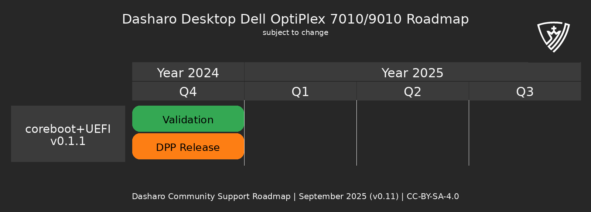</center>

* [TrenchBoot Support was released](https://blog.3mdeb.com/2025/2025-06-10-aem-uefi/)
* Exactly the same situation as with Protectli VP4670.
* No release plans at this point.

<!--

- DUG#11
  - no plans
- DUG#10
  - no plans
- DUG#9
  - (RELEASED) Dell OptiPlex 7010/9010 v0.1.1 planned for Q4'24
    - release date changed to Q4'24
    - release scope changed to v0.1.1
- DUG#8
  - (CHANGED) Dell OptiPlex 7010/9010 v0.1.0 planned for Q3'24
    - release date changed to Q4'24
    - release scope changed to v0.1.1
- DUG#7
  - (ON TRACK) Dell OptiPlex 7010/9010 v0.1.0 planned for Q3'24
- DUG#6
  - (CHANGED) Dell OptiPlex 7010/9010 v0.1.0 planned for Q2'24
    - release date changed to Q3'24 (+1)
- DUG#5
  - (CHANGED) Dell OptiPlex 7010/9010 v0.1.0 planned for Q4'23
    - release date changed to Q2'24 (+1)
  - (REMOVED) Dell T1650 v0.1.0 planned for Q1'24
- DUG#4
  - (CHANGED) Dell OptiPlex 7010/9010 v0.1.0 planned for Q4'23
    - release date changed to Q1'24 (+1)
  - (CHANGED) Dell T1650 v0.1.0 planned for Q1'24
    - release date changed to Q3'24 (+2)
- DUG#3
  - (CHANGED) Dell OptiPlex 7010/9010 v0.1.0 planned for Q4'23
    - release type changed to DES
  - (CHANGED) Dell T1650 v0.1.0 planned for Q1'24
    - release type changed to DES
- DUG#2
  - (CHANGED) Dell OptiPlex 7010/9010 v0.1.0 planned for Q2'23
    - release date changed to Q4'23 (+2)
  - (CHANGED) Dell T1650 v0.1.0 planned for Q3'23
    - release date changed to Q1'24 (+2)
- DUG#1
  - (NEW) Dell OptiPlex 7010/9010 v0.1.0 planned for Q2'23
  - (NEW) Dell T1650 v0.1.0 planned for Q3'23

-->

---

<center>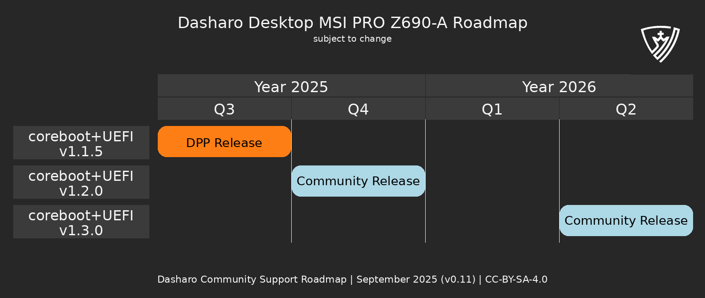</center>

* Introduction of non-LTS releases (no extensive testing, just minimal regression).
* EOL for Dasharo support for MSI PRO Z690-A is 2026 EOY.
* This year there are two upcoming releases: DPP and DCR.
* Support will most likely end next year unless there will be enough renewal to
support next release, but since that hardware is no longer sold we are concern
it would not be the case.

<!--

- DUG#11
  - (RELEASED) MSI Z690-A v1.1.5 planned for Q3'25
  - (CHANGED) MSI Z690-A v1.2.0 planned for Q3'24
    - release date changed to Q4'25 (+1)
  - (CHANGED) MSI Z690-A v1.3.0 planned for Q3'25
    - release date changed to Q2'26 (+3)
- DUG#10
  - (NEW) MSI Z690-A v1.1.5 planned for Q3'25
  - (CHANGED) MSI Z690-A v1.2.0 planned for Q2'24
    - release date changed to Q3'25 (+1)
  - (NEW) MSI Z690-A v1.3.0 planned for Q3'25
- DUG#9
  - (CHANGED) MSI Z690-A v1.2.0 planned for Q1'24
    - release date changed to Q2'25 (+1)
- DUG#8
  - (RELEASED) MSI Z690-A v1.1.4 planned for Q4'24
- DUG#7
  - (CHANGED) MSI Z690-A v1.1.4 planned for Q3'24
    - release date changed to Q4'24 (+1)
  - (ON TRACK) MSI Z690-A v1.2.0 planned for Q4'24
- DUG#6
  - (ON TRACK) MSI Z690-A v1.1.4 planned for Q3'24
  - (ON TRACK) MSI Z690-A v1.2.0 planned for Q4'24
- DUG#5
  - (RELEASED) MSI Z690-A v1.1.3 planned for Q4'23
  - (NEW) MSI Z690-A v1.1.4 planned for Q3'24
  - (CHANGED) MSI Z690-A v1.2.0 planned for Q1'24
    - release date changed to Q2'24 (+2)
- DUG#4
  - (CHANGED) MSI Z690-A v1.1.3 planned for Q4'23
    - release date changed to Q1'24 (+1)
  - (CHANGED) MSI Z690-A v1.2.0 planned for Q1'24
    - release date changed to Q2'24 (+1)
- DUG#3
  - (RELEASED) MSI Z690-A v1.1.2 planned for Q3'23
  - (ON TRACK) MSI Z690-A v1.1.3 planned for Q4'23
  - (ON TRACK) MSI Z690-A v1.2.0 planned for Q1'24
- DUG#2
  - (ON TRACK) MSI Z690-A v1.1.2 planned for Q3'23
  - (NEW) MSI Z690-A v1.1.3 release planned for Q4'23
  - (CHANGED) MSI Z690-A v1.2.0 planned for Q4'23
    - release date changed to Q1'24 (+1)
- DUG#1
  - (NEW) MSI Z690-A v1.1.2 planned for Q3'23
  - (NEW) MSI Z690-A v1.2.0 planned for Q4'23

-->

---

# Non-LTS concept

* LTS - _Long Term Stable_
* So far every release get through extensive test cycle (hundreds of tests),
what took a lot of time and could cost more than 50% of the whole release cost.
* For stable platforms with fixed set of known issues, there is no need for LTS
test cycle.
* No question about, non-LTS will not come with the same guarantees.

<!--

Create marketing names for those test cycles.

-->

---

<center>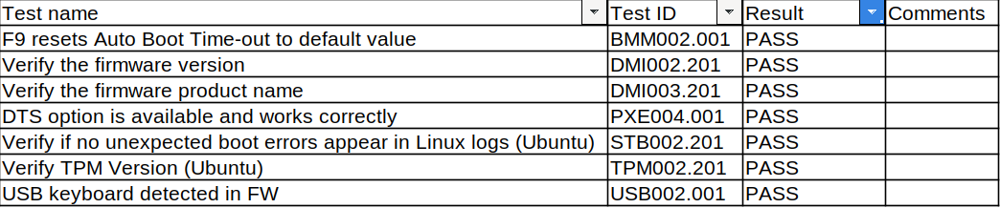</center>

<br>

* Set or running tests depends largely on platform capabilities and hardware
configuration.
  - In case of previous release it was 161 tests
  - Full test cycle takes Senior Firmware Engineer over week of work.
  - Minimal regression which we run has just 6 tests and takes up to half a day.
* This is practical triage of introducing upcoming concepts:
  - non-LTS releases with minimal regression
  - "something-in-between"
  - LTS regular releases with full test cycle

---

## Dasharo (coreboot+UEFI) for Z690-A SBOM

<br>

* Dasharo coreboot fork based on 24.12 revision fecb8be2 (from 24.02.01)
* Dasharo EDKII fork based on edk2-stable202502 revision 1c50dad8 (from edk2-stable202402)
* iPXE based on 2025.03 revision 6c7068fc

<br>

<center>

#### https://docs.dasharo.com/variants/msi_z690/releases/#v115-2025-09-18

</center>

<!--

When we update base framework we should explain what changes were introduced in
it that could affect platform functions and quality.

-->

---

## What is inside?

<br>

### Added

* Improved measured boot support
* Microsoft Option ROM UEFI CA to Secure Boot DB
* Check for flash descriptor writability when exposing HAP disable option

---

### Changed

* Rebased coreboot repository to 24.12
* Rebased edk2 repository to edk2-stable202502
* Owner GUID of Secure Boot DB and KEK to Microsoft recommended values
* Updated DBX to 2025-06-13

<br>

### Known Issues

* [XMP1 profile does not boot in combination with some DDR5 configurations](https://github.com/Dasharo/dasharo-issues/issues/683)
* [Windows 11 installer unable to detect i225 Ethernet NIC](https://github.com/Dasharo/dasharo-issues/issues/482)
* [Cannot wake from suspend via RTC on QubesOS](https://github.com/Dasharo/dasharo-issues/issues/484)
* [Windows 11 VBS (Virtualization-based Security) appears Not enabled on System Information](https://github.com/Dasharo/dasharo-issues/issues/539)
* [Capsule update signing is not enforced](https://github.com/Dasharo/dasharo-issues/issues/1075)
* And more included in future milestones.

---

<center>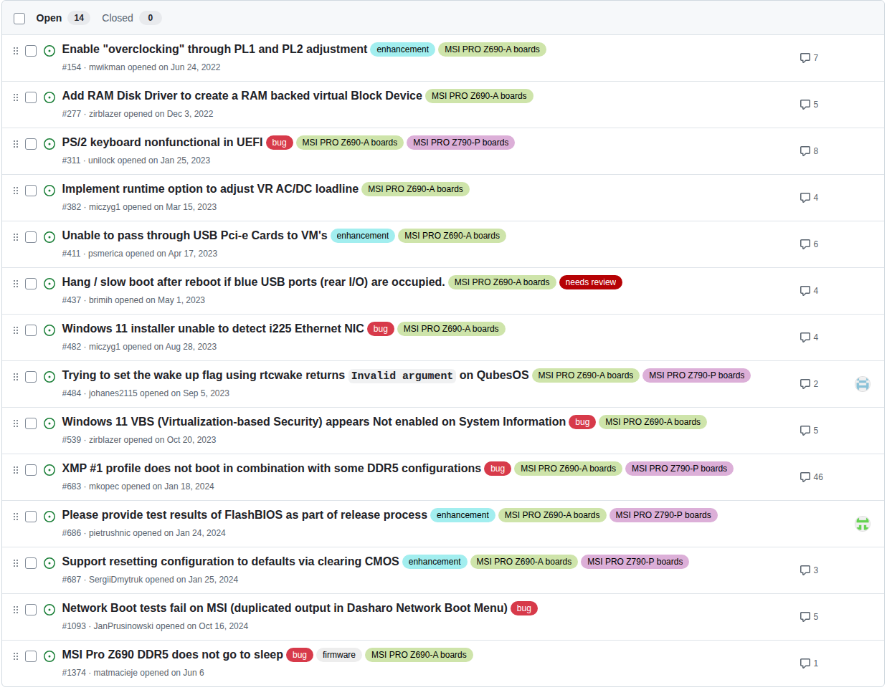</center>

---

<center></center>

* The same situation as with Z690-A.

<!--

- DUG#11
  - (RELEASED) MSI Z790-P v0.9.3 planned for Q3'25
  - (CHANGED) MSI Z790-P v1.0.0 planned for Q3'24
    - release date changed to Q4'25 (+1)
  - (CHANGED) MSI Z790-P v1.1.0 planned for Q3'25
    - release date changed to Q2'26 (+3)
- DUG#10
  - (NEW) MSI Z790-A v0.9.3 planned for Q3'25
  - (CHANGED) MSI Z790-A v1.0.0 planned for Q2'24
    - release date changed to Q3'25 (+1)
  - (NEW) MSI Z790-A v1.1.0 planned for Q3'25
- DUG#9
  - (CHANGED) MSI Z790-P v1.0.0 planned for Q1'25
    - release date changed to Q2'25 (+1)
- DUG#8
  - (RELEASED) MSI Z790-P v0.9.2 planned for Q4'24
  - (CHANGED) MSI Z790-P v1.0.0 planned for Q4'24
    - release date changed to Q1'25 (+1)
- DUG#7
  - (CHANGED) MSI Z790-P v0.9.2 planned for Q3'24
    - release date changed to Q4'24 (+1)
  - (ON TRACK) MSI Z790-P v1.0.0 planned for Q4'24
- DUG#6
  - (ON TRACK) MSI Z790-P v0.9.2 planned for Q3'24
  - (ON TRACK) MSI Z790-P v1.0.0 planned for Q4'24
- DUG#5
  - (ON TRACK) MSI Z790-P v0.9.2 planned for Q3'24
  - (ON TRACK) MSI Z790-P v1.0.0 planned for Q4'24
- DUG#5
  - (RELEASED) MSI Z790-P v0.9.1 planned for Q4'23
  - (NEW) MSI Z790-P v0.9.2 planned for Q3'24
  - (CHANGED) MSI Z790-P v1.0.0 planned for Q1'24
    - release date changed to Q2'24 (+2)
- DUG#4
  - (CHANGED) MSI Z790-P v1.0.0 planned for Q1'24
    - release date changed to Q2'24 (+1)
  - (ON TRACK) MSI Z790-P v0.9.1 planned for Q4'23
- DUG#3
  - (RELEASED) MSI Z790-P v0.9.0 planned for Q3'23
  - (ON TRACK) MSI Z790-P v0.9.1 planned for Q4'23
  - (ON TRACK) MSI Z790-P v1.0.0 planned for Q1'24
- DUG#2
  - (NEW) MSI Z790-P v0.9.0 planned for Q3'23
  - (NEW) MSI Z790-P v0.9.1 planned for Q4'23
  - (ON TRACK) MSI Z790-P v1.0.0 planned for Q1'24
- DUG#1
  - (NEW) MSI Z790-P v1.0.0 planned for Q1'24

-->

---

<center>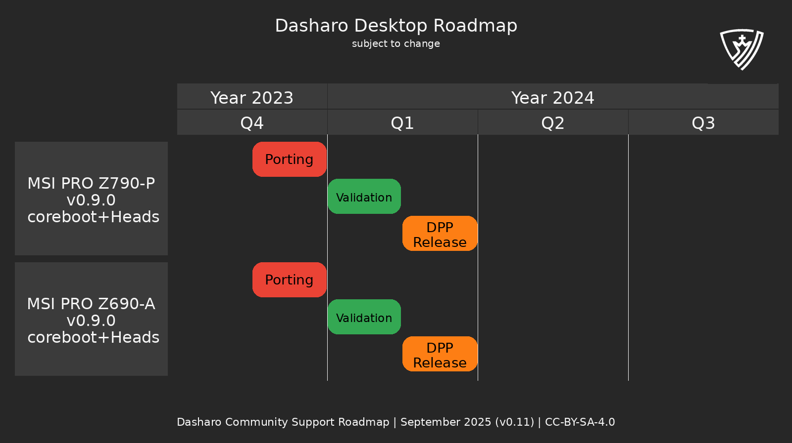</center>

* Unfortunately, we have no new plans.

<!--

- DUG#11
  - no new plans
- DUG#10
  - no new plans
- DUG#9
  - no new plans
- DUG#8
  - no new plans
- DUG#7
  - no new plans
- DUG#6
  - (RELEASED) MSI Z790-P Dasharo (coreboot+Heads) v0.9.0 planned for Q1'24
  - (RELEASED) MSI Z690-P Dasharo (coreboot+Heads) v0.9.0 planned for Q1'24
- DUG#5
  - (ON TRACK) MSI Z790-P Dasharo (coreboot+Heads) v0.9.0 planned for Q1'24
  - (NEW) MSI Z690-P Dasharo (coreboot+Heads) v0.9.0 planned for Q1'24
- DUG#4
  - (CHANGED) MSI Z790-P Dasharo (coreboot+Heads) v0.9.0 planned for Q1'24
    - release date changed to Q1'24 (-1)
    - version changed to v0.9.0
- DUG#3
  - (NEW) MSI Z790-P Dasharo (coreboot+Heads) v1.0.1 planned for Q2'24

-->

---

<center>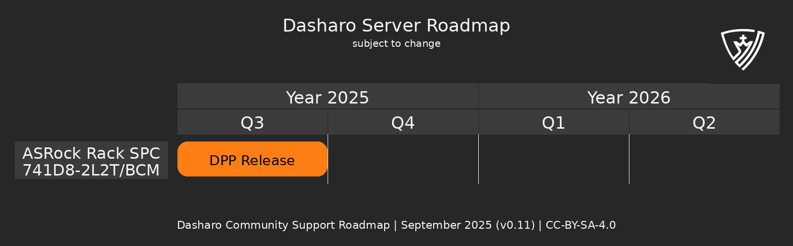</center>

<br>

* Finally we can put on our roadmap relatively modern server platform.
* We gratefully acknowledge the [https://os.itec.kit.edu](https://os.itec.kit.edu)
(Operating Systems Group) at Karlsruhe Institute of Technology (Fabian Meyer,
Felix Zimmer, Yussuf Khalil) for their contribution in initiating the coreboot
port for this platform and supporting open-source firmware development.
* Without Yussuf team delivering this release so fast would not be possible.
* [Github Milestone Link](https://github.com/Dasharo/dasharo-issues/milestone/75) - **20% complete**.

<!--

- DUG#11
  - (NEW) ASRock Rack SPC741D8-2L2T Dasharo (coreboot+Heads) v0.9.0 planned for Q3'25

-->

---

<center></center>

<br>

<center>

### [https://shop.3mdeb.com/product-category/dasharo-supported-hardware/](https://shop.3mdeb.com/product-category/dasharo-supported-hardware/)
</center>

<!--

We are in process of changing business model in Dasharo Pro and Enterprise
Package, so if you are interested in this hardware with Dasharo please let us
know.

-->
---

<center>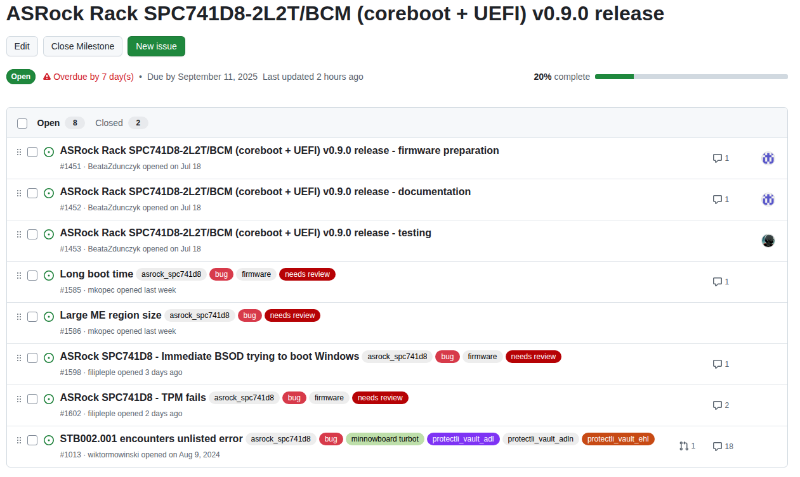</center>


---

<center>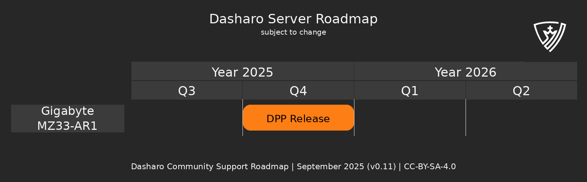</center>

<br>

* This is second big announcement from us. We plan to deliver AMD OpenSIL based Dasharo for Gigabyte MZ33-AR1 in Q4'25.
* Timeline is not yet very solid, because this is new and complex project (server, new silicon initialization code).
* We publishing our results on [3mdeb blog](https://blog.3mdeb.com/tags/mz33-ar1/).

<!--

- DUG#11
  - (NEW) Gigabyte MZ33-AR1 Dasharo (coreboot+Heads) v0.9.0 planned for Q3'25

-->

---

<center></center>

<br>

<center>

### [https://shop.3mdeb.com/product-category/dasharo-supported-hardware/](https://shop.3mdeb.com/product-category/dasharo-supported-hardware/)
</center>

---

## Dasharo Security Bulletin (DSB)

- Launching Dasharo Security Bulletin (DSB): clear, actionable advisories for
Dasharo-supported platforms and firmware.
- Format identical to Xen Security Advisories (XSA) and Qubes Security
Bulletins (QSB): summary, impact, affected versions, fixes/mitigations,
timeline, credits, references.
- Coordinated disclosure with upstreams/vendors; embargoes when needed; publish
when fixes/mitigations are ready.
- Trust and verifiability: PGP‑signed advisories, permanent web archive; CVE
IDs and links included when available.
- Numbering and cadence: DSB-YYYY-NN; released as needed (not on a fixed
schedule).
- Distribution: Dasharo website with archive and RSS/Atom, announcement mailing
list, GitHub security advisories, and community channels.
- Community actions: subscribe, verify signatures and apply updates; report
vulnerabilities via our security contact (see security.txt).
- Security reports link: https://docs.dasharo.com/security/

---
layout: cover
background: /intro.png
class: text-center

---
# Q&A

---
layout: cover
background: /intro.png
class: text-center

---
# CHANGELOG

---

# Changelog DUG#10

- (NEW) QEMU Q35 v0.3.0 planned for Q4'25
- (NEW) QEMU Q35 v0.2.1 planned for Q2'25
- (RELEASED) QEMU Q35 v0.2.1 planned for Q2'25
- (CHANGED) QEMU Q35 v0.9.0 planned for Q2'25
- (RELEASED) PC Engines apu2/3/4/6 Dasharo (creboot+SeaBIOS) v24.08.00.01 planned for Q4'24
- (REMOVED) PC Engines apu2/3/4/6 Dasharo (coreboot+SeaBIOS) v25.03.00.01 planned for Q3'25
- (REMOVED) PC Engines apu2/3/4/6 Dasharo (coreboot+SeaBIOS) v25.12.00.01 planned for Q2'25
- (NEW) PC Engines apu2/3/4/6 Dasharo (coreboot+SeaBIOS) v25.06.00.01 planned for Q2'25
- (CHANGED) PC Engines apu2/3/4/6 Dasharo (coreboot+UEFI) v0.9.1 planned for Q2'25
- (CHANGED) Protectli VP4670 planned for Q2'25
- (CHANGED) Hardkernel Odroid-H4 Dasharo(coreboot+UEFI) v0.9.1 planned for Q2'25
- (RELEASED) NV4x Dasharo (coreboot+Heads) v0.9.2 planned for Q1'25
- (REMOVED) NV4x Dasharo (coreboot+SeaBIOS) v1.7.2.x planned for Q1'25
- (NEW) MSI Z690-A v1.1.5 planned for Q3'25

---

# Changelog DUG#10

- (CHANGED) MSI Z690-A v1.2.0 planned for Q2'24
- (NEW) MSI Z690-A v1.3.0 planned for Q3'25
- (NEW) MSI Z790-A v0.9.3 planned for Q3'25
- (CHANGED) MSI Z790-A v1.0.0 planned for Q2'24
- (NEW) MSI Z790-A v1.1.0 planned for Q3'25

---

# Changelog DUG#9

- (CHANGED) QEMU Q35 v0.9.0 planned for Q1'25
- (NEW) PC Engines apu2/3/4/6 Dasharo (coreboot+SeaBIOS) v25.03.00.01 planned for Q3'25
- (NEW) PC Engines apu2/3/4/6 Dasharo (coreboot+SeaBIOS) v25.12.00.01 planned for Q2'25
- (CHANGED) PC Engines apu2/3/4/6 Dasharo (coreboot+UEFI) v0.9.1 planned for Q1'25
- (CHANGED) PC Engines apu2/3/4/6 Dasharo (creboot+SeaBIOS) v24.08.00.01 planned for Q4'24
- (CHANGED) Protectli VP4670 planned for Q1'25
- (RELEASED) Hardkernel Odroid-H4 Dasharo(coreboot+UEFI) planned for Q4'24
- (NEW) Hardkernel Odroid-H4 Dasharo(coreboot+UEFI) v0.9.1 planned for Q2'25
- (RELEASED) V56TU Dasharo (coreboot+Heads) v0.9.0 planned for Q4'24
- (CHANGED) NV4x Dasharo (coreboot+Heads) v0.9.2 planned for Q1'25
- (REMOVED) NV4x Dasharo (coreboot+SeaBIOS) v1.7.2.x planned for Q1'25
- (RELEASED) Dell OptiPlex 7010/9010 v0.1.1 planned for Q4'24
- (CHANGED) MSI Z690-A v1.2.0 planned for Q1'24
- (CHANGED) MSI Z790-P v1.0.0 planned for Q1'25

---

# Changelog DUG#8

- (NEW) QEMU Q35 v24.08.00.01 planned for Q1'25
- (REMOVED) PC Engines apu2/3/4/6 Dasharo (creboot+SeaBIOS) legacy planned for Q4'24
- (CHANGED) PC Engines apu2/3/4/6 Dasharo (coreboot+UEFI) v0.9.1 planned for Q4'24
- (CHANGED) PC Engines apu2/3/4/6 Dasharo (creboot+SeaBIOS) v24.08.00.01 planned for Q3'24
- (CHANGED) Protectli VP4670 planned for Q4'24
- (REMOVED) MinnowBoard Turbot Dasharo(coreboot+UEFI) planned for Q3'24
- (CHANGED) Hardkernel Odroid-H4 Dasharo(coreboot+UEFI) planned for Q4'24
- (NEW) V56TU Dasharo (coreboot+Heads) v0.9.0 planned for Q4'24
- (NEW) NV4x Dasharo (coreboot+Heads) v0.9.2 planned for Q1'25
- (CHANGED) NV4x Dasharo (coreboot+SeaBIOS) v1.7.2.x planned for Q1'25
- (CHANGED) Dell OptiPlex 7010/9010 v0.1.0 planned for Q3'24
- (RELEASED) MSI Z690-A v1.1.4 planned for Q4'24
- (CHANGED) MSI Z690-A v1.2.0 planned for Q4'24

---

# Changelog DUG#8

- (RELEASED) MSI Z790-P v0.9.2 planned for Q4'24
- (CHANGED) MSI Z790-P v1.0.0 planned for Q4'24

---
layout: cover
background: /intro.png
class: text-center

---

# Q&A
