## Dasharo Open Source Firmware Validation Status

<center></center>

---

# <center> Agenda </center>

* Short introduction to OSFV
* Stats
* Improvements
* Work in progress & future plans
* Q&A

---
layout: cover
background: /intro.png
class: text-center
---

# <center> Introduction to Open Source Firmware Validation </center>

---

# <center> Introduction to Open Source Firmware Validation </center>

- Open Source Validation of Open Source Firmware
- Based on Robot Framework
- Used to detect regression in next dasharo release via series of automated test cases

---
layout: cover
background: /intro.png
class: text-center
---

# OSFV Stats

---

# <center> PR stats </center>
### <center> open-source-firmware-validation </center>
#### <center> Total </center>

<center>
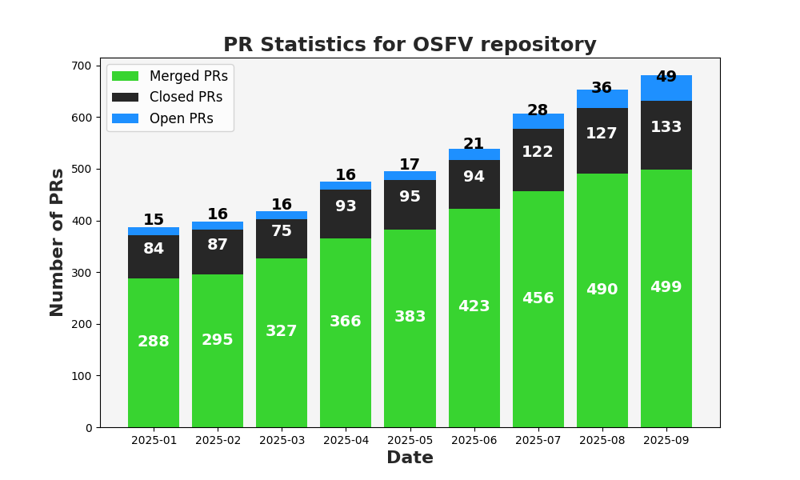
</center>

<!--

-->

---

# <center> PR stats </center>
### <center> open-source-firmware-validation </center>
#### <center> Difference </center>

<center>
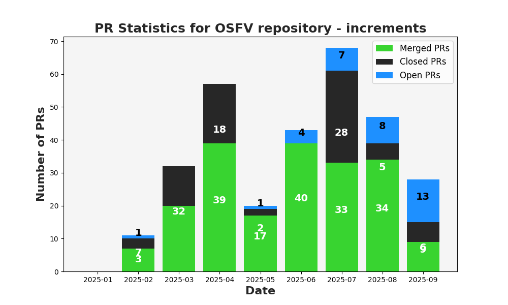
</center>

<!--
steady pace of development
-->

---

# <center> Test modules stats </center>
#### <center> Total test cases </center>

<center>
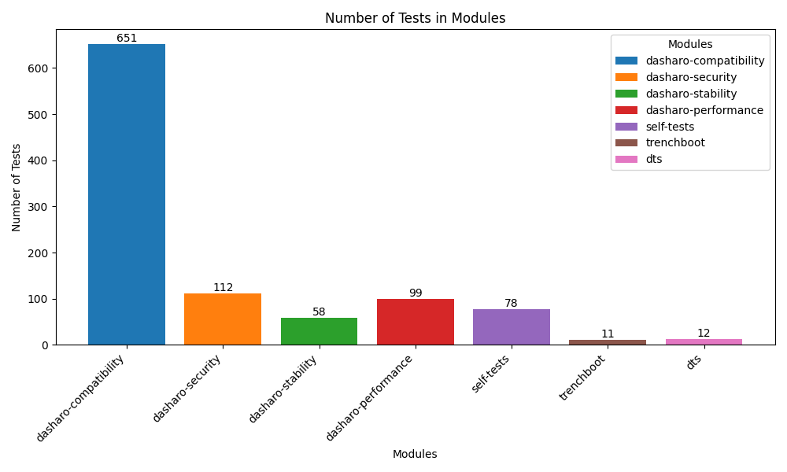
</center>

### <center><b>1038</b> total test cases!</center>

---

# <center> Test modules stats </center>
#### <center> Difference </center>

<center>
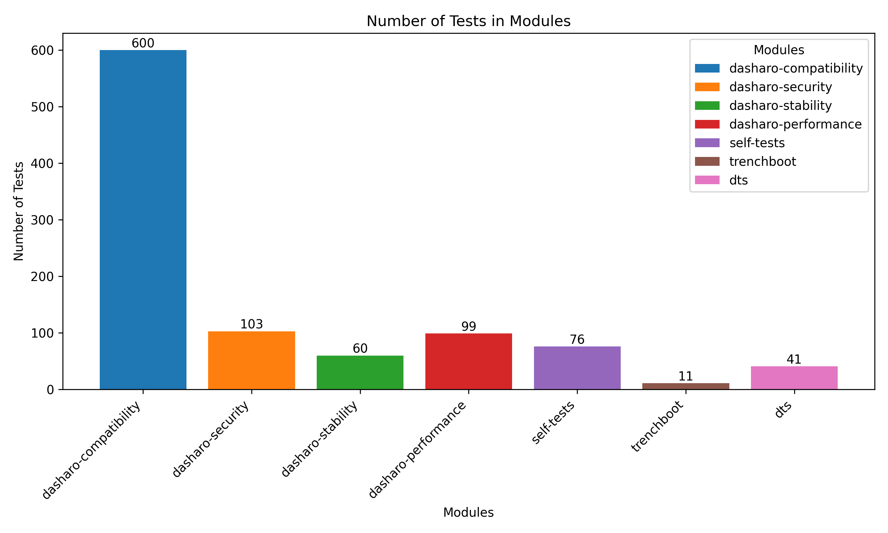
</center>

### <center>Total count increased by **48** since DUG #10</center>

---

# <center> Moving to Robot Framework 7 </center>

Benefits:
- Updated syntax & deprecations cleaned up
- Better type support & annotations
- More powerful keywords & resource handling
- Most notable is the introduction of VAR syntax for variable creation

 We jumped on the new VAR syntax right away because it makes variable creation cleaner
 That clarity has been so useful that in just a short time we've already used VAR 534 times across 94 files- a clear sign of how much it improves readability and maintainability in our test suites

---

# <center> New test cases </center>
- Added ACPI suite -instalation and use of dasharo ACPI driver
- Added CBNT suite - Converged Boot Guard and TXT tests
- Added FWUPD suite - Testing firmware update via cabinet files
- Expanded MBO suite - This test suite verifies measured boot integrity by checking that TPM PCR values and event logs are consistent across boots, that specific firmware/secure boot or Dasharo configuration changes affect only the intended PCRs, and that identical system states always result in identical PCR measurements.
- Added XCP-NG variants to some existing test cases
- test ID overhaul that affected many tests

---

# <center> New platforms </center>

  <center><table>
  <tr>
  <td>
  <ul>
  <li>Odroid ULTRA</li>
  <li>ASRock SPC741D8-2L2T/BCM</li>
  <li>Novacustom NUC Box</li>
  </ul>
  </td>
  <td>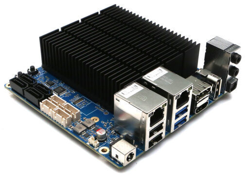</td>
  </tr>
  <tr>
  <td>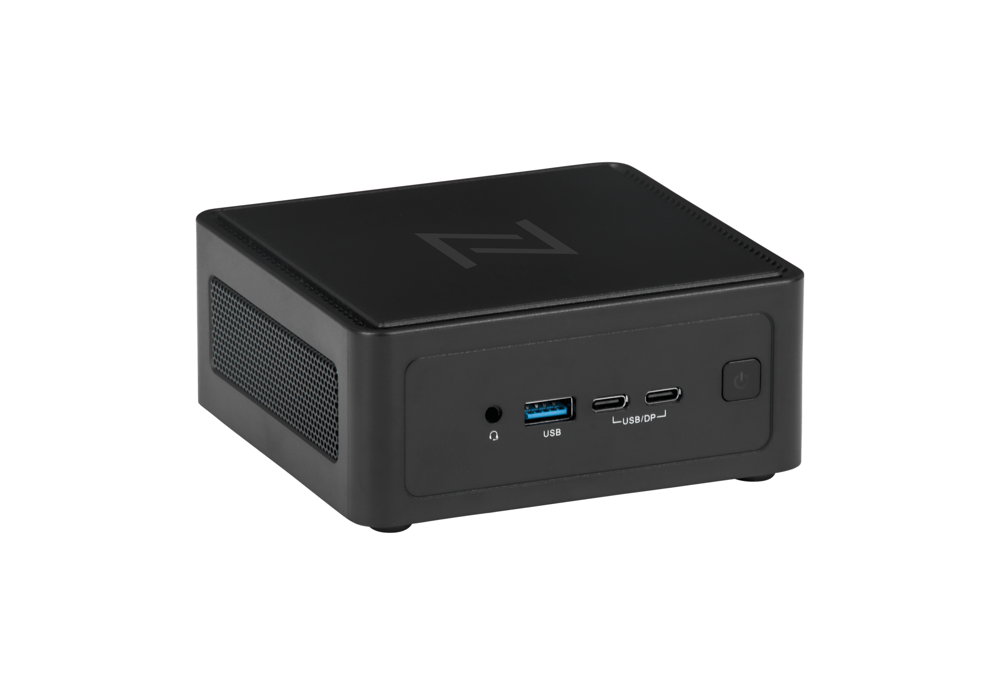</td>
  <td>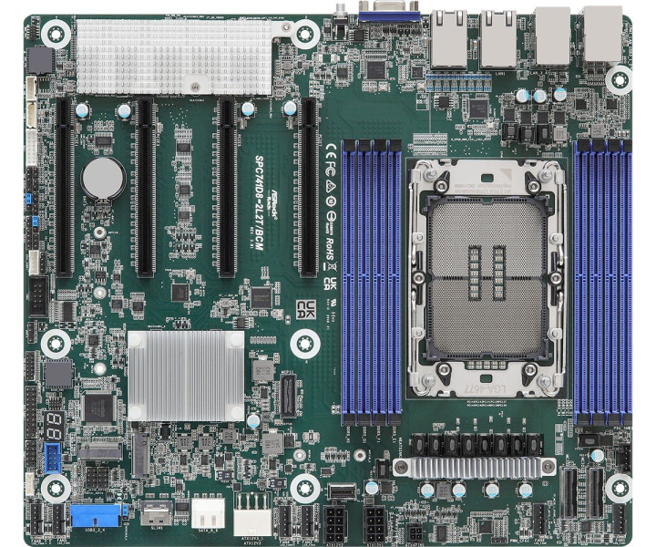</td>
  </tr>
  </table></center>

---
layout: cover
background: /intro.png
class: text-center
---

# Key changes

---

# <center> Tags </center>
- Manual testing became overwhelming as project scale increased
- Run of seemingly all auto tests was often interrupted by semi-auto test that awaited for
- Introduced Tags to clearly distinguish between: manual tests and automated tests
<center>
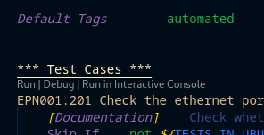
</center>
---

# <center> Tags </center>

 Test tags synergize well with ID overhaul giving a possibility to target a specific group of tests in one go

Example
```bash
--include {automated/semiauto} -t "*{OS_ID}*"
```
Without tags:
<center>
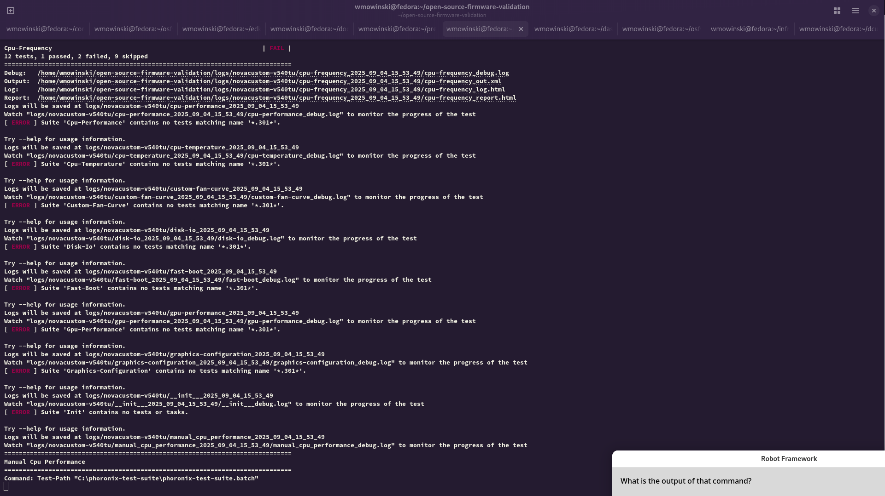
</center>
---

# <center> Automatic OS Flash </center>

- Added support for flashing full disk images in automated tests
- Supported scenarios:
  - Windows + Ubuntu + Fedora triple-boot
  - Windows + Ubuntu dual-boot
- Orchestrated through Clonezilla + Robot Framework

ENV variables:
```bash
SOURCE_IMAGE=windows_ubuntu
TARGET_DISK=nvme0n1
-- -t "Restore*"
```

<center>
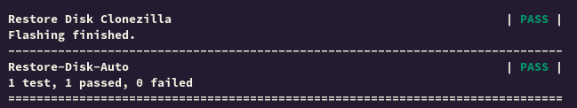
</center>

---

# <center> Automatic OS Flash </center>
Progress bar display on DUT
<center>
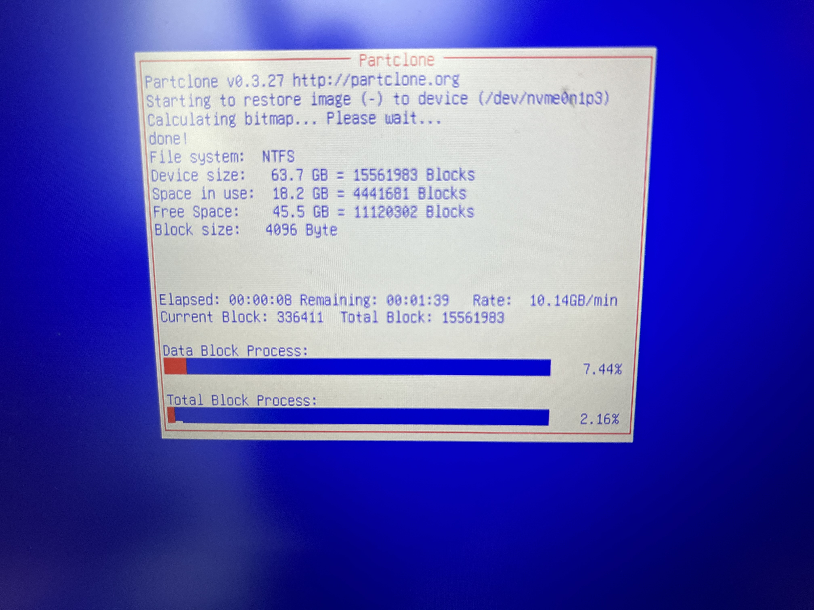
</center>

---

# <center> Serial output over USB </center>
- Integrated laptops into the default test workflow
- Achieved through Serial FTDI USB converters
- Benefits:
  - Broader hardware coverage
  - Ability to test setup menu features on laptops
  - Standardized workflow regardless of device type
<!--
- Allowed developers/testers to run the same workflows as other platforms
-->
---

# <center> Serial output over USB </center>

<center>
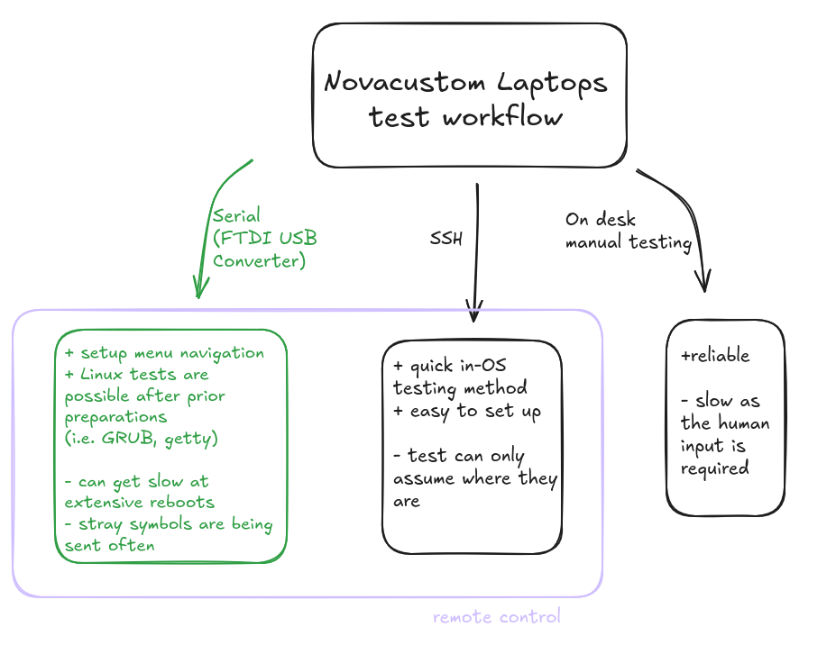
</center>

---

# <center> Serial output over USB </center>

<center>
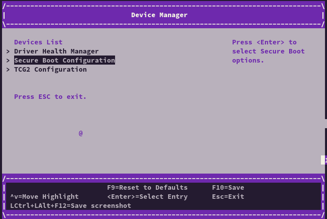
</center>

<!--
Display of probable cause of the double click in menu navigation
-->
---

# <center> Serial output over USB </center>

<center>
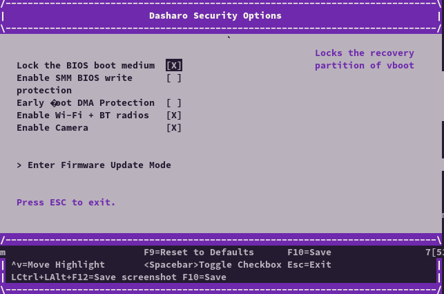
</center>

<!--
Missing or wrong characters - need for read content tolerance, next section Fuzzy Search-beta
-->
---

# <center> Fuzzy Search  </center>
- USB FTDI connections introduced signal distortions
- Needed a tolerant search approach instead of strict matching
- Implemented fuzzy search to handle noisy or incomplete data
---

# <center> Fuzzy Search  </center>
```bash
Traditional Serial                                                    ..PASS
FAIL
FAIL
PASS
FAIL
PASS
PASS
FAIL
PASS
PASS
Traditional Serial                                                    | FAIL |
'$failed' should not be true.
------------------------------------------------------------------------------
Fuzzy Serial                                                          ..PASS
PASS
PASS
PASS
PASS
PASS
PASS
PASS
FAIL
PASS
Fuzzy Serial                                                          | FAIL |
'$failed' should not be true.
------------------------------------------------------------------------------
```
<!--
- Enabled reliable detection of devices despite imperfect input with customizable tolerance threshold
- Reduced false negatives in identifying hardware connections
- Improves robustness of test automation workflows
-->

---

# <center> Adding HW tests to OSFV CI </center>

</br>
Performing CI tests on real hardware will greatly improve the reliability of OSFV

- The work is in progress
- Two representatives prepared as a start
    <center><table>
    <tr>
    <td>MSI Z690 DDR4 i5 14600k</td><td>PC Engines APU3C AMD GX-412TC</td>
    </tr>
    <tr>
    <td>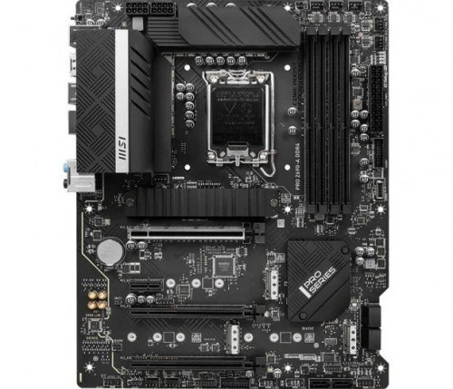</td>
    <td>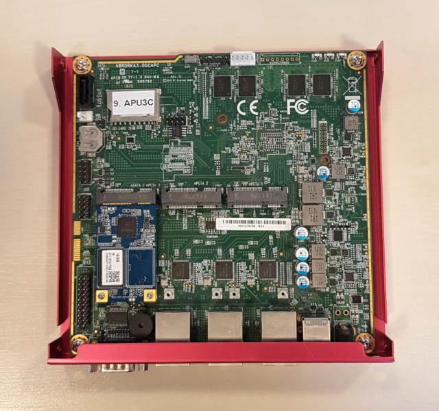</td>
    </tr>
    </table></center>

<!--

-->
---

# <center> Adding HW tests to OSFV CI </center>
Github Action Runner `Scoped Regression`

<center>
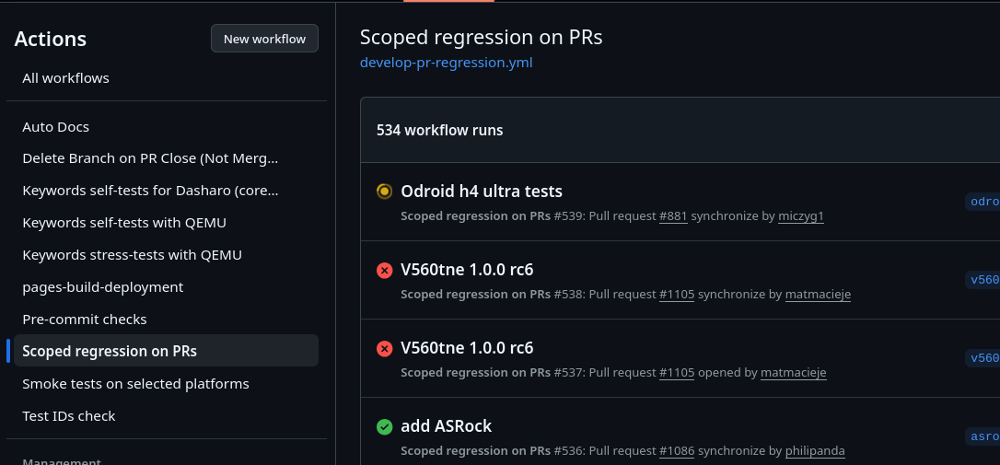
</center>

---

# <center> Priorities for the future </center>

* CI tests on real hardware on every PR
  * Improving current workflow to prevent unexpected breaks on changes
* Full SeaBIOS support is still on the roadmap

<!--
d
-->

---
layout: cover
background: /intro.png
class: text-center
---
# <center> Thank you! </center>
<!--
Current state
Changes:
- Enforcing the test naming convention
  - the bulk amount of tests we perform
  - how to look for the results, how to find the features you are
    interested in
- A summary of improvements and additions regarding the test cases and supported platforms
- Deprecation of Dasharo Test Specification at docs.dasharo.com
- FTDI converters for laptops

Future plans:
- Development of a new tool for managing Dasharo releases and the testing process
  - still in progress, but can do a little highlight

-->
