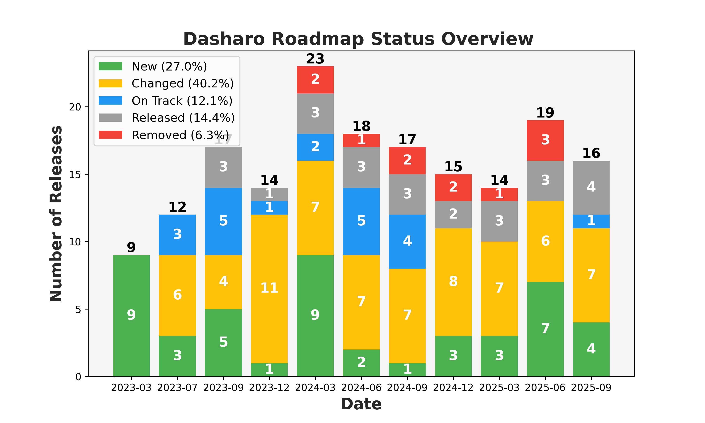

## &#x1F44B; Dasharo User Group #12 &#x1F389;

### Dasharo Community Release Roadmaps

<center></center>

<!--

- consider what feature set is provided in roadmaps
  - define publicly visible deliverables of each phase
  - document frameworks and tools on which given release will be based on
- We need more focused slides, saying precisely what we plan for given release,
  what features what will be validated etc.
- Dasharo development unification
- Customer stories?
- Features matrix concept
- Inform about our priorities
- Average Delay of Dasharo Community Release
- Average Time To Dasharo Community Release
- Explain Dasharo TrustRoot
- Dasharo Certification Lab

-->

---

<center></center>

<small>

_Please note that the roadmap for the Dasharo Community Support Program is
subject to change and may not represent final release candidates or end of
support dates. This roadmap is intended to provide guidance and direction for
the program's development, but is not a guarantee of specific timelines or
outcomes. For more information on release candidates or release dates, please
contact the Dasharo Team directly._

</small>
<!--

We consider to be more conservative in adding new platforms to the roadmap.

-->

---

- For those watching this presentation first time we really encourage to look
  at past videos to get better context and understanding of the format.
  - [DUG#11](https://www.youtube.com/playlist?list=PLuISieMwVBpKT9np4kX808u07j5CNZn4r),
    [DUG#10](https://www.youtube.com/watch?v=imhXpjCoQb4&list=PLuISieMwVBpIA51fGDz2dSPDlFE5Df1cE&index=3),
   [DUG#9](https://www.youtube.com/watch?v=ZVgjzvRcnqU&list=PLuISieMwVBpKNjDQBK2MU78tbU1XWkiPD),
  [DUG#8](https://www.youtube.com/watch?v=elEYzR-kVkw&list=PLuISieMwVBpLcYtLuM7rwooWeoH7I6tEF),
    [DUG#7](https://www.youtube.com/watch?v=raxY3JfMdp0&list=PLuISieMwVBpIJQpso6QICMUqqW5z8L1S2),
    [DUG#6](https://www.youtube.com/watch?v=Q8ILsTzoUjA&list=PLuISieMwVBpIQqHtHwYqypru50eg5nxoz),
    [DUG#5](https://www.youtube.com/watch?v=n7yv9T4VoFc&list=PLuISieMwVBpKBpfYlGZnDXOcqcQKXGXCX),
    [DUG#4](https://www.youtube.com/live/EN5rBAAOdOk?feature=shared&t=3973),
    [DUG#3](https://www.youtube.com/live/xHdlDmZVVkI?feature=shared&t=8700),
    [DUG#2](https://www.youtube.com/live/ZyctrnJNTPc?feature=shared&t=3395),
    [DUG#1](https://www.youtube.com/live/fUfjWyljKNs?feature=shared&t=795)

<center></center>

---

<center></center>

* Dasharo (coreboot+UEFI) Pro Rapid Package for MSI Z690-A
* Dasharo (coreboot+Heads) Pro Assured Package for NV41
* Dasharo (Slim Bootloader) Enterprise LTS Package for Odroid-H4

<!--

More details about it can be found in previous editions of the talk e.g. [DUG #9](https://youtu.be/bhWMc06UEiU?feature=shared&t=118).

-->

---

<center></center>

<!--

- Average: 24.0 releases/year, 6.0 releases/quarter for all releases,
  108 releases total since Q3'21
- 44 DCR / 64 DSPR = 0.688 DCR/DSPR (+0.043 from DUG#11)
- Considering year by year:
  - 2021: 10
  - 2022: 31
  - 2023: 16
  - 2024: 27
  - 2025: 24

- Q3'25 releases (corrected, 10 total):
  - 5 DCR: ASRock SPC741D8, Odroid-H4 (coreboot), Odroid-H4 (SBL), MSI Z690-A
    v1.1.5, MSI Z790-P v0.9.3
  - 5 DSPR: NovaCustom NUC Box, V540TU, V560TU, Protectli VP2440, VP32xx

- Q4'25 releases (Oct-Dec only, 3 DCR, 0 DSPR):
  - MSI Z690-A v1.1.6 (2025-12-01)
  - MSI Z790-P v0.9.4 (2025-12-01)
  - PC Engines apu UEFI v0.9.1 (2025-11-27)

- DSPR classification: Only NovaCustom OR Protectli (excluding Heads)

- snippets for verification:

```bash
cd ~/src/3mdeb/dasharo/docs
# All Q3'25 releases (verify last quarter)
grep "^## v" docs/variants -r | grep -E "2025-(07|08|09)"
# All Q4'25 releases
grep "^## v" docs/variants -r | grep -E "2025-(10|11|12)"
# DSPR Q3'25 releases (NovaCustom/Protectli, no Heads)
grep "^## v" docs/variants -r | grep -E "2025-(07|08|09)" | \
  grep -E "novacustom|protectli" | grep -v "heads"
# DSPR Q4'25 releases (NovaCustom/Protectli, no Heads)
grep "^## v" docs/variants -r | grep -E "2025-(10|11|12)" | \
  grep -E "novacustom|protectli" | grep -v "heads"
```

-->

---

<center></center>

<!--

* NUC Box and Odroid are classified as network appliance
* Server segment added in Q3'25 with ASRock Rack SPC741D8 release

Market segment breakdown (Q3'21 through Q4'25, 108 total releases):
- Emulation: 3 releases (2.8%)
- Network Appliance: 33 releases (30.6%)
- Laptops: 42 releases (38.9%)
- Desktops: 20 releases (18.5%)
- Workstation: 9 releases (8.3%)
- Server: 1 release (0.9%)

-->

---

<center></center>

<!--

* We have a lot of changes to report. Exciting new platforms coming.
* To some extent this diagram say, that likelihood of change is 40%.
* Likelihood we will add new release 27% and that we will remove existing one
is 6%.
* There is only 15% chance we will release or 12% chance we will stay on track
towards release.

-->
---

<center></center>

- coreboot+SeaBIOS keep waiting for its prime time, it is connected with
transition to OSFV, which we are very hesitant to do because it is quite a lot
of work and we have other projects
- [GitHub Milestone Link](https://github.com/Dasharo/dasharo-issues/milestone/59)
  to QEMU Q35 (coreboot+SeaBIOS) v0.9.0. **No progress** - shifted to Q1'26
- [GitHub Milestone Link](https://github.com/Dasharo/dasharo-issues/milestone/45)
  to QEMU Q35 (coreboot+UEFI) v0.3.0. **62% completed** - shifted to Q1'26

<!--

- DUG#12:
  - (CHANGED) QEMU Q35 v0.3.0 planned for Q4'25
    - release date changed: to Q1'26
  - (CHANGED) QEMU Q35 v0.9.0 planned for Q4'25
    - release date changed: to Q1'26
- DUG#11:
  - (ON TRACK) QEMU Q35 v0.3.0 planned for Q4'25
  - (CHANGED) QEMU Q35 v0.9.0 planned for Q3'25
    - release date changed: to Q4'25
- DUG#10:
  - (NEW) QEMU Q35 v0.3.0 planned for Q4'25
  - (NEW) QEMU Q35 v0.2.1 planned for Q2'25
  - (RELEASED) QEMU Q35 v0.2.1 planned for Q2'25
  - (CHANGED) QEMU Q35 v0.9.0 planned for Q2'25
    - release date changed: to Q3'25
- DUG#9:
  - (CHANGED) QEMU Q35 v0.9.0 planned for Q1'25
    - release name changed: v24.08.00.01 to v0.9.0
    - release date changed: to Q2'25
- DUG#8:
  - (NEW) QEMU Q35 v24.08.00.01 planned for Q1'25
- DUG#7:
  - (RELEASED) QEMU Q35 v0.2.0 planned for Q2'24
- DUG#6:
  - (CHANGED) QEMU Q35 v0.2.0 planned for Q3'24
    - release scope changed: we will use coreboot+UEFI instead of pure UEFI
    - release date changed: to Q2'24
- DUG#5:
  - (NEW) QEMU Q35 v0.2.0 planned for Q3'24
- DUG#4:
  - (RELEASED) QEMU Q35 v0.1.0 release
- DUG#3:
  - (ON TRACK) QEMU Q35 v0.1.0 planned for Q4'23
- DUG#2:
  - (CHANGED) QEMU Q35 v0.1.0 planned for Q3'23
    - release date changed to Q4'23 (+1)
- DUG#1:
  - (NEW) QEMU Q35 v0.1.0 planned for Q3'23

-->

---

<center></center>

* `v25.06` was replaced with `v25.09` release. It is planned for EOM.
* We also caught Andrew during QOSS'25 hackathon and spend quite a lot of time
educating ourselves about best practice to manage pq.
* `v25.09.00.01` is **12% completed**.
  [GitHub Milestone Link](https://github.com/Dasharo/dasharo-issues/milestone/68)
  - on track for Q4'25
* `v0.9.1` was **RELEASED** on 2025-11-27 (Q4'25)
  [Release Notes](https://docs.dasharo.com/variants/pc_engines/releases/#v091-2025-11-27)

<!--

- DUG#12:
  - (ON TRACK) PC Engines apu2/3/4/6 Dasharo (coreboot+SeaBIOS) v25.09.00.01
    planned for Q4'25
  - (RELEASED) PC Engines apu2/3/4/6 Dasharo (coreboot+UEFI) v0.9.1 released on
    2025-11-27 (Q4'25)
- DUG#11
  - (CHANGED) PC Engines apu2/3/4/6 Dasharo (coreboot+SeaBIOS) v25.06.00.01
    planned for Q2'25
    - release scope change: switched tag to 24.09.00.01
    - release date changed to Q4'25 (+2)
  - (CHANGED) PC Engines apu2/3/4/6 Dasharo (coreboot+UEFI) v0.9.1 planned for
    Q3'25
    - release date changed to Q4'25 (+1)
- DUG#10
  - (RELEASED) PC Engines apu2/3/4/6 Dasharo (creboot+SeaBIOS) v24.08.00.01
    planned for Q4'24
  - (REMOVED) PC Engines apu2/3/4/6 Dasharo (coreboot+SeaBIOS) v25.03.00.01
    planned for Q3'25
  - (REMOVED) PC Engines apu2/3/4/6 Dasharo (coreboot+SeaBIOS) v25.12.00.01
    planned for Q2'25
  - (NEW) PC Engines apu2/3/4/6 Dasharo (coreboot+SeaBIOS) v25.06.00.01 planned
    for Q2'25
  - (CHANGED) PC Engines apu2/3/4/6 Dasharo (coreboot+UEFI) v0.9.1 planned for
    Q2'25
    - release date changed to Q3'25 (+1)
- DUG#9
  - (NEW) PC Engines apu2/3/4/6 Dasharo (coreboot+SeaBIOS) v25.03.00.01 planned
    for Q3'25
  - (NEW) PC Engines apu2/3/4/6 Dasharo (coreboot+SeaBIOS) v25.12.00.01 planned
    for Q2'25
  - (CHANGED) PC Engines apu2/3/4/6 Dasharo (coreboot+UEFI) v0.9.1 planned for
    Q1'25
    - release date changed to Q2'25 (+1)
  - (CHANGED) PC Engines apu2/3/4/6 Dasharo (creboot+SeaBIOS) v24.08.00.01
    planned for Q4'24
    - release date changed to Q2'25 (+2)
- DUG#8
  - (REMOVED) PC Engines apu2/3/4/6 Dasharo (creboot+SeaBIOS) legacy planned for
    Q4'24
  - (CHANGED) PC Engines apu2/3/4/6 Dasharo (coreboot+UEFI) v0.9.1 planned for
    Q4'24
    - release date changed to Q1'25
  - (CHANGED) PC Engines apu2/3/4/6 Dasharo (creboot+SeaBIOS) v24.08.00.01
    planned for Q3'24
    - release date changed to Q4'24
- DUG#7
  - (RELEASED) PC Engines apu2/3/4/6 Dasharo (creboot+SeaBIOS) v24.05.00.01
    planned for Q2'24
  - (NEW) PC Engines apu2/3/4/6 Dasharo (creboot+SeaBIOS) v24.08.00.01 planned
    for Q3'24
- DUG#6
  - (RELEASED) PC Engines apu2/3/4/6 Dasharo (coreboot+UEFI) v0.9.0 planned for
    Q1'24
  - (CHANGED) PC Engines apu2/3/4/6 Dasharo (creboot+SeaBIOS) mainline planned
    for Q2'24
    - release scope change: switched tag to 24.05.00.01
  - (CHANGED) PC Engines apu2/3/4/6 Dasharo (creboot+SeaBIOS) legacy planned for
    Q3'24
    - release date changed to Q3'24
  - (NEW) PC Engines apu2/3/4/6 Dasharo (coreboot+UEFI) v0.9.1 planned for Q2'24
- DUG#5
  - (CHANGED) PC Engines apu2/3/4/6 Dasharo (coreboot+UEFI) planned for Q1'24
    - release scope changed: additional platform apu4
  - (NEW) PC Engines apu2/3/4/6 Dasharo (creboot+SeaBIOS) mainline planned for Q2'24
  - (NEW) PC Engines apu2/3/4/6 Dasharo (creboot+SeaBIOS) legacy planned for Q2'24
- DUG#4:
  - (CHANGED) PC Engines apu3 planned for Q4'23
    - release date changed to Q1'23 (+1)
    - add support for apu2 and apu6
- DUG#3:
  - (NEW) PC Engines apu3 planned for Q4'23

-->

---

## PC Engines apu2/3/4/6 Dasharo (coreboot+UEFI) v0.9.1 SBOM

**Upgrade from v0.9.0 (2024-04-02) to v0.9.1 (2025-11-27)**

<br>

* [Dasharo coreboot fork](https://github.com/Dasharo/coreboot/tree/217612e6)
  based on **24.12** (was: 4.21)
* [Dasharo EDKII fork](https://github.com/Dasharo/edk2/tree/42934b12) based on
  **edk2-stable202502** (was: edk2-stable202002)
* [iPXE](https://github.com/Dasharo/ipxe/tree/6c7068fc) revision **6c7068fc**
  from 2025-08-21 (was: 2023.12)
*
  [vboot](https://chromium.googlesource.com/chromiumos/platform/vboot_reference/+/f1f70f46/)
  revision **f1f70f46** from 2024-07-18 (was: 0c11187c75)

<br>

AMD components unchanged: AGESA MullinsPI 1.0.0.A, PSP D.1.1.4D, SMU 1433, xHCI 1.1.0.0068

<br>

<center>

[Full Release Notes](https://docs.dasharo.com/variants/pc_engines/releases/#v091-2025-11-27)

</center>

---

## PC Engines apu2/3/4/6 v0.9.1 - What is inside?

**Upgrade from v0.9.0 (2024-04-02) → v0.9.1 (2025-11-27)**

<br>

### Changed

* [coreboot 4.21 →
  24.12](https://doc.coreboot.org/releases/coreboot-24.12-relnotes.html): 3.5
  years of upstream improvements
* edk2-stable202002 → edk2-stable202502: 5 years of UEFI stack updates
* iPXE 2023.12 → 2025-08-21: Latest network boot improvements
* vboot 0c11187c75 → f1f70f46: 12 months of updates
* Secure Boot Owner GUID: Aligned DB/KEK with Microsoft standards for compatibility
* [DBX revocation list](https://uefi.org/revocationlistfile): Updated to
  2025-10-16 (blocks vulnerable bootloaders): 5 years of UEFI revocation list
  updates

<br>

<center>

Released: **2025-11-27** | [Full Release Notes](https://docs.dasharo.com/variants/pc_engines/releases/#v091-2025-11-27)

</center>

---

<center></center>

* **Status:** REMOVED - Support cancelled for DUG#12
* **Reason:** Lack of resources to address complex technical issues
* **Impact:** v0.9.0 (coreboot+SeaBIOS) DPP Release will not be delivered
* **Milestone #52:** 0% completed → Will be closed
* **Note:** This slide will be removed in DUG#13

[GitHub Milestone #52](https://github.com/Dasharo/dasharo-issues/milestone/52)

<!--

- DUG#12:
  - (REMOVED) Protectli VP4670 Dasharo (coreboot+SeaBIOS) v0.9.0 planned for Q4'25
    - support removed: lack of resources, complex technical issues, 0% milestone
      completion
    - milestone #52 will be closed
    - slide will be removed in DUG#13
- DUG#11
  - (CHANGED) Protectli VP4670 planned for Q3'25
    - release date changed to Q4'25 (+1)
- DUG#10
  - (CHANGED) Protectli VP4670 planned for Q2'25
    - release date changed to Q3'25 (+1)
- DUG#9
  - (CHANGED) Protectli VP4670 planned for Q1'25
    - release date changed to Q2'25 (+1)
- DUG#8
  - (CHANGED) Protectli VP4670 planned for Q4'24
    - release date changed to Q1'25 (+1)
- DUG#7
  - (CHANGED) Protectli VP4670 planned for Q3'24
    - release date changed to Q4'24 (+1)
- DUG#6
  - (CHANGED) Protectli VP4670 planned for Q2'24
    - release date changed to Q3'24 (+1)
    - scope change to Dasharo (coreboot+SeaBIOS)
- DUG#5
  - (CHANGED) Protectli VP4670 planned for Q2'24
    - release date changed to Q2'24 (-1)
- DUG#4:
  - (CHANGED) Protectli VP4670 planned for Q2'24
    - release date changed to Q3'23 (+1)
- DUG#3:
  - (NEW) Protectli VP4670 planned for Q2'24

-->

---

<center></center>

* `v0.9.1` (coreboot+UEFI) was released on 2025-09-03 (Q3'25) - documented in DUG#11
* `v0.9.0` (Slim Bootloader+UEFI) was released on 2025-08-12 (Q3'25) -
  documented in DUG#11
* ODROID-H4 is our platform of choice for PET (Pace Enterprise Training)
* `v0.9.2` planned for Q1'26: [GitHub Milestone #82](https://github.com/Dasharo/dasharo-issues/milestone/82)

<!--

- DUG#12:
  - (CHANGED) ODROID-H4 (coreboot+UEFI) v0.9.2 planned for Q4'25
    - release date changed to Q1'26 (+1)
- DUG#11
  - (NEW) Hardkernel Odroid-H4 Dasharo(coreboot+UEFI) v0.9.2 planned for Q4'25
  - (RELEASED) Hardkernel Odroid-H4 Dasharo(Slim Bootloader) v0.9.0 planned for Q3'25
  - (NEW) Hardkernel Odroid-H4 Dasharo(Slim Bootloader) v0.9.0 planned for Q3'25
  - (RELEASED) Hardkernel Odroid-H4 Dasharo(coreboot+UEFI) v0.9.1 planned for Q3'25
- DUG#10
  - (CHANGED) Hardkernel Odroid-H4 Dasharo(coreboot+UEFI) v0.9.1 planned for Q2'25
    - changed to second half of Q3'25 (+1)
- DUG#9
  - (RELEASED) Hardkernel Odroid-H4 Dasharo(coreboot+UEFI) planned for Q4'24
  - (NEW) Hardkernel Odroid-H4 Dasharo(coreboot+UEFI) v0.9.1 planned for Q2'25
- DUG#8
  - (CHANGED) Hardkernel Odroid-H4 Dasharo(coreboot+UEFI) planned for Q4'24
    - changed to second half of Q4'24'
- DUG#7
  - (ON TRACK) Hardkernel Odroid-H4 Dasharo(coreboot+UEFI) planned for Q4'24
- DUG#6
  - (NEW) Hardkernel Odroid-H4 Dasharo(coreboot+UEFI) planned for Q4'24

-->

---

<center></center>

---

<center></center>

* No new Dasharo (coreboot+Heads) releases planned for 2025
* Next release planned for 2026 (by end of year)
* Specific release date will be announced during DUG#13
* Note: coreboot+UEFI releases (V540TU/V560TU) are DSPR, not DCR - outside this
  roadmap scope

<!--

- DUG#12:
  - No new coreboot+Heads releases in 2025
  - Next release planned for 2026 (by end of year, date TBA in DUG#13)
- DUG#11:
  - No plans in 2025
- DUG#10:
  - (RELEASED) NV4x Dasharo (coreboot+Heads) v0.9.2 planned for Q1'25
    - release date changed to Q2'25 (+1)
  - (REMOVED) NV4x Dasharo (coreboot+SeaBIOS) v1.7.2.x planned for Q1'25
    - release scope changed to coreboot+SeaBIOS
    - release date changed to Q1'25
- DUG#9:
  - (RELEASED) V56TU Dasharo (coreboot+Heads) v0.9.0 planned for Q4'24
  - (CHANGED) NV4x Dasharo (coreboot+Heads) v0.9.2 planned for Q1'25
    - release date changed to Q2'25 (+1)
  - (REMOVED) NV4x Dasharo (coreboot+SeaBIOS) v1.7.2.x planned for Q1'25
    - release scope changed to coreboot+SeaBIOS
    - release date changed to Q1'25
- DUG#8:
  - (NEW) V56TU Dasharo (coreboot+Heads) v0.9.0 planned for Q4'24
  - (NEW) NV4x Dasharo (coreboot+Heads) v0.9.2 planned for Q1'25
  - (CHANGED) NV4x Dasharo (coreboot+SeaBIOS) v1.7.2.x planned for Q1'25
    - release scope changed to coreboot+SeaBIOS
    - release date changed to Q1'25
- DUG#7:
  - (RELEASED) Novacustom NV4x Dasharo (coreboot+Heads) v0.9.1 planned for Q3'24
  - (CHANGED) Novacustom NV4x Dasharo (coreboot+UEFI) v2.0.0 planned for Q3'24
    - release scope changed it will base on v2.0.0
    - release date changed to Q4'24 (+1)
- DUG#6:
  - (ON TRACK) Novacustom NV4x Dasharo (coreboot+Heads) v0.9.1 planned for Q3'24
  - (ON TRACK) Novacustom NV4x Dasharo (coreboot+UEFI) v1.8.0 planned for Q3'24
- DUG#5:
  - (RELEASED) Novacustom NV4x Dasharo (coreboot+Heads) v0.9.0 planned for Q4'23
  - (NEW) Novacustom NV4x Dasharo (coreboot+Heads) v0.9.1 planned for Q3'24
  - (NEW) Novacustom NV4x Dasharo (coreboot+UEFI) v1.8.0 planned for Q3'24
- DUG#4:
  - (CHANGED) Novacustom NV4x Dasharo (coreboot+Heads) v0.9.0 planned for Q4'23
    - release date changed to Q1'24 (+1)
- DUG#3:
  - (NEW) Novacustom NV4x Dasharo (coreboot+Heads) v0.9.0 planned for Q4'23

-->

---

<center></center>

* `v0.1.1` was released on 2024-12-17 (Q4'24)
* `v0.2.0` and `v0.3.0` preemptively added to roadmap for TrenchBoot support
  - [Milestone #49
    (v0.2.0)](https://github.com/Dasharo/dasharo-issues/milestone/49): 50%
    complete - TrenchBoot AEM support
  - [Milestone #50
    (v0.3.0)](https://github.com/Dasharo/dasharo-issues/milestone/50): 0%
    complete
- Decision on platform support continuation to be made during DUG#13

<!--

- DUG#12
  - (NEW) Dell OptiPlex 7010/9010 v0.2 planned for Q2'26
  - (NEW) Dell OptiPlex 7010/9010 v0.3 planned for Q3'26
- DUG#11
  - no plans
- DUG#10
  - no plans
- DUG#9
  - (RELEASED) Dell OptiPlex 7010/9010 v0.1.1 planned for Q4'24
    - release date changed to Q4'24
    - release scope changed to v0.1.1
- DUG#8
  - (CHANGED) Dell OptiPlex 7010/9010 v0.1.0 planned for Q3'24
    - release date changed to Q4'24
    - release scope changed to v0.1.1
- DUG#7
  - (ON TRACK) Dell OptiPlex 7010/9010 v0.1.0 planned for Q3'24
- DUG#6
  - (CHANGED) Dell OptiPlex 7010/9010 v0.1.0 planned for Q2'24
    - release date changed to Q3'24 (+1)
- DUG#5
  - (CHANGED) Dell OptiPlex 7010/9010 v0.1.0 planned for Q4'23
    - release date changed to Q2'24 (+1)
  - (REMOVED) Dell T1650 v0.1.0 planned for Q1'24
- DUG#4
  - (CHANGED) Dell OptiPlex 7010/9010 v0.1.0 planned for Q4'23
    - release date changed to Q1'24 (+1)
  - (CHANGED) Dell T1650 v0.1.0 planned for Q1'24
    - release date changed to Q3'24 (+2)
- DUG#3
  - (CHANGED) Dell OptiPlex 7010/9010 v0.1.0 planned for Q4'23
    - release type changed to DES
  - (CHANGED) Dell T1650 v0.1.0 planned for Q1'24
    - release type changed to DES
- DUG#2
  - (CHANGED) Dell OptiPlex 7010/9010 v0.1.0 planned for Q2'23
    - release date changed to Q4'23 (+2)
  - (CHANGED) Dell T1650 v0.1.0 planned for Q3'23
    - release date changed to Q1'24 (+2)
- DUG#1
  - (NEW) Dell OptiPlex 7010/9010 v0.1.0 planned for Q2'23
  - (NEW) Dell T1650 v0.1.0 planned for Q3'23

-->

---

<center></center>

* Introduction of Rapid releases (reduced test cycle, minimal regression ≤10% of
  LTS scope).
* `v1.1.5` (2025-09-18) and `v1.1.6` (2025-12-01) were Rapid DPP Releases
* Community Release v1.2.0 shifted to Q1'26
* EOL for Dasharo support for MSI PRO Z690-A is 2026 EOY.

<!--

* Support will most likely end next year unless there will be enough renewal to
support next release, but since that hardware is no longer sold we are concern
it would not be the case.

- DUG#12:
  - (RELEASED) MSI Z690-A v1.1.5 planned for Q3'25 (Rapid DPP)
  - (NEW) MSI Z690-A v1.1.6 planned for Q4'25 (Rapid DPP)
  - (RELEASED) MSI Z690-A v1.1.6 planned for Q4'25 (Rapid DPP)
  - (CHANGED) MSI Z690-A v1.2.0 Community Release shifted to Q1'26 (was Q4'25)
  - (REMOVED) MSI Z690-A v1.3.0 planned for Q3'25
- DUG#11
  - (RELEASED) MSI Z690-A v1.1.5 planned for Q3'25
  - (CHANGED) MSI Z690-A v1.2.0 planned for Q3'24
    - release date changed to Q4'25 (+1)
  - (CHANGED) MSI Z690-A v1.3.0 planned for Q3'25
    - release date changed to Q2'26 (+3)
- DUG#10
  - (NEW) MSI Z690-A v1.1.5 planned for Q3'25
  - (CHANGED) MSI Z690-A v1.2.0 planned for Q2'24
    - release date changed to Q3'25 (+1)
  - (NEW) MSI Z690-A v1.3.0 planned for Q3'25
- DUG#9
  - (CHANGED) MSI Z690-A v1.2.0 planned for Q1'24
    - release date changed to Q2'25 (+1)
- DUG#8
  - (RELEASED) MSI Z690-A v1.1.4 planned for Q4'24
- DUG#7
  - (CHANGED) MSI Z690-A v1.1.4 planned for Q3'24
    - release date changed to Q4'24 (+1)
  - (ON TRACK) MSI Z690-A v1.2.0 planned for Q4'24
- DUG#6
  - (ON TRACK) MSI Z690-A v1.1.4 planned for Q3'24
  - (ON TRACK) MSI Z690-A v1.2.0 planned for Q4'24
- DUG#5
  - (RELEASED) MSI Z690-A v1.1.3 planned for Q4'23
  - (NEW) MSI Z690-A v1.1.4 planned for Q3'24
  - (CHANGED) MSI Z690-A v1.2.0 planned for Q1'24
    - release date changed to Q2'24 (+2)
- DUG#4
  - (CHANGED) MSI Z690-A v1.1.3 planned for Q4'23
    - release date changed to Q1'24 (+1)
  - (CHANGED) MSI Z690-A v1.2.0 planned for Q1'24
    - release date changed to Q2'24 (+1)
- DUG#3
  - (RELEASED) MSI Z690-A v1.1.2 planned for Q3'23
  - (ON TRACK) MSI Z690-A v1.1.3 planned for Q4'23
  - (ON TRACK) MSI Z690-A v1.2.0 planned for Q1'24
- DUG#2
  - (ON TRACK) MSI Z690-A v1.1.2 planned for Q3'23
  - (NEW) MSI Z690-A v1.1.3 release planned for Q4'23
  - (CHANGED) MSI Z690-A v1.2.0 planned for Q4'23
    - release date changed to Q1'24 (+1)
- DUG#1
  - (NEW) MSI Z690-A v1.1.2 planned for Q3'23
  - (NEW) MSI Z690-A v1.2.0 planned for Q4'23

-->

---

# Rapid Release concept

* Release types: Rapid | Assured | LTS (defined by QA scope and support cadence)
* LTS - _Long Term Stable_: Full extensive test cycle (hundreds of tests),
  can take a lot of time and cost 50%+ of whole release cost.
* Rapid: Minimal regression only (≤10% of LTS), typically 3-10 tests
* For stable platforms with fixed set of known issues, there is no need for full
  LTS
  test cycle.
* Rapid releases will not come with the same guarantees as LTS.

<!--

Create marketing names for those test cycles.

-->

---

## Dasharo (coreboot+UEFI) for Z690-A SBOM

<br>

* Intel microcode version ADL/RPL C0/H0 0x3d 12/10/2025
* Intel microcode version RPL B0 0x132 08/10/2025

<br>

<center>

#### https://docs.dasharo.com/variants/msi_z690/releases/#v116-2025-12-01

</center>

<!--

When we update base framework we should explain what changes were introduced in
it that could affect platform functions and quality.

-->

---

<center></center>

* `v0.9.3` (2025-09-18) and `v0.9.4` (2025-12-01) were Rapid DPP Releases
* Community Release v1.0.0 shifted to Q1'26
* EOL for Dasharo support for MSI PRO Z790-P is 2026 EOY.
* Support will most likely end next year unless there will be enough renewal to
support next release, but since that hardware is no longer sold we are concern
it would not be the case.

<!--

- DUG#12:
  - (RELEASED) MSI Z790-P v0.9.3 planned for Q3'25 (Rapid DPP)
  - (RELEASED) MSI Z790-P v0.9.4 planned for Q4'25 (Rapid DPP)
  - (CHANGED) MSI Z790-P v1.0.0 Community Release shifted to Q1'26 (was Q4'25)
  - (REMOVED) MSI Z790-P v1.1.0 planned for Q2'26
- DUG#11
  - (RELEASED) MSI Z790-P v0.9.3 planned for Q3'25
  - (CHANGED) MSI Z790-P v1.0.0 planned for Q3'24
    - release date changed to Q4'25 (+1)
  - (CHANGED) MSI Z790-P v1.1.0 planned for Q3'25
    - release date changed to Q2'26 (+3)
- DUG#10
  - (NEW) MSI Z790-A v0.9.3 planned for Q3'25
  - (CHANGED) MSI Z790-A v1.0.0 planned for Q2'24
    - release date changed to Q3'25 (+1)
  - (NEW) MSI Z790-A v1.1.0 planned for Q3'25
- DUG#9
  - (CHANGED) MSI Z790-P v1.0.0 planned for Q1'25
    - release date changed to Q2'25 (+1)
- DUG#8
  - (RELEASED) MSI Z790-P v0.9.2 planned for Q4'24
  - (CHANGED) MSI Z790-P v1.0.0 planned for Q4'24
    - release date changed to Q1'25 (+1)
- DUG#7
  - (CHANGED) MSI Z790-P v0.9.2 planned for Q3'24
    - release date changed to Q4'24 (+1)
  - (ON TRACK) MSI Z790-P v1.0.0 planned for Q4'24
- DUG#6
  - (ON TRACK) MSI Z790-P v0.9.2 planned for Q3'24
  - (ON TRACK) MSI Z790-P v1.0.0 planned for Q4'24
- DUG#5
  - (ON TRACK) MSI Z790-P v0.9.2 planned for Q3'24
  - (ON TRACK) MSI Z790-P v1.0.0 planned for Q4'24
- DUG#5
  - (RELEASED) MSI Z790-P v0.9.1 planned for Q4'23
  - (NEW) MSI Z790-P v0.9.2 planned for Q3'24
  - (CHANGED) MSI Z790-P v1.0.0 planned for Q1'24
    - release date changed to Q2'24 (+2)
- DUG#4
  - (CHANGED) MSI Z790-P v1.0.0 planned for Q1'24
    - release date changed to Q2'24 (+1)
  - (ON TRACK) MSI Z790-P v0.9.1 planned for Q4'23
- DUG#3
  - (RELEASED) MSI Z790-P v0.9.0 planned for Q3'23
  - (ON TRACK) MSI Z790-P v0.9.1 planned for Q4'23
  - (ON TRACK) MSI Z790-P v1.0.0 planned for Q1'24
- DUG#2
  - (NEW) MSI Z790-P v0.9.0 planned for Q3'23
  - (NEW) MSI Z790-P v0.9.1 planned for Q4'23
  - (ON TRACK) MSI Z790-P v1.0.0 planned for Q1'24
- DUG#1
  - (NEW) MSI Z790-P v1.0.0 planned for Q1'24

-->

---

<center></center>

* **Formal EOL Announcement: MSI coreboot+Heads Support Ending**
* Last release: v0.9.0 (2024-03-21) for both Z690-A and Z790-P
<!--

- DUG#12:
  - (EOL) MSI Z690-A and Z790-P coreboot+Heads formal EOL announcement
  - Last release v0.9.0 (2024-03-21) remains supported until 2026 EOY
  - DTS integration broken (#1536, #1631) - fix planned (remove Heads workflows)
  - Backward compatibility maintained for existing v0.9.0 users
  - Migration to coreboot+UEFI recommended
  - Reference: Presentations #89
- DUG#11
  - no new plans
- DUG#10
  - no new plans
- DUG#9
  - no new plans
- DUG#8
  - no new plans
- DUG#7
  - no new plans
- DUG#6
  - (RELEASED) MSI Z790-P Dasharo (coreboot+Heads) v0.9.0 planned for Q1'24
  - (RELEASED) MSI Z690-P Dasharo (coreboot+Heads) v0.9.0 planned for Q1'24
- DUG#5
  - (ON TRACK) MSI Z790-P Dasharo (coreboot+Heads) v0.9.0 planned for Q1'24
  - (NEW) MSI Z690-P Dasharo (coreboot+Heads) v0.9.0 planned for Q1'24
- DUG#4
  - (CHANGED) MSI Z790-P Dasharo (coreboot+Heads) v0.9.0 planned for Q1'24
    - release date changed to Q1'24 (-1)
    - version changed to v0.9.0
- DUG#3
  - (NEW) MSI Z790-P Dasharo (coreboot+Heads) v1.0.1 planned for Q2'24

-->

---

# Dasharo (coreboot+Heads) issues

* **Known Issue**: DTS integration broken - UEFI->Heads transition not working
  (#1536, #1631)
* **Fix Planned**: DTS will be updated to remove broken Heads workflows (#1378, #1380)
* **Backward Compatibility**: Existing v0.9.0 users can continue using current firmware
* **Migration Path**: Users should transition to coreboot+UEFI (stable, actively
  maintained)
* **Support Timeline**: Extended support for v0.9.0 until 2026 EOY, then fully EOL
* **Reason**: Low adoption, technical integration issues, focus on UEFI development
* **Reference**: Presentations Issue #89 - Product Withdrawal Announcement

---

<center></center>

<br>

* We gratefully acknowledge the [https://os.itec.kit.edu](https://os.itec.kit.edu)
(Operating Systems Group) at Karlsruhe Institute of Technology (Fabian Meyer,
Felix Zimmer, Yussuf Khalil) for their contribution in initiating the coreboot
port for this platform and supporting open-source firmware development.
* `v0.9.1` planned for Q1'26: [Milestone #83](https://github.com/Dasharo/dasharo-issues/milestone/83)

<!--

- DUG#12
  - (RELEASED) ASRock Rack SPC741D8-2L2T v0.9.0 planned for Q3'25
  - (NEW) ASRock Rack SPC741D8-2L2T v0.9.1 planned for Q1'26
- DUG#11
  - (NEW) ASRock Rack SPC741D8-2L2T Dasharo (coreboot+Heads) v0.9.0 planned for Q3'25

-->

---

<center></center>
<br>

<center>

### [https://shop.3mdeb.com/product-category/dasharo-supported-hardware/](https://shop.3mdeb.com/product-category/dasharo-supported-hardware/)
</center>

<!--

We are in process of changing business model in Dasharo Pro and Enterprise
Package, so if you are interested in this hardware with Dasharo please let us
know.

-->

---

<center></center>

<br>

* This is second big announcement from us. We plan to deliver AMD OpenSIL based
  Dasharo for Gigabyte MZ33-AR1 in Q1'26.
* Timeline is not yet very solid, because this is new and complex project
  (server, new silicon initialization code).
* We publishing our results on [3mdeb blog](https://blog.3mdeb.com/tags/mz33-ar1/).

<!--

- DUG#12
  - (CHANGED) Gigabyte MZ33-AR1 release shifted from Q4'25 to Q1'26
- DUG#11
  - (NEW) Gigabyte MZ33-AR1 Dasharo (coreboot+UEFI) v0.9.0 planned for Q4'25

-->

---

<center></center>

<br>

<center>

### [https://shop.3mdeb.com/product-category/dasharo-supported-hardware/](https://shop.3mdeb.com/product-category/dasharo-supported-hardware/)
</center>

---

## Dasharo Security Bulletin (DSB)

- Launching Dasharo Security Bulletin (DSB): clear, actionable advisories for
Dasharo-supported platforms and firmware.
- Format identical to Xen Security Advisories (XSA) and Qubes Security
Bulletins (QSB): summary, impact, affected versions, fixes/mitigations,
timeline, credits, references.
- Coordinated disclosure with upstreams/vendors; embargoes when needed; publish
when fixes/mitigations are ready.
- Trust and verifiability: PGP‑signed advisories, permanent web archive; CVE
IDs and links included when available.
- Numbering and cadence: DSB-YYYY-NN; released as needed (not on a fixed
schedule).
- Distribution: Dasharo website with archive and RSS/Atom, announcement mailing
list, GitHub security advisories, and community channels.
- Community actions: subscribe, verify signatures and apply updates; report
vulnerabilities via our security contact (see security.txt).
- Security reports link: https://docs.dasharo.com/security/

---
layout: cover
background: /intro.png
class: text-center

---
# Q&A

---
layout: cover
background: /intro.png
class: text-center

---
# CHANGELOG

---

# Changelog DUG#10

- (NEW) QEMU Q35 v0.3.0 planned for Q4'25
- (NEW) QEMU Q35 v0.2.1 planned for Q2'25
- (RELEASED) QEMU Q35 v0.2.1 planned for Q2'25
- (CHANGED) QEMU Q35 v0.9.0 planned for Q2'25
- (RELEASED) PC Engines apu2/3/4/6 Dasharo (creboot+SeaBIOS) v24.08.00.01
  planned for Q4'24
- (REMOVED) PC Engines apu2/3/4/6 Dasharo (coreboot+SeaBIOS) v25.03.00.01
  planned for Q3'25
- (REMOVED) PC Engines apu2/3/4/6 Dasharo (coreboot+SeaBIOS) v25.12.00.01
  planned for Q2'25
- (NEW) PC Engines apu2/3/4/6 Dasharo (coreboot+SeaBIOS) v25.06.00.01 planned
  for Q2'25
- (CHANGED) PC Engines apu2/3/4/6 Dasharo (coreboot+UEFI) v0.9.1 planned for Q2'25
- (CHANGED) Protectli VP4670 planned for Q2'25
- (CHANGED) Hardkernel Odroid-H4 Dasharo(coreboot+UEFI) v0.9.1 planned for Q2'25
- (RELEASED) NV4x Dasharo (coreboot+Heads) v0.9.2 planned for Q1'25
- (REMOVED) NV4x Dasharo (coreboot+SeaBIOS) v1.7.2.x planned for Q1'25
- (NEW) MSI Z690-A v1.1.5 planned for Q3'25

---

# Changelog DUG#10

- (CHANGED) MSI Z690-A v1.2.0 planned for Q2'24
- (NEW) MSI Z690-A v1.3.0 planned for Q3'25
- (NEW) MSI Z790-A v0.9.3 planned for Q3'25
- (CHANGED) MSI Z790-A v1.0.0 planned for Q2'24
- (NEW) MSI Z790-A v1.1.0 planned for Q3'25

---

# Changelog DUG#9

- (CHANGED) QEMU Q35 v0.9.0 planned for Q1'25
- (NEW) PC Engines apu2/3/4/6 Dasharo (coreboot+SeaBIOS) v25.03.00.01 planned
  for Q3'25
- (NEW) PC Engines apu2/3/4/6 Dasharo (coreboot+SeaBIOS) v25.12.00.01 planned
  for Q2'25
- (CHANGED) PC Engines apu2/3/4/6 Dasharo (coreboot+UEFI) v0.9.1 planned for
  Q1'25
- (CHANGED) PC Engines apu2/3/4/6 Dasharo (creboot+SeaBIOS) v24.08.00.01 planned
  for Q4'24
- (CHANGED) Protectli VP4670 planned for Q1'25
- (RELEASED) Hardkernel Odroid-H4 Dasharo(coreboot+UEFI) planned for Q4'24
- (NEW) Hardkernel Odroid-H4 Dasharo(coreboot+UEFI) v0.9.1 planned for Q2'25
- (RELEASED) V56TU Dasharo (coreboot+Heads) v0.9.0 planned for Q4'24
- (CHANGED) NV4x Dasharo (coreboot+Heads) v0.9.2 planned for Q1'25
- (REMOVED) NV4x Dasharo (coreboot+SeaBIOS) v1.7.2.x planned for Q1'25
- (RELEASED) Dell OptiPlex 7010/9010 v0.1.1 planned for Q4'24
- (CHANGED) MSI Z690-A v1.2.0 planned for Q1'24
- (CHANGED) MSI Z790-P v1.0.0 planned for Q1'25

---

# Changelog DUG#8

- (NEW) QEMU Q35 v24.08.00.01 planned for Q1'25
- (REMOVED) PC Engines apu2/3/4/6 Dasharo (creboot+SeaBIOS) legacy planned for Q4'24
- (CHANGED) PC Engines apu2/3/4/6 Dasharo (coreboot+UEFI) v0.9.1 planned for Q4'24
- (CHANGED) PC Engines apu2/3/4/6 Dasharo (creboot+SeaBIOS) v24.08.00.01 planned
  for Q3'24
- (CHANGED) Protectli VP4670 planned for Q4'24
- (REMOVED) MinnowBoard Turbot Dasharo(coreboot+UEFI) planned for Q3'24
- (CHANGED) Hardkernel Odroid-H4 Dasharo(coreboot+UEFI) planned for Q4'24
- (NEW) V56TU Dasharo (coreboot+Heads) v0.9.0 planned for Q4'24
- (NEW) NV4x Dasharo (coreboot+Heads) v0.9.2 planned for Q1'25
- (CHANGED) NV4x Dasharo (coreboot+SeaBIOS) v1.7.2.x planned for Q1'25
- (CHANGED) Dell OptiPlex 7010/9010 v0.1.0 planned for Q3'24
- (RELEASED) MSI Z690-A v1.1.4 planned for Q4'24
- (CHANGED) MSI Z690-A v1.2.0 planned for Q4'24

---

# Changelog DUG#8

- (RELEASED) MSI Z790-P v0.9.2 planned for Q4'24
- (CHANGED) MSI Z790-P v1.0.0 planned for Q4'24

---
layout: cover
background: /intro.png
class: text-center

---

# Q&A
