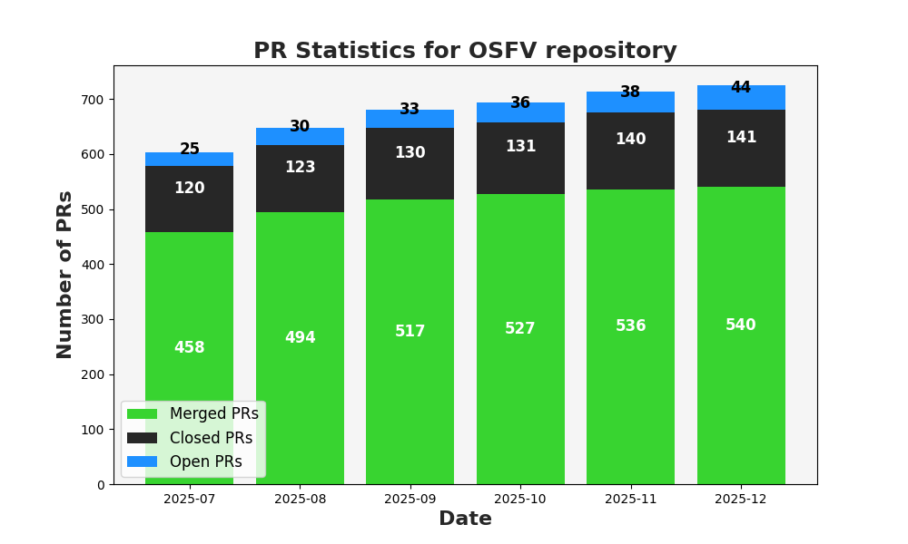
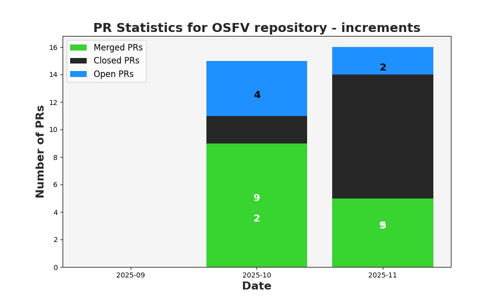
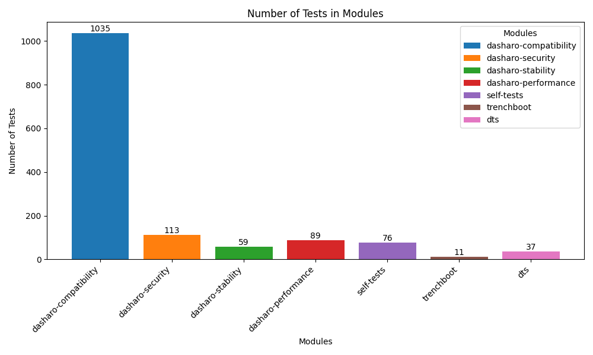
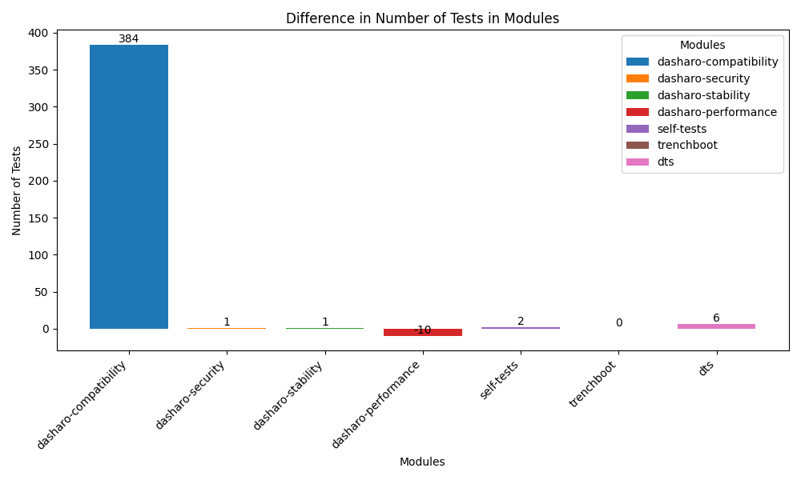

## Dasharo Open Source Firmware Validation Status

---

# 
 Agenda 

* Short introduction to OSFV
* Stats
* Improvements
* Work in progress & future plans
* Q&A

---
layout: cover
background: /intro.png
class: text-center
---

# 
 Introduction to Open Source Firmware Validation 

---

# 
 Introduction to Open Source Firmware Validation 

- Open Source Validation of Open Source Firmware
- Based on Robot Framework
- Used to detect regression in next dasharo release via series of automated test cases

---
layout: cover
background: /intro.png
class: text-center
---

# OSFV Stats

---

# 
 PR stats 

### 
 open-source-firmware-validation 

#### 
 Total 

---

# 
 PR stats 

### 
 open-source-firmware-validation 

#### 
 Difference 

---

# 
 Test modules stats 

#### 
 Total test cases 

---

# 
 Test modules stats 

#### 
 Difference 

---

# 
 Biggest changes 

---

# 
 Implemented: 

- a possibility to run tests simultaneously
- an QubesOS automatic installer
- an OpenWrt automation: installation & basic tests
- Microcode revision testing
---

# 
 In progress/planned: 

- QubesOS test cases in OSFV

---

# 
a possibility to run tests simultaneously

- dasharo-performance module
- CPT, CPF, STB suites
- grouped & executed per ENV_ID

---

# 
>an QubesOS automatic installer

---

# 
 Priorities for the future 

---

# 
 Thank you! 

