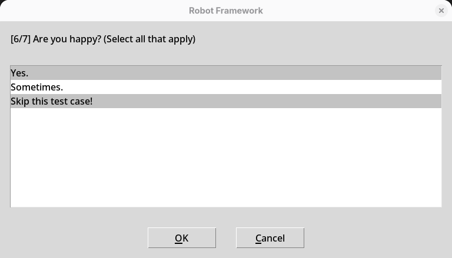
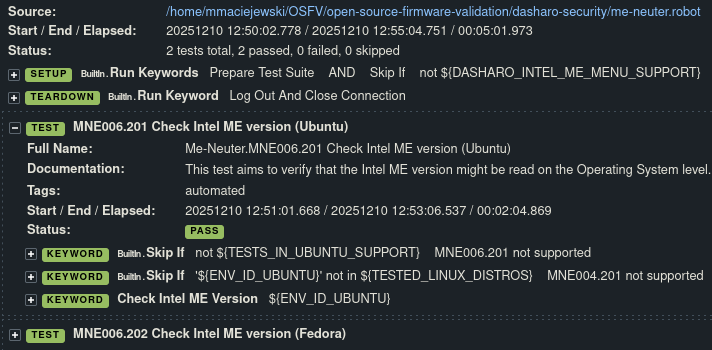
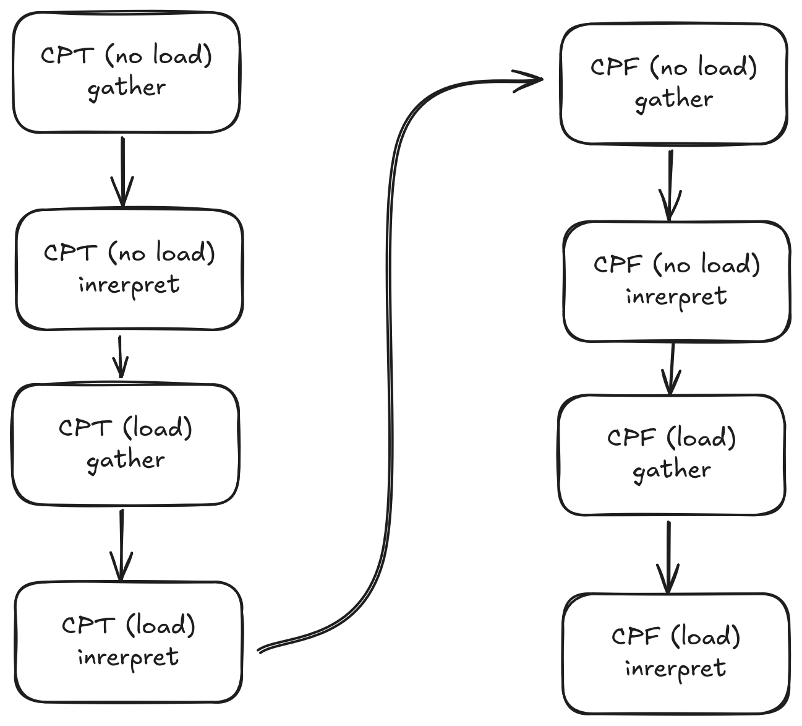
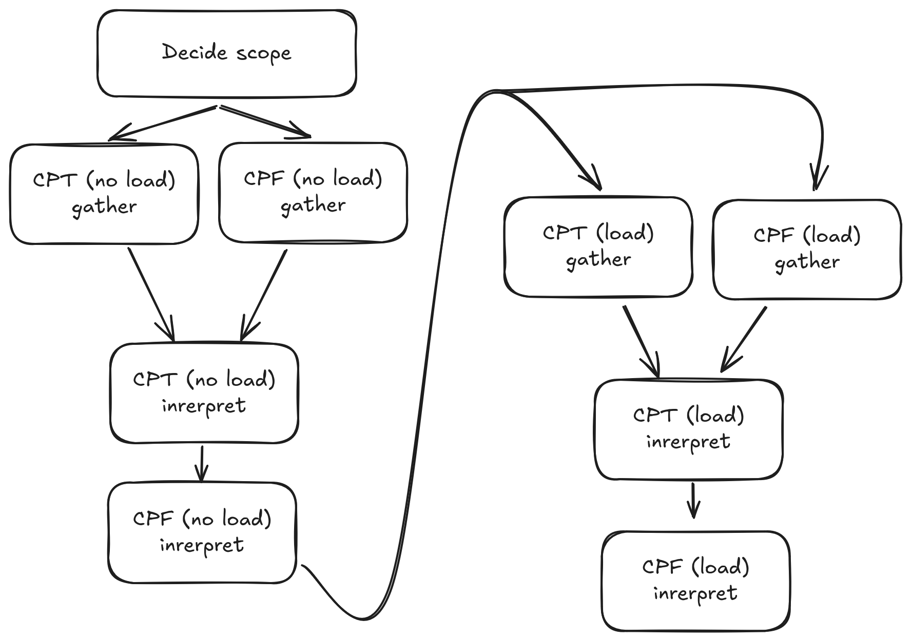
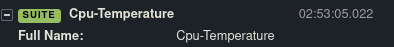
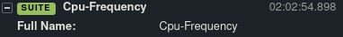
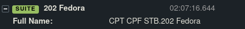
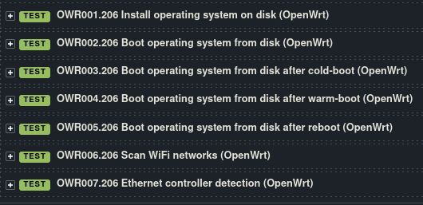

## Dasharo Open Source Firmware Validation Status

---

# 
 Agenda 

* Short introduction to OSFV
* Statistics
* Significant changes: Implemented
* Significant changes: WiP & future plans
* Q&A

---
layout: cover
background: /intro.png
class: text-center
---

# 
 Introduction to Open Source Firmware Validation 

---

# 
 Introduction to Open Source Firmware Validation 

- Open Source Validation of Open Source Firmware
- Based on Robot Framework 7.3
- Used to detect regression in next dasharo release via series of automated test cases
- Semi-manual (interactive!) test cases using Dialogs library

- Tree-like platform configuration structure
- Several DUT control & connectivity options

---

# 
 Introduction to Open Source Firmware Validation 

- Dasharo test modules:
  - dasharo-compatibility
  - dasharo-performance
  - dasharo-stability
  - dasharo-security

- Other test modules:
  - utils
  - dts
  - self-tests
  - (...)

---

# 
 Introduction to Open Source Firmware Validation 

- Log files kept in directory tree:
  - ./logs/platform-config/dir-prefix_platform-config_time-stamp
  - DIR_PREFIX variable
  - .xml - for further processing
  - 2x .html - human-readable results
  - .log - what actually happens?

---
layout: cover
background: /intro.png
class: text-center
---

# 
 OSFV Statistics 

---

# 
 PR stats 

### 
 open-source-firmware-validation 

#### 
 Total 

---

# 
 PR stats 

### 
 open-source-firmware-validation 

#### 
 Difference 

---

# 
 Test modules stats 

#### 
 Total test cases 

---

# 
 Test modules stats 

#### 
 Difference 

---
layout: cover
background: /intro.png
class: text-center
---

# 
 Significant changes 

---

# 
 Implemented: 

- a possibility to run tests simultaneously
  - dasharo-performance module
  - CPT, CPF, STB suites
  - grouped & executed per ENV_ID

---

# 
 Implemented: 

- a possibility to run tests simultaneously

Sequential:

+

+

STBxxx.202 - at least 1h

Concurrent:

---

# 
 Implemented: 

- an OpenWrt automation: installation & basic tests for Protectli platforms
  - OS installation via DTS network boot
  - For now, no image preseed, automated configuration after OS boot

---

# 
 Implemented: 

- Microcode revision testing
  - based on cbmem command output
  - microcode update is sometimes included in Dasharo releases
  - introduced to avoid accidental usage of older microcode in release binary ...
  - ... or failed microcode update.

---

# 
 In progress/planned: 

- QubesOS test cases in OSFV
  - ENV_ID == 203 (200 means Linux distribution, third flavour)
  - distributed between modules & suites
  - 28 automated test cases in total
  - QubesOS installation now possible with preseed

---

# 
 Priorities for the future 

- Reduction of DUT non-essential power cycles
- OSFV versioning & release cycle:
  - We want to return back to versioning of OSFV from the current develop branch live approach.
  - The CI will probably be expanded in the future to help with that.
  - Some platforms will automatically run some set of tests to have a proof that an OSFV release works on a set of setups

---
layout: cover
background: /intro.png
class: text-center
---

# 
 Questions? 

---
layout: cover
background: /intro.png
class: text-center
---

# 
 Thank you! 

---
