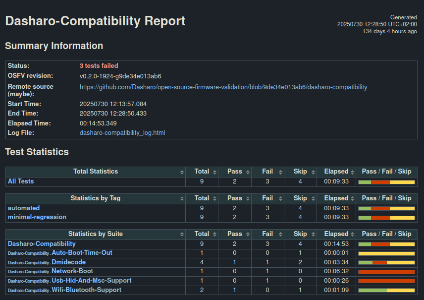
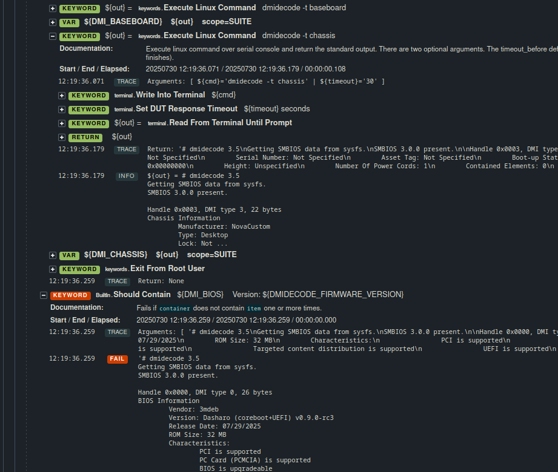

# Windows Hardware Lab Kit
## A new tool at Dasharo testers arsenal

---
layout: two-cols-header
---

## What's Windows Hardware Lab Kit

::left::
Testing framework that has evolved since 2000s
- Hardware Compatibility Test - Windows 2000, XP
- Driver Test Manager - Windows Vista
- Windows Logo Kit / Windows Hardware Certification Kit - Windows 7, 8, 8.1
- Windows Hardware Lab Kit - Windows 10, 11
::right::

<!--
multiple certification programs by MS along the years
-->

---
layout: two-cols-header
---

## Why it's interesting to us
::left::
- **4659** unique test cases according to the test lists at https://aka.ms/HLKPlaylist
OSFV "only" has **1425** test cases as of 10.12.2025

Coverage:
- Audio, Video, Ethernet, Wi-Fi, Bluetooth
- GPIO, I2C, USB, NFC, PWM, SPI, UART, SATA, NVMe
- Drivers
- TPM, Secure Boot, disk encryption, TXT DMA Protection Ranges, Windows specific security features
- Windows Logo Certification, Windows Secured Core PC (?)
::right::

<!--

-->
---
layout: two-cols-header
---

## HLK Overview #1
::left::
Three basic components:
- HLK Controller - scheduling, performing tests
- HLK Studio - GUI, creating projects, packaging results
- HLK Client - access to the DUT for the HLK Controller

::right::

<!--

-->

---
layout: two-cols
---

## HLK Overview #2

::right::

<!--
- note how OSFV is P2P
- note how HLK Controller can do parallel and multi device tests easily thanks to centralization
-->

---
layout: two-cols
---

## HLK VM Setup
Windows HLK Controller & Studio can only run on Windows Server:
- on a dedicated machine
- on a Hyper-V VM (VHLK)

If Windows server is to be run on a VM, nested virtualization of VHLK **WILL**
cause headaches.

For this minimal test setup, a Proxmox VM running HLK natively was decided to be
enough
- CPU: Xeon E5620, 4 cores allocated, NUMA enabled
- RAM: 4-12 GiB, dynamic allocation
- Disk: 70 GiB VirtIO
- RedHat VirtIO drivers in the to CD drive

::right::

<!-- proxmox VM, allocated resources -->

<!--
CPU: won't boot with <2 cores
RAM: won't boot with <4GB
Disk: recommended 32GB would be just barely enough and just a few test results would fit
-->

---
layout: cover
---

# Live Demo
For more details check the blog post at https://blog.3mdeb.com/2025/2025-12-11-windows-hlk

<!--
  1. connect via remmina
  2. create device group, add a HLK client to the new group
  3. create project called after some imaginary Dasharo release
  4. select devices - a single component of a laptop as loading all the tests takes a couple minutes
  5. run (schedule) tests, cancel the scheduling as it takes a long time
  6. show test results (premade), compare to how results look in OSFV
  7. show logs (premade), compare to how logs look in OSFV
 -->

---

## Creating a device group

---

## Creating a project

---

## Device selection

---

## Tests selection

---

## Viewing results

---

## Test logs

---

## OSFV Viewing results

---

---
layout: two-cols-header
---

## PoC on Novacustom NV41PZ v1.7.2

::left::
145 / 764 compatible tests ran over 60 hours
- expected total runtime: ~400h, estimation by interpolation: ~6000 hours

Interesting Passes:
- All WLAN, DX3D, WDDM
- Most Camera, Bluetooth, SMBIOS tables

Some Interesting Fails:
- [TPM 2.0 Verify Existence and Device Requirements Test](https://learn.microsoft.com/en-us/windows-hardware/test/hlk/testref/8ddefeef-88ca-4949-ac0c-6eb036a98200)
- [Check SMBIOS Mapped Address Ranges](https://learn.microsoft.com/en-us/windows-hardware/test/hlk/testref/746bad65-cf37-490b-a0fd-afe5623e282d)
- [AutoMemoryBenchmark](https://learn.microsoft.com/en-us/windows-hardware/test/hlk/testref/cdcc3607-ae2c-4e38-954b-fc6a2ef27e63)
- [Audio Logo Test](https://learn.microsoft.com/en-us/windows-hardware/test/hlk/testref/16a492f7-a503-4f7e-8c1d-6fd4370b9b65)

::right::

<!--

 -->

---
layout: default
---

## Summary & next steps

Windows HLK will provide a lot of value to Dasharo Hardware Certification Lab
- 4 times the test cases of OSFV
- Windows Logo Certification
  - Windows Secured Core PC certification?

Some work is still ahead:
1. VM on a 10+ yrs old Xeon is not _**nearly**_ enough
2. Work on automation, GUI is suboptimal
   - HLK automation only via .NET from a Windows device
   - Promising project! https://github.com/hck-ci
3. Presenting and interpreting the binary results

<!--
- faster server needed even for single DUT. HLK is resource intensive
- converting to human readable format
- promising project should scaling be needed https://github.com/HCK-CI
-->

---
layout: cover
---

# Thank You
