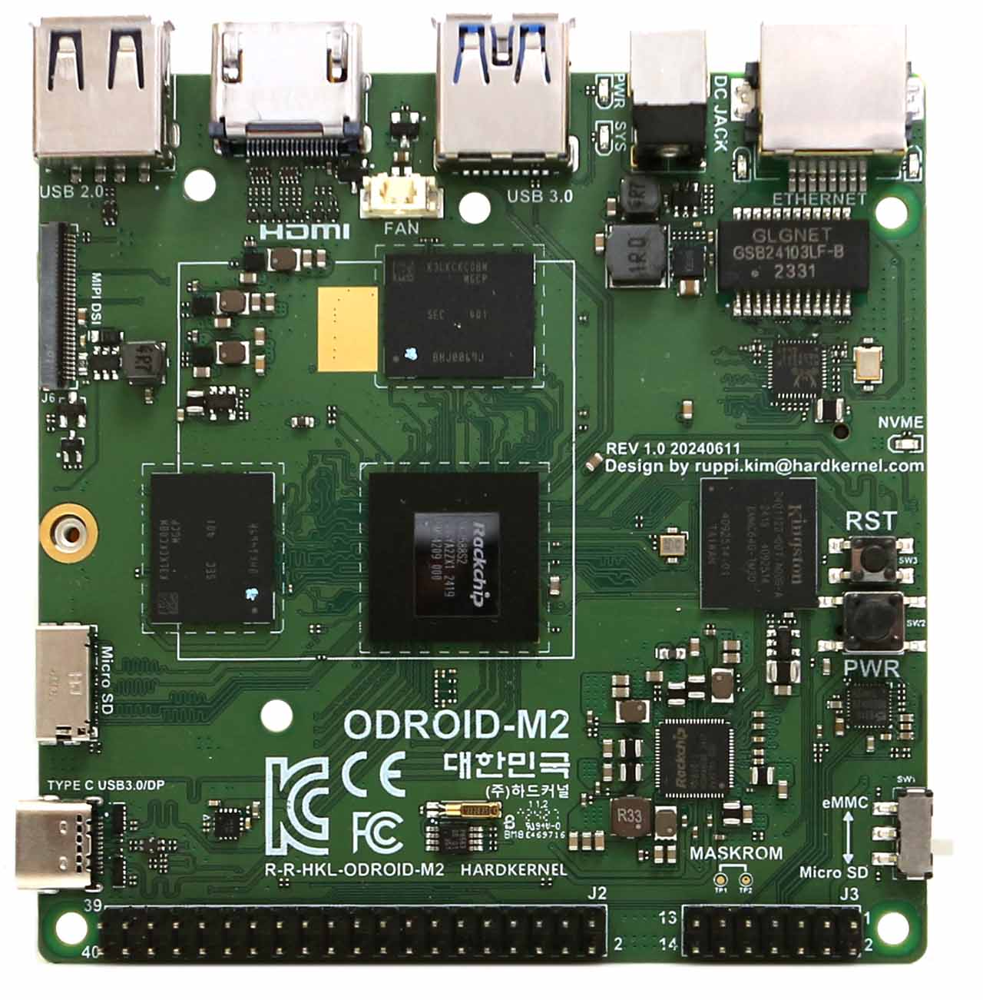
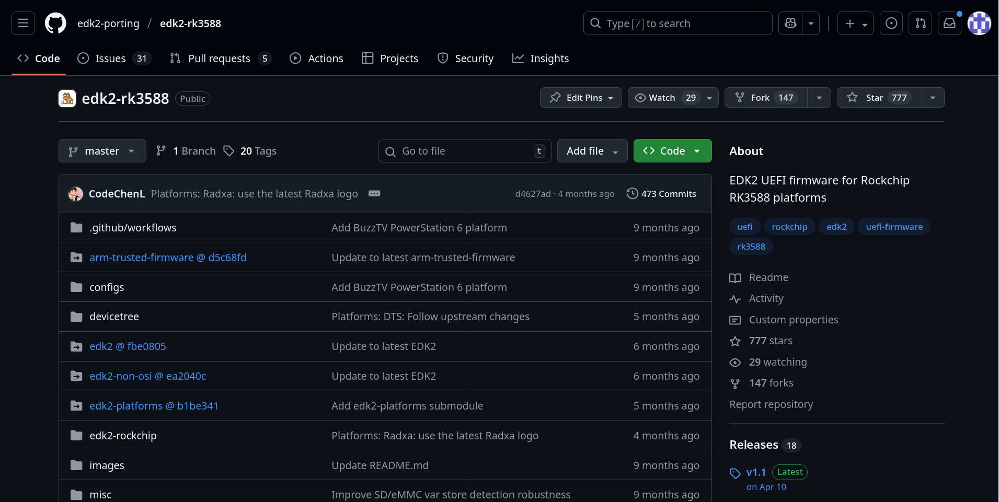

## Booting TianoCore EDK II on an Odroid M2

### A walk‑through of porting, building and flashing

---

## Introduction

<div style="display: flex; align-items: center; gap: 20px; margin-bottom: 20px;">
  
  <div>
    <b style="font-size: 1.5em;">Michał Kopeć</b><br>
    <i style="font-size: 1.2em;">Firmware Engineer</i>
  </div>
</div>

<div style="display: flex; justify-content: space-between; align-items: center; font-size: 1.2em;">
  <div>
    🔑 <code>869E 9AE8 AFDB 5FAE 6068  338B 99BD 2EEE E2D0 CE31</code><br>
    ✉️ <a href="mailto:michal.kopec@3mdeb.com">michal.kopec@3mdeb.com</a><br>
    🔗 <a href="https://www.linkedin.com/in/michał-kopeć-a8b216200/">LinkedIn</a><br>
    💻 <a href="https://github.com/mkopec">GitHub</a><br>
  </div>
</div>

- Firmware Engineer working primarily with coreboot and EDK2 but also Heads and
  Linux
- Have been at 3mdeb for 4 years now
- Free and open source software enthusiast
- ThinkPad collector

---

## Why EDK II on ARM?

- UEFI: unified boot, platform services, secure boot, etc.
- Historical dominance: x86; ARM traditionally uses U‑Boot.
- Trend: high‑performance ARM SoCs → need rich firmware → EDK II fills gap.
- Open‑source effort: edk2‑porting community → Rockchip, Mediatek, etc.

<center></center>

---

## Meet the Odroid M2

- SBC, RK3588 (ARM64, 8‑core big.LITTLE)
- 40‑pin RPI-like GPIO header, 2×7 additional GPIO header, HDMI, USB‑C‑DP,
  MIPI‑DSI, Gigabit Ethernet
- Built‑in NPU, small 4‑pin fan, debug UART
- Runs Ubuntu 25.04 out of the box

<center></center>

---

## The edk2‑rk3588 Repository

- Base repo: edk2‑porting/edk2‑rk3588
- Existing Rockchip ports: OrangePi5, Radxa ROCK5 and more
- Pull‑request 218 adds Odroid M2 → Dasharo:odroid-m2

<center></center>

---

## High‑Level Porting Architecture

```text
EDK II  ──►  Rockchip Platform Abstraction Layer (PAL)
     │                 │
     │                 └─► GPIO / PWM / PWM‑Fan
     ▼
    Board‑Specific Code
```

- PAL: Rockchip‑specific driver skeleton (GPIO, PWM, I²C, etc.)
- Board‑Specific: voltage rails, PCIe init, fan control, LEDs, debug UART, SD‑card boot path

---

## Step 1 - Voltage Regulator Configuration

- RK3588 uses regulators for power rails: VDD‑CPU, VDD‑GPU, VDD‑IO, etc.
- Source: RK3588 device tree from upstream Linux
- Code excerpt:

```c
static struct regulator_init_data rk806_init_data[] = {
    /* Master PMIC */
    RK8XX_VOLTAGE_INIT(MASTER_BUCK1, 950000),
    RK8XX_VOLTAGE_INIT(MASTER_BUCK2, 950000),
    RK8XX_VOLTAGE_INIT(MASTER_BUCK3, 750000),
    RK8XX_VOLTAGE_INIT(MASTER_BUCK4, 950000),
    RK8XX_VOLTAGE_INIT(MASTER_BUCK5, 900000),
    /* This is not configured in the M2's Linux device tree
    RK8XX_VOLTAGE_INIT(MASTER_BUCK6, 1100000), */
    RK8XX_VOLTAGE_INIT(MASTER_BUCK7, 2000000),
    RK8XX_VOLTAGE_INIT(MASTER_BUCK8, 3300000),
    RK8XX_VOLTAGE_INIT(MASTER_BUCK10, 1800000),
```

---

## Step 2 - PCIe (M.2) Initialization

`1.` What the existing code tells us:

  ```c
  if (Segment == PCIE_SEGMENT_PCIE20L2) {
      GpioPinSetDirection(3, GPIO_PIN_PD1, GPIO_PIN_OUTPUT);
  }
  ```

- Only Reset signal → GPIO PD1
- No Power‑Enable on this board

`2.` Hardkernel schematic findings:

- Reset → GPIO 1 PA7
- Power‑Enable → GPIO 0 PC6

---

## Step 2 - PCIe (M.2) Initialization

`3.` Final M.2-specific code:

```c
EFIAPI
PcieIoInit(UINT32 Segment) {
    if (Segment == PCIE_SEGMENT_PCIE20L2) {
        GpioPinSetDirection(1, GPIO_PIN_PA7, GPIO_PIN_OUTPUT);
        GpioPinSetDirection(0, GPIO_PIN_PC6, GPIO_PIN_OUTPUT);
    }
}

VOID EFIAPI
PciePowerEn(UINT32 Segment, BOOLEAN Enable) {
    if (Segment == PCIE_SEGMENT_PCIE20L2)
        GpioPinWrite(0, GPIO_PIN_PC6, Enable);
}

VOID EFIAPI
PciePeReset(UINT32 Segment, BOOLEAN Enable) {
    if (Segment == PCIE_SEGMENT_PCIE20L2)
        GpioPinWrite(1, GPIO_PIN_PA7, !Enable);
}
```

---

## Step 3: Fan control

- Fan wired to GPIO 1 PA2 (PWM0_M2)
- Small fan → low period (50 µs) + 50 % duty → quiet at low speed
- Code:

  ```c
  PWM_DATA pwm_data = {
      .ControllerID = PWM_CONTROLLER0,
      .ChannelID    = PWM_CHANNEL0,
      .PeriodNs     = 50000,
      .DutyNs       = 50000,
      .Polarity     = FALSE,
  };

  VOID EFIAPI PwmFanIoSetup(VOID) {
      GpioPinSetFunction(1, GPIO_PIN_PA2, 0xB);   // PWM0_M2
      RkPwmSetConfig(&pwm_data);
      RkPwmEnable(&pwm_data);
  }
  ```

---

## Additional board-specific tweaks

| FEATURE | CURRENT STATE | COMMENTS |
| --- | --- | --- |
| LEDs | Not functional | Need to map GPIOs |
| USB 2.0 | Functional | |
| USB 3.0 | Not functional | Works once booted into OS |
| Booting Windows | Not functional | Need proper ACPI tables |

---

## Building the image

- Root of edk2‑rk3588 → build.sh
- Command:

  ```bash
  ./build.sh --device odroid-m2

  => FIT build done
  => Building 8MB NOR FLASH IMAGE
  ...
  Build done: RK3588_NOR_FLASH.img
  ```

---

## Flashing to MicroSD

- Odroid M2 boots from microSD (no onboard NAND on dev boards)
- Flashing command:

  ```bash
  sudo dd if=RK3588_NOR_FLASH.img of=/dev/sdb bs=4M status=progress
  ```

---

## Boot result

- Insert SD card, power on
- Image inserted → board powers up → UEFI splash appears
- Ubuntu 25.04 boots (from FIT image)

---
theme: slidev-template/theme
layout: cover
background: /intro.png
class: text-center
---

# Demo

---

## What we still need

- Windows 10/11 – ACPI tables
- USB‑3.0 mass storage exposed in UEFI environment
- LED and power‑state indicators
- Serial console from UEFI (early‑boot debug)
- Full Dasharo release - payload and feature integration

---

## The Pull Request & Community

- Pull‑request #218: Odroid M2 port
- Repository: edk2‑porting/edk2‑rk3588
- Thanks to Hardkernel for schematics

---
theme: slidev-template/theme
layout: cover
background: /intro.png
class: text-center
---

# Q&A
