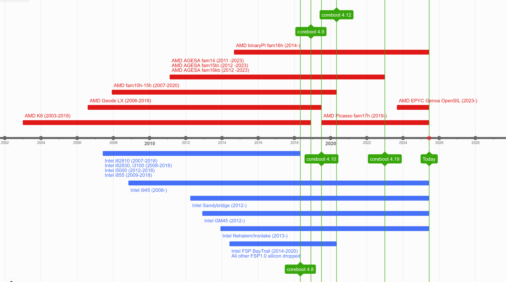
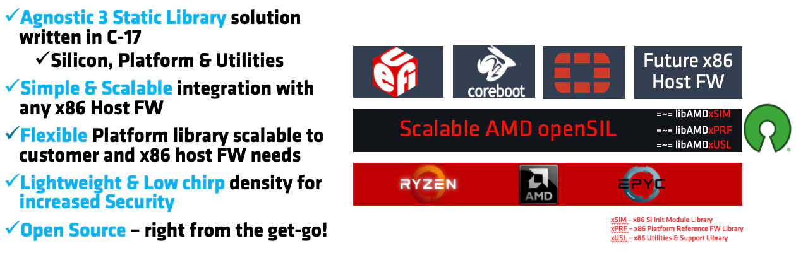
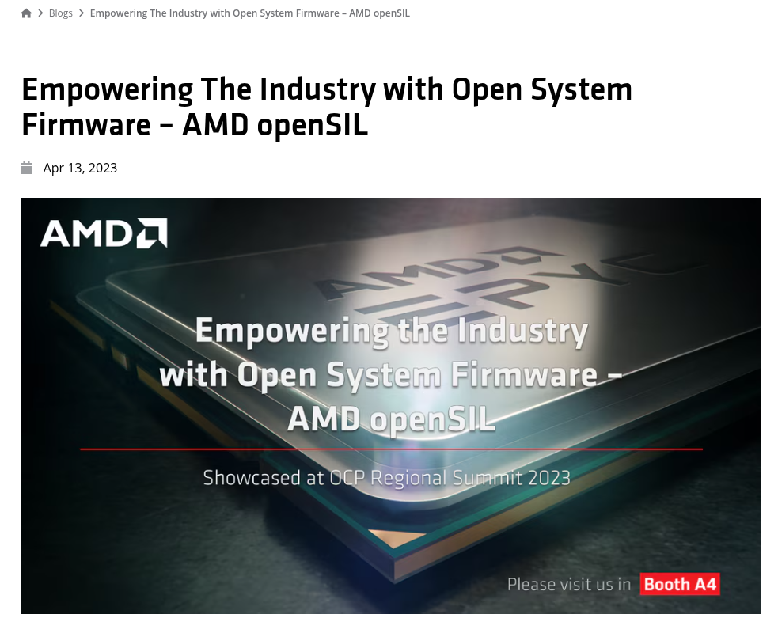
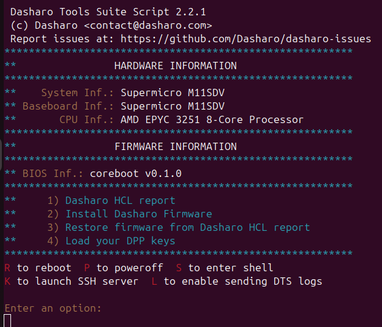

## What is this "Empowering The Industry" about with AMD OpenSIL?

---

## Agenda

- AMD and Intel silicon support in open-source firmware
- AMD and Intel silicon support in coreboot historically
- AMD OpenSIL introduction
- Bonus
- Q&A and Discussion

---

## Disclaimer

The presentation contains my own private opinions, thoughts and speculations,
**not my employers**. The information contained in the presentation may not be
accurate and simply aims to spark a discussion.

Historical data for coreboot x86 silicon support has been extracted with git.

---

## AMD and Intel silicon support in open-source firmware

* **Intel:**
  - Has quite strong monopoly on x86 open-source firmware (EDK2, SBL, coreboot, FSP)
  - Very stable and dominant in coreboot tree (except old FSP1.x boards)
  - Lots of (never-ending) speculative vulnerabilities
* **AMD**
  - Almost not present in open-source firmware frameworks besides coreboot
    (EDK2 contributions only recently)
  - Early silicon support was fully open-source (native, AGESA/CIMx) until mid
    2014 with introduction of BinaryPI (binary AGESA) and later AMD FSP
  - Open-source firmware support for new AMD platforms nearly didn't exist
    between 2015 and 2020 due to economical situation of AMD
  - Older silicon parts are not very stable in coreboot tree, often dropping
    from main branch (famous KGPE-D16 and others), unmaintained with poor code
    quality
  - AMD restores its position in open-source firmware ecosystem with OpenSIL

---

## AMD and Intel silicon support in coreboot historically

<!--

- Marked only the most important deprecations and current northbridges/cpus

AMD:
- Deprecations started around coreboot 4.8
- Notice the gap between binaryPI AMD fam16h and Picasso fam17h
- OpenSIL started showing up in 2023

Intel:
- New Intel SOCs are added regularly, didn't bother to add the mall
- We can notice how older northbridges are holding up to this day, while AMD's not necessarily

-->

---

## AMD OpenSIL introduction

  

> https://www.amd.com/en/blogs/2023/empowering-the-industry-with-open-system-firmware-.html

---

## AMD OpenSIL - "Empowering The Industry"

> https://www.amd.com/en/blogs/2023/empowering-the-industry-with-open-system-firmware-.html

<!--

We have Genoa support and Turin (published not so long ago).

Phoenix should follow soon too, but did not see any code yet.

But what possibilities does this give us?

-->

---

# Bonus

---

## Closing Thoughts

* "Empowering The Industry" ? Time will show.
  * Empowering small businesses right now? Definitely.
* AMD slowly regains its position in open-source firmware ecosystem
  * They are way ahead of Intel in terms of new features and design

---

## Q&A
