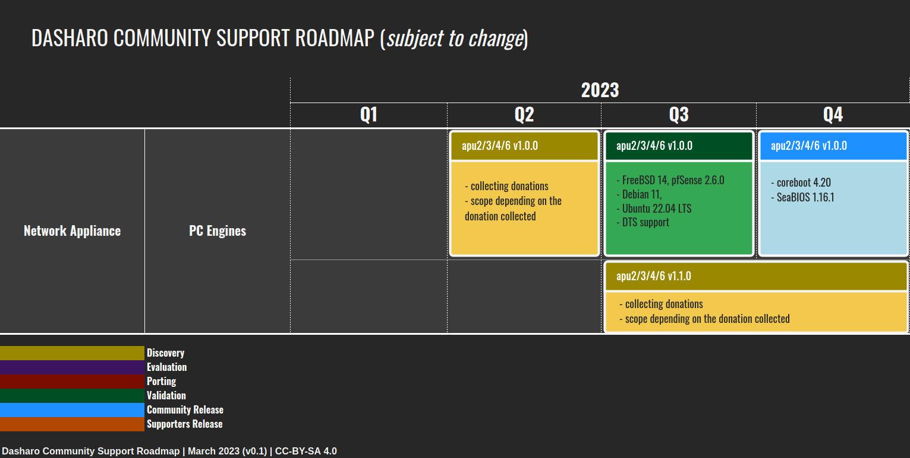

class: center, middle, intro

# PC Engines post-EoL firmware

## Survey summary and next steps

.center[]

---

# What is it about?

.center.image-30[ ]

* In September 2022 PC Engines decided to discontinue sponsorship for
  open-source firmware on their devices.
* We announced that recently after v4.19.0.1 release (Feb 2023).
* We sent survey to community to ask, if there is interest in continuation of
  open-source firmware support through potential subscription model.
* In following presentation we want to share summary and next steps regarding
  PC Engines open-source firmware support future.

---

# Summary

* We would like to thank all of the respondents for taking the time and
  providing valuable feedback.
* Some questions in survey could be explained better, maybe with example.
* We received 100+ answers, respondents report over 600 PC engines hardware
  units for update.
* Most valuable features:
  - ECC
  - OpenBSD, FreeBSD, OPNsense and pfSense support
  - Core Preformance Boost
  - TPM support
  - Stability and security
  - Debian and NetBSD support

???

- `How many PC Engines apuX platforms would you like to support with regular firmware updates?`
- was interpreted as question about which PC Engines platforms apu1,apu2 and so
  on, should get updates
- what we intended to ask was how for how many hardware devices/units, given
  respondent would like to get updates

---

# Summary

.center.image-100[]

---

# Summary

.center.image-100[]

---

# Summary

.center.image-70[]

* Over 50% of respondents are interested in paid model
  - yearly subscription is most popular among other requests
  - subscription-interested respondents represent 66% of all devices reported
    in survey

---

# Community suggestions

* Use donation driven development instead of subscription.
* On-demand custom firmware builds.
  - We will add that to 3mdeb offer
* Charging for each release
  - We don't think it is economically feasible.
* One-off upgrades
  - We don't see how it would be different from dontation model.
* Paid Technical Assistant Center (TAC) support
  - We already deliver such services through Dasharo Support Package using JIRA
    Service Desk and we would be glad to extend it to support PC Engines
    customers.
* Provide roadmap you planning to implement.
  - We will do that quarterly during DUGs.

---

# Decision

* Because of feedback we received we opt for donation-only model for now.
  - subscription model with expressed interest is not economically feasible
* What may change our decision in future?
  - more business customers interested in supporting open-source firmware
    updates
  - crictial mass of users who want to see subscription model

---

# Feature requests

.center.image-99[]

---

# Roadmap

.center.image-99[]

---

# How to donate

* LiberaPay: https://liberapay.com/dasharo
* OpenCollective: https://opencollective.com/3mdeb_com
  - we plan to enable cryptocurrencies donations before DUG#2
* Other methods including cryptocurrencies:
  - https://docs.dasharo.com/ways-you-can-help-us/#donate-money

---
class: center, middle, intro

# Q&A
